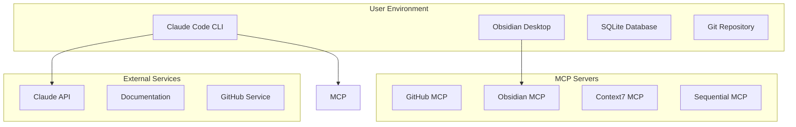

# Physical Architecture

> **How** the system is built - technologies, deployment, and infrastructure

## Quick Start

The physical architecture implements a **local-first, agent-oriented** system:
- Claude Code CLI as the execution engine
- Obsidian as the knowledge UI
- MCP ecosystem for integrations
- Progressive cloud enhancement

## Progressive Exploration

### 🎯 [Physical Architecture with Traceability](Physical-Architecture-With-Traceability.md) **NEW**
Complete mapping from logical to physical components with clear traceability

### 📊 [Component Traceability Matrix](Component-Traceability-Matrix.md) **NEW**
Detailed interfaces, dependencies, and data flows for each component

### 🔧 [Overview](Overview.md)
Start here for technology decisions and deployment topology

### 💻 [Technology Stack](Technology-Stack.md)
Detailed technology choices for each layer:
- Claude Code & MCP integration
- Obsidian plugin architecture
- Local data management
- AI service integration

### 🚀 [Deployment Architecture](Deployment.md)
How components are deployed:
- Local development setup
- Production deployment
- Scaling strategies
- Monitoring approach

### 💾 [Data Architecture](Data-Architecture.md)
Storage and synchronization:
- Local-first data model
- Event sourcing design
- Knowledge graph storage
- Sync mechanisms

### 🔐 [Security Architecture](Security.md)
Privacy and protection:
- Local-first security
- Optional E2E encryption
- Access control
- Compliance approach

### 🤖 [Agent Implementation](Agent-Implementation.md)
How agents are built and run:
- Markdown-based definitions
- Claude Code integration
- Performance optimization
- Update mechanisms

### 🔌 [Integration Architecture](Integrations.md)
External system connections:
- MCP server setup
- API integrations
- Plugin architecture
- Extension points

## Key Technologies

## Design Principles

1. **Local-First**: Full functionality offline
2. **Privacy-First**: User owns all data
3. **Performance**: Sub-second responses
4. **Compatibility**: Claude Code ecosystem
5. **Extensibility**: Plugin architecture