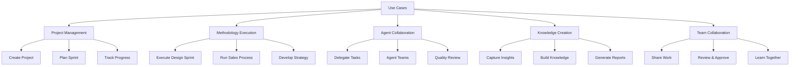
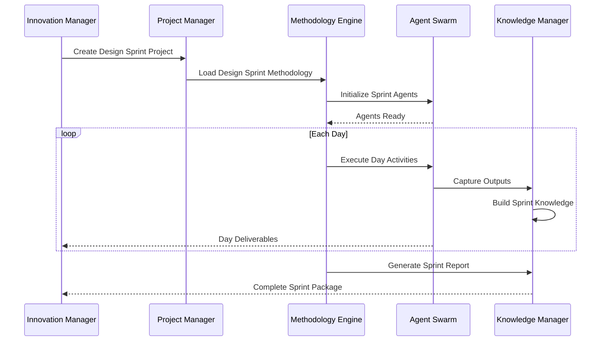
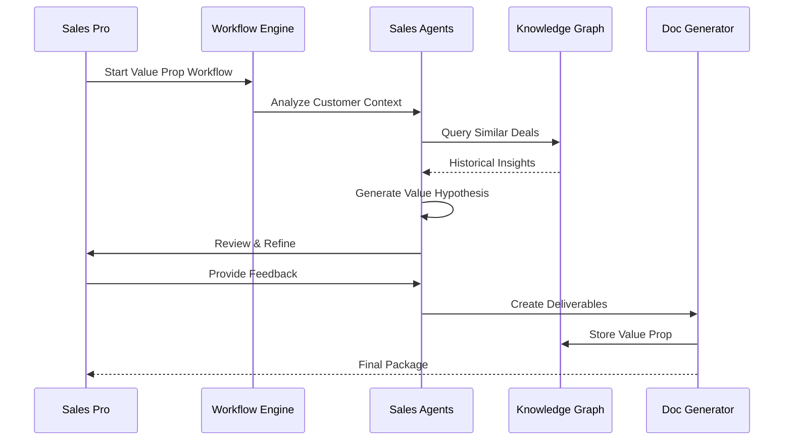
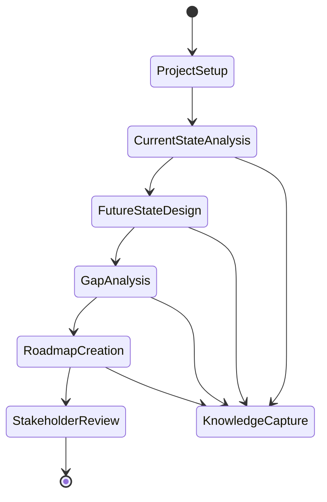
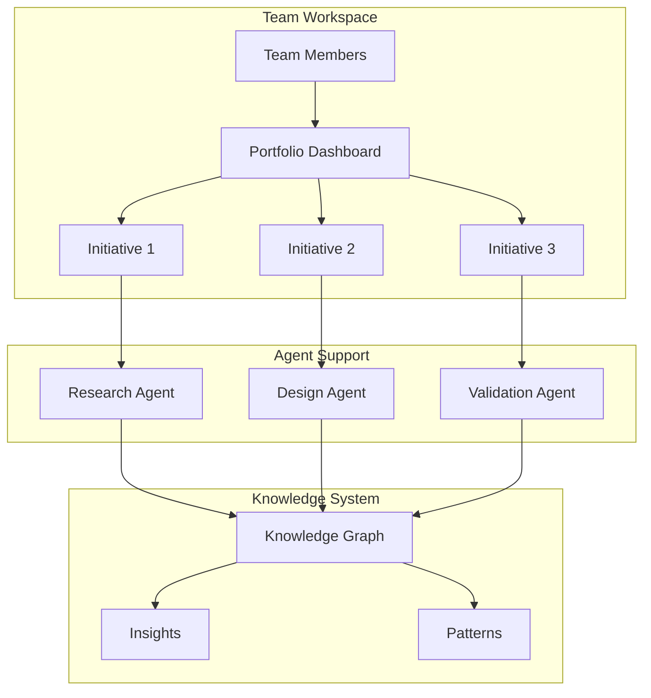
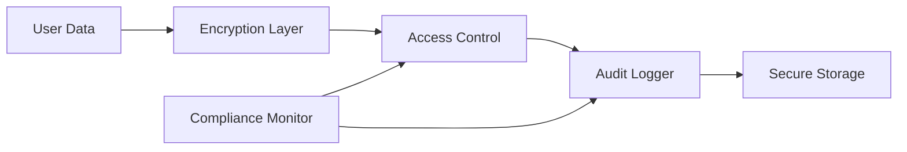
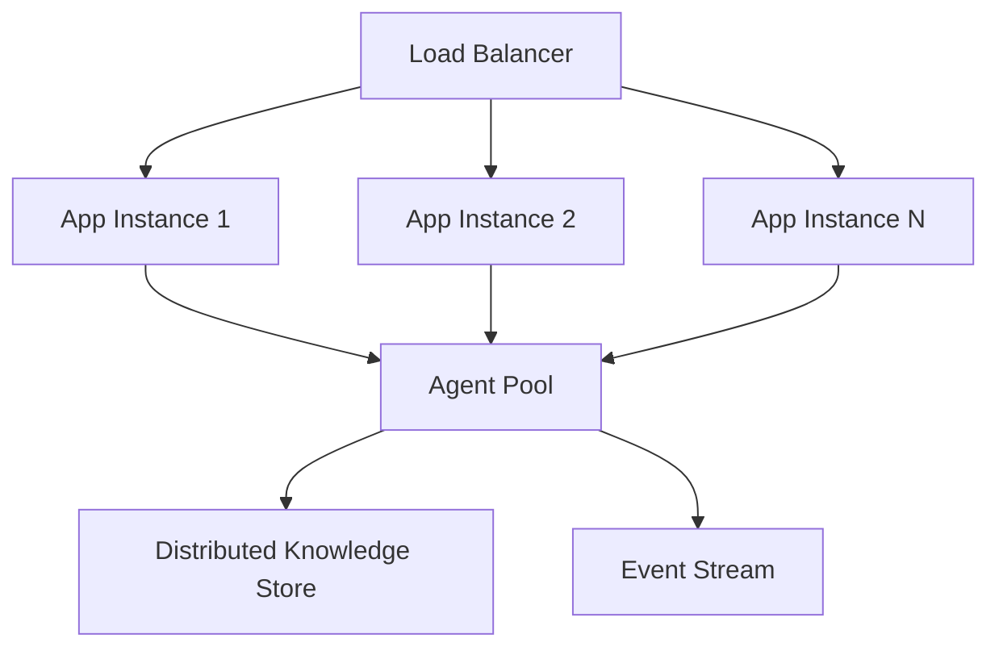
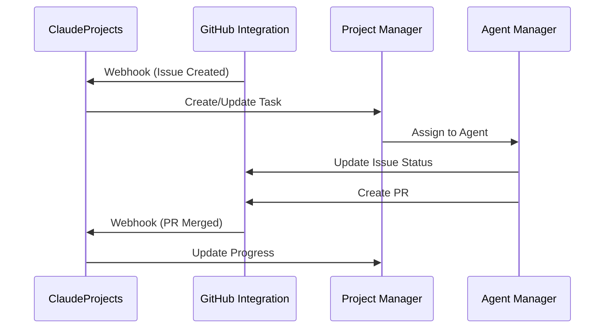
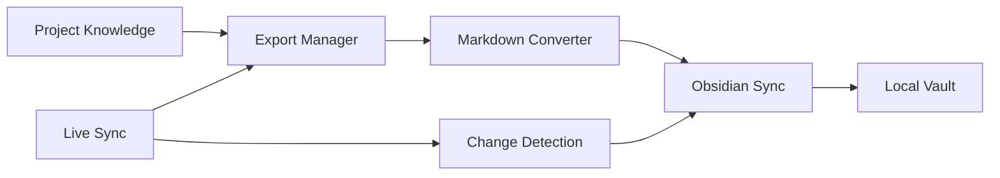

# Logical Architecture Use Case Mapping

## Overview

This document maps key use cases to the logical architecture components, demonstrating how the architecture supports real-world scenarios.

## Use Case Categories

## Detailed Use Case Mappings

### UC1: Innovation Manager Runs Design Sprint

**Actor**: Innovation Manager  
**Goal**: Execute a 5-day design sprint with AI assistance

**Logical Component Interaction**:

**Components Used**:
- Project Domain: Project creation, sprint tracking
- Methodology Domain: Design Sprint methodology, phase orchestration
- Agent Domain: Facilitator, Researcher, Designer, Prototyper agents
- Knowledge Domain: Insight capture, pattern recognition

### UC2: Sales Team Builds Value Proposition

**Actor**: Sales Professional  
**Goal**: Create compelling value proposition for enterprise deal

**Logical Component Interaction**:

**Components Used**:
- Methodology Domain: Sales methodology, value creation process
- Agent Domain: Sales Analyst, Value Designer, Competitor Analyst
- Knowledge Domain: Deal history, win/loss patterns
- User Domain: Team collaboration, approval workflow

### UC3: Consultant Develops Transformation Strategy

**Actor**: Strategy Consultant  
**Goal**: Create digital transformation roadmap

**Logical Component Interaction**:

**Components Used**:
- Project Domain: Multi-phase project management
- Methodology Domain: Strategy consulting framework
- Agent Domain: Business Analyst, Industry Expert, Transformation Specialist
- Knowledge Domain: Industry benchmarks, best practices

### UC4: Team Collaborates on Innovation Portfolio

**Actor**: Innovation Team  
**Goal**: Manage portfolio of innovation initiatives

**Logical Component Interaction**:

**Components Used**:
- User Domain: Team workspace, permissions
- Project Domain: Portfolio management
- Agent Domain: Specialized innovation agents
- Knowledge Domain: Cross-project insights

## Non-Functional Use Cases

### UC5: Ensure Data Privacy

**Requirement**: All client data must be encrypted and access controlled

**Logical Component Mapping**:

### UC6: Scale to 10,000 Concurrent Users

**Requirement**: System must handle enterprise scale

**Logical Component Mapping**:

## Integration Use Cases

### UC7: Sync with GitHub for Development Projects

**Actor**: Development Team  
**Goal**: Integrate ClaudeProjects with existing GitHub workflow

**Component Interaction**:

### UC8: Export to Obsidian Knowledge Base

**Actor**: Knowledge Worker  
**Goal**: Maintain personal knowledge base in Obsidian

**Component Interaction**:

## Performance Use Cases

### UC9: Sub-Second UI Response

**Requirement**: All UI operations < 1 second

**Architectural Support**:
- Local-first data caching
- Optimistic UI updates
- Background agent processing
- Progressive loading

### UC10: Intelligent Agent Response

**Requirement**: Agents provide relevant responses within 5 seconds

**Architectural Support**:
- Pre-loaded context
- Distributed agent pools
- Caching of common patterns
- Parallel processing

## Conclusion

The logical architecture successfully supports all primary use cases through:
1. Clear domain separation enabling focused functionality
2. Agent-oriented design providing intelligent automation
3. Knowledge-centric approach ensuring continuous learning
4. Event-driven architecture enabling real-time collaboration
5. Flexible integration framework supporting diverse tools

This mapping validates that our logical architecture aligns with user needs and system requirements.