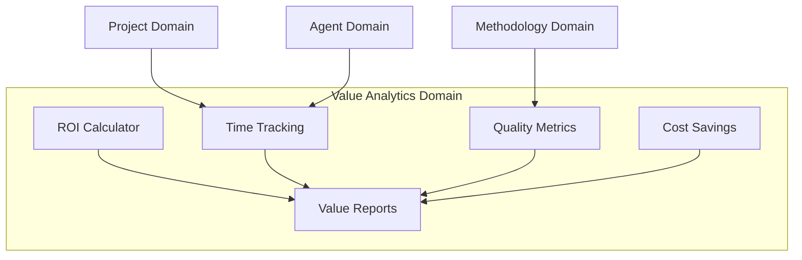
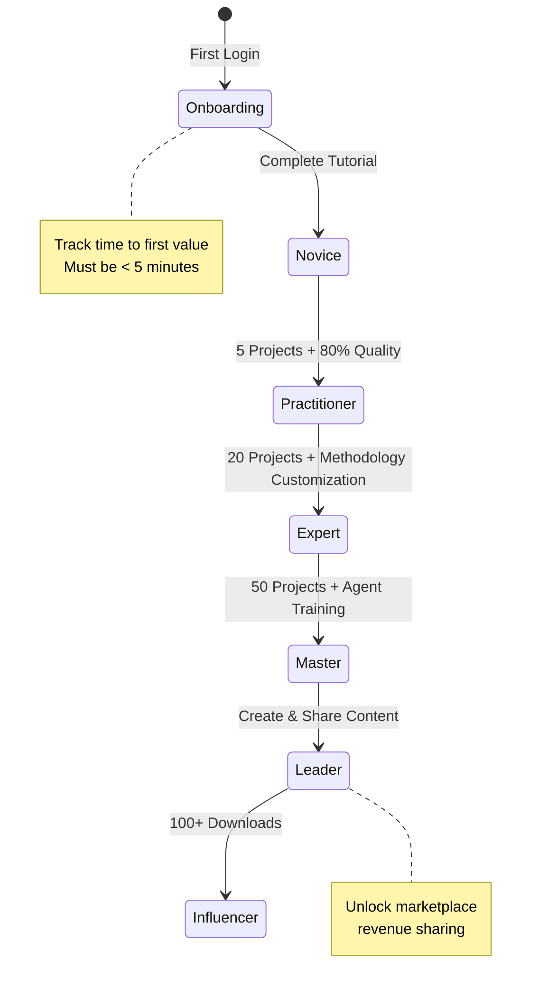
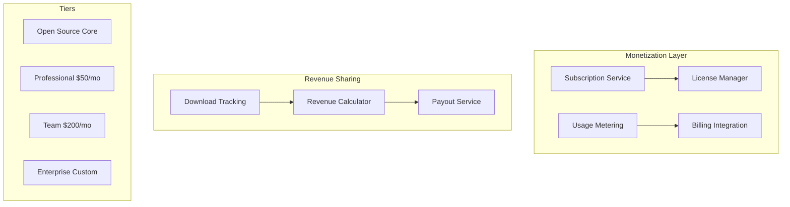

# Logical Architecture Vision Alignment Improvements

## Executive Summary
This document outlines specific improvements to align the logical architecture more closely with the product vision's promises, particularly around business value demonstration, user journey, and monetization.

## Priority 1: Business Value Tracking (Critical)

### New Domain: Value Analytics Domain
Add a new domain focused on tracking and demonstrating the 10x productivity gains:



### Implementation Components:
- **Baseline Capture**: Record traditional approach metrics
- **Real-time Tracking**: Monitor actual time/resource usage
- **Comparison Engine**: Calculate improvements
- **ROI Dashboard**: Visual representation of value delivered
- **Export Reports**: Share value with stakeholders

## Priority 2: User Journey Enhancement

### Enhanced User Domain Growth System



### New Components:
- **Onboarding Orchestrator**: Guided first experience
- **Achievement System**: Track milestones and unlock features
- **Skill Progression Tracker**: Measure capability growth
- **Personalized Learning Paths**: Adapt to user's domain

## Priority 3: Marketplace Monetization Architecture

### Enhanced Marketplace Domain



### Implementation Requirements:
- **Tiered Feature Access**: Control based on subscription
- **Usage Limits**: Enforce plan restrictions
- **Revenue Attribution**: Track which content generates revenue
- **Automated Payouts**: Monthly creator payments

## Priority 4: Success Story Integration

### Project Type Enhancements

Each project type should include:
- **Success Baselines**: Expected traditional timeline
- **Achievement Milestones**: Key progress indicators
- **Case Study Templates**: Document success for marketing
- **Testimonial Capture**: Automated satisfaction surveys

### New Project Type Attributes:
```typescript
interface ProjectType {
  // Existing attributes...
  
  // New vision-aligned attributes
  successMetrics: {
    traditionalDuration: Duration;
    expectedDuration: Duration;
    qualityBaseline: Percentage;
    expectedQuality: Percentage;
  };
  
  userStoryTemplate: {
    scenario: string;
    painPoints: string[];
    expectedOutcome: string;
    valueProposition: string;
  };
  
  testimonialTriggers: {
    completionPrompt: boolean;
    exceptionalResultsPrompt: boolean;
    milestonePrompts: Milestone[];
  };
}
```

## Priority 5: Time-to-Value Optimization

### Quality Attributes Addition

Add specific metrics for initial user experience:

| Metric | Target | Implementation |
|--------|--------|----------------|
| Time to First Project | < 2 minutes | Template selection wizard |
| Time to First AI Output | < 30 seconds | Pre-warmed agents |
| Time to Understand Value | < 5 minutes | Interactive value demo |
| Time to Complete Tutorial | < 15 minutes | Guided experience |

### Onboarding Flow Components:
- **Quick Start Wizard**: 3-step project creation
- **Value Demonstration**: Show before/after comparison
- **Instant Gratification**: Pre-loaded sample project
- **Progress Indicator**: Visual feedback on setup

## Implementation Roadmap

### Phase 1 (Sprint 2-3): Foundation
1. Add Value Analytics Domain structure
2. Implement basic ROI tracking
3. Create onboarding flow framework

### Phase 2 (Sprint 4-5): User Journey
1. Enhance User Domain with progression system
2. Add achievement and unlock mechanisms
3. Implement personalized learning paths

### Phase 3 (Sprint 6-7): Monetization
1. Build subscription management system
2. Implement usage metering
3. Add license enforcement

### Phase 4 (Sprint 8-9): Success Stories
1. Enhance project types with success metrics
2. Create testimonial capture system
3. Build case study generation

### Phase 5 (Sprint 10): Optimization
1. Fine-tune time-to-value metrics
2. A/B test onboarding flows
3. Optimize for 5-minute first value

## Success Criteria

The improvements will be considered successful when:
1. **ROI Visibility**: Every project shows clear time/cost savings
2. **User Progression**: 80% of users advance past Novice within 30 days
3. **Revenue Generation**: Marketplace achieves first $10K MRR
4. **Success Stories**: 10+ documented case studies with metrics
5. **First Value**: 95% of users see value within 5 minutes

## Next Steps

1. Review and approve this improvement plan
2. Create detailed technical specifications for each component
3. Update domain models with new entities
4. Design UI/UX for value tracking dashboard
5. Plan database schema changes for new features