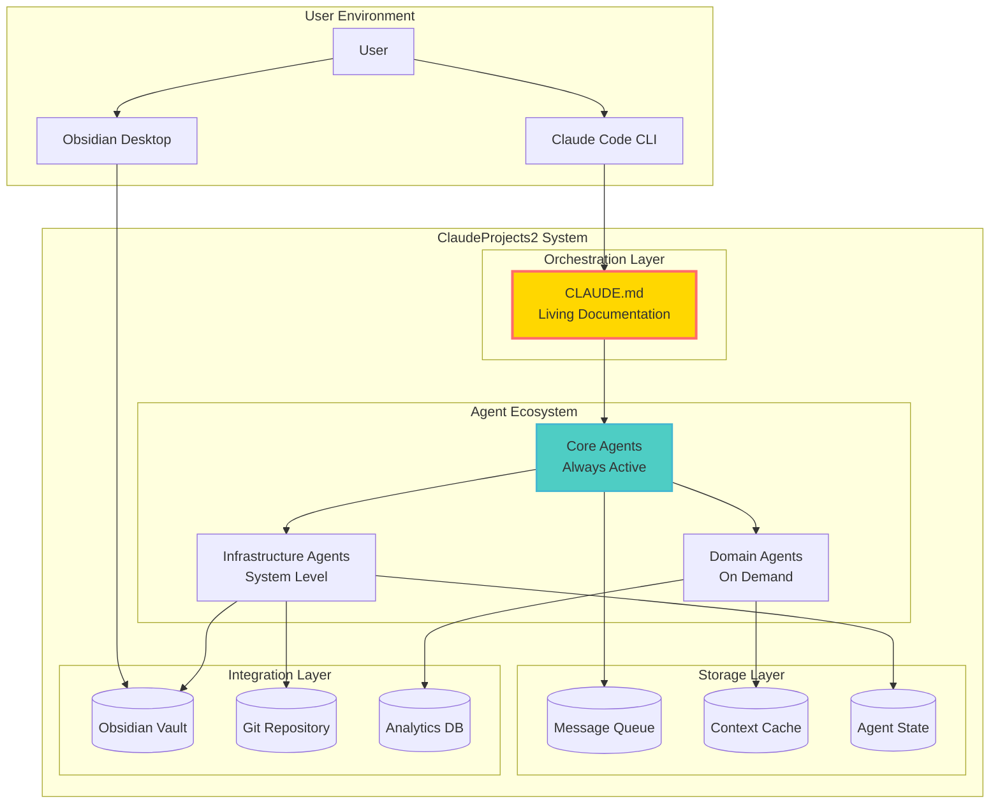
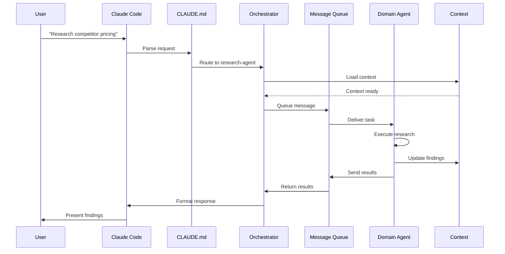
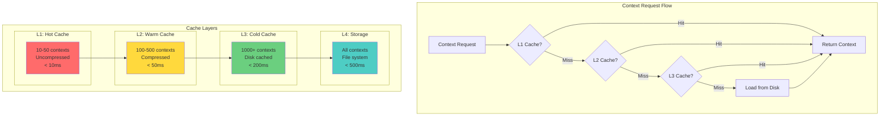
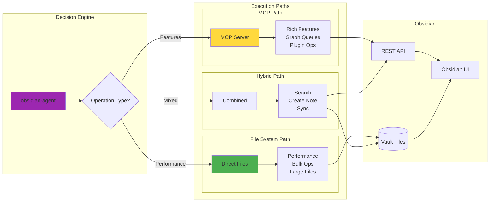
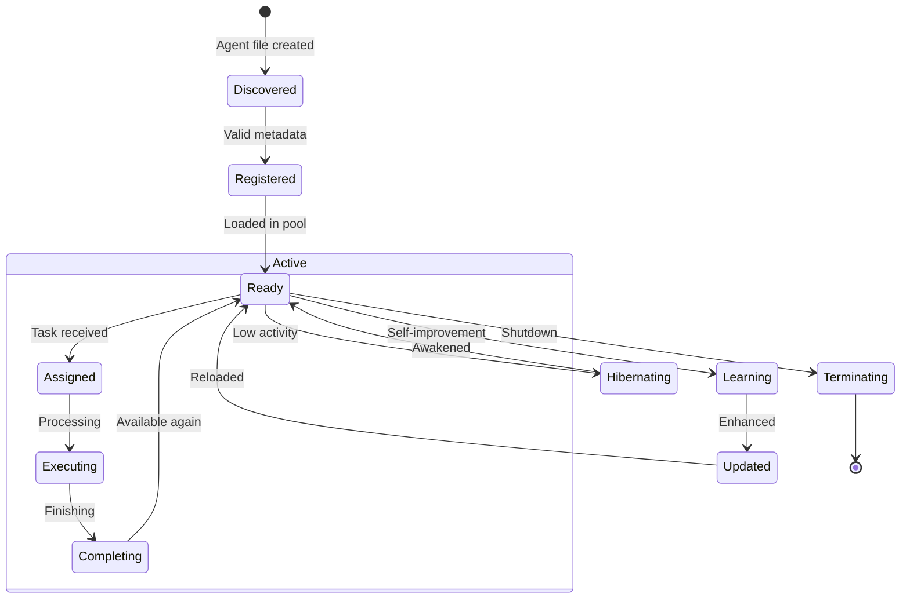
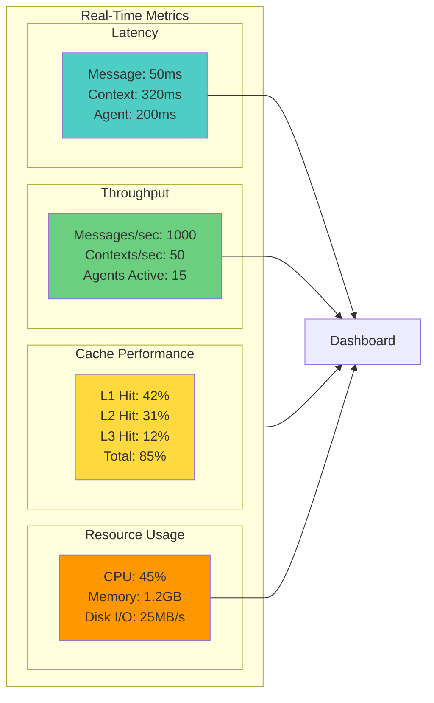
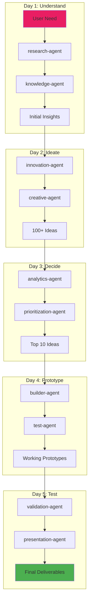
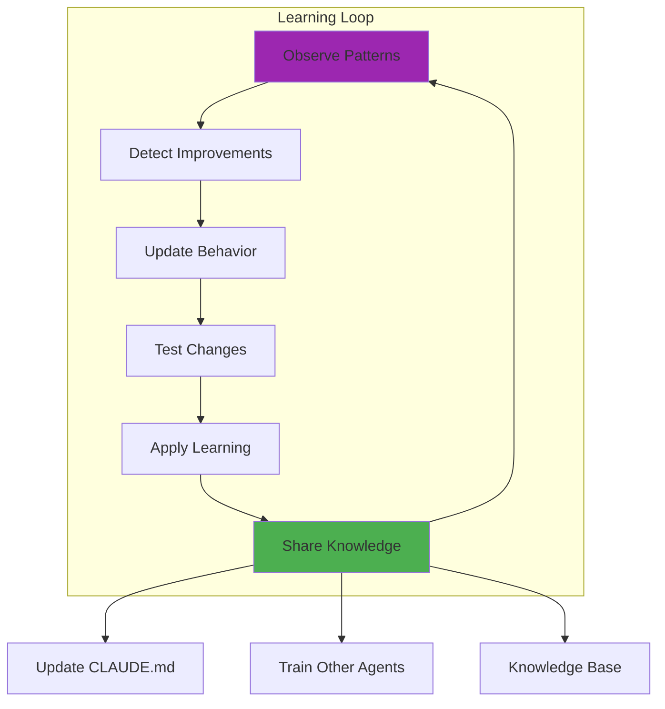
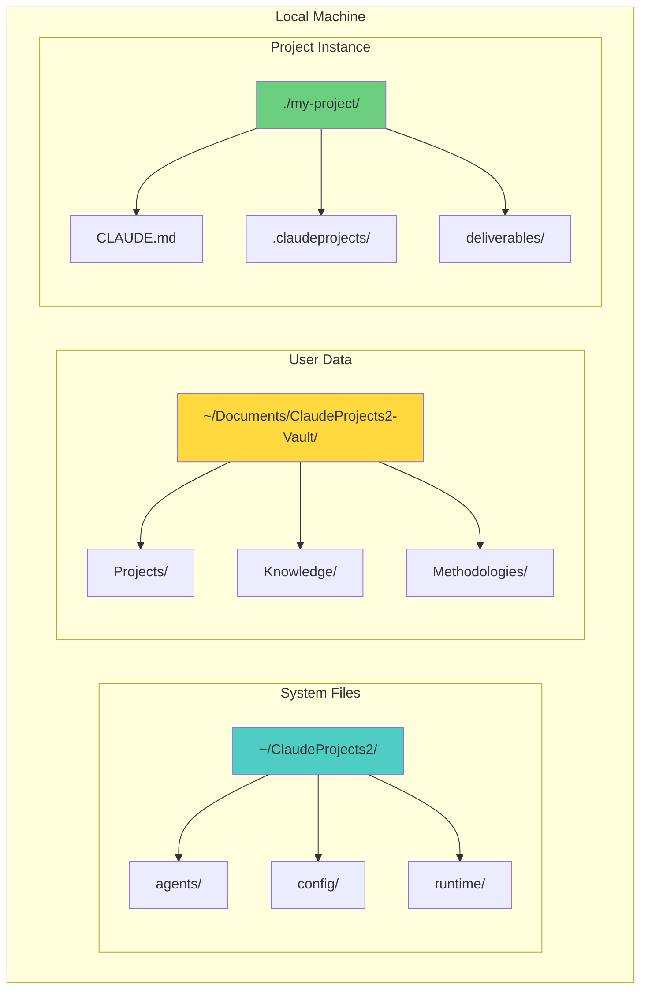

# Architecture Diagrams for Sprint 2 Demo
**Visual Assets for Presentation**

## 1. System Overview Diagram



## 2. Agent Communication Flow



## 3. Context Cache Architecture



## 4. Obsidian Integration Strategy



## 5. Agent Lifecycle State Machine



## 6. Message Queue Structure

```mermaid
graph TD
    subgraph "Message Queue File System"
        ROOT[.claudeprojects/messages/]
        
        subgraph "Active Queues"
            Q1[queues/orchestrator/]
            Q2[queues/methodology-agent/]
            Q3[queues/research-agent/]
            
            Q1P[priority/]
            Q1N[normal/]
            Q1L[low/]
        end
        
        subgraph "Processing"
            PROC[processing/]
            LOCK[{agent-id}/{msg-id}.lock]
        end
        
        subgraph "Archive"
            DL[dead-letter/]
            ARCH[archive/]
        end
    end
    
    ROOT --> Q1
    ROOT --> Q2
    ROOT --> Q3
    Q1 --> Q1P & Q1N & Q1L
    ROOT --> PROC
    PROC --> LOCK
    ROOT --> DL
    ROOT --> ARCH
    
    style Q1P fill:#ff6b6b
    style Q1N fill:#ffd93d
    style Q1L fill:#6bcf7f
```

## 7. Performance Metrics Dashboard



## 8. Innovation Sprint Flow



## 9. Self-Improvement Cycle



## 10. Deployment Architecture



## Usage Instructions

These diagrams can be:
1. Rendered in any Mermaid-compatible viewer
2. Exported as SVG/PNG for presentations
3. Embedded in documentation
4. Used in the demo walkthrough

Each diagram illustrates a key architectural concept and can be shown during the relevant section of the demo presentation.