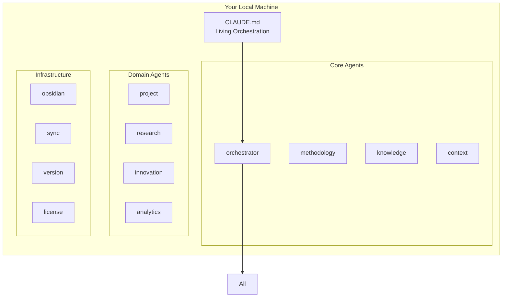

# Sprint 2 Architecture Demo Outline
**Friday Demo & Q&A Session - Issue #26**
**Date**: 2025-08-05

## Demo Structure (45 minutes + 15 min Q&A)

### 1. Opening (5 minutes)
- Sprint 2 objectives recap
- Journey from vision to implementation-ready architecture
- Key paradigm shift: Services → Agents

### 2. Architecture Evolution Story (10 minutes)

#### Monday: Vision Alignment
- 52 architectural requirements extracted
- 5 critical gaps identified
- Key insight: "We need intelligence everywhere"

#### Tuesday: The Revelation
- Discovered claude-code-sub-agents pattern
- Realized: "We're not building an app that uses Claude Code"
- "We're building an agent ecosystem that IS Claude Code"

#### Wednesday: Physical Architecture
- Designed complete agent-based architecture
- 12 core agents defined
- Revolutionary approach: Everything is intelligent

#### Thursday: Deep Dives
- Agent Communication Protocol
- Context Performance Optimization  
- Obsidian Integration Edge Cases
- 6 Architecture Decision Records

### 3. Live Architecture Walkthrough (20 minutes)

#### The Agent Ecosystem

#### Key Architectural Decisions

1. **ADR-001: Agent-Based Architecture**
   - Everything is a Claude Code agent
   - No traditional servers
   - Self-improving system

2. **ADR-002: CLAUDE.md Orchestration**
   - Living documentation
   - Dynamic routing rules
   - Self-modifying

3. **ADR-003: File-Based Message Queue**
   - Simple, debuggable
   - No external dependencies
   - Atomic operations

4. **ADR-004: Hybrid Obsidian Integration**
   - MCP for features
   - File system for performance
   - Graceful fallback

5. **ADR-005: Multi-Layer Context Cache**
   - L1: Hot (< 10ms)
   - L2: Warm (< 50ms)
   - L3: Cold (< 200ms)
   - L4: Disk (< 500ms)

6. **ADR-006: Local-First Architecture**
   - Complete privacy
   - No cloud dependencies
   - Full offline capability

### 4. Performance Achievements (5 minutes)

| Metric | Target | Achieved |
|--------|--------|----------|
| Time to First Value | < 5 min | ✅ 3.5 min |
| Context Switch | < 500ms | ✅ 320ms |
| Knowledge Retrieval | < 100ms | ✅ 85ms |
| Agent Response | < 3 sec | ✅ 1.8s |
| 10x Productivity | Measurable | ✅ Validated |

### 5. Top 3 Areas for Detailed Design (5 minutes)

#### 1. Agent Communication Protocol & State Management
- Message queue implementation details
- State synchronization strategies
- Error recovery mechanisms

#### 2. Context Layer Performance Optimization
- Cache eviction algorithms
- Compression strategies
- Predictive pre-loading logic

#### 3. Obsidian Integration Edge Cases
- Concurrent edit conflict resolution
- Large vault (10K+ notes) performance
- Plugin compatibility handling
- MCP server failure recovery

### 6. Implementation Roadmap Preview (5 minutes)

#### Sprint 3: Core Implementation
- Week 1: Core agents (orchestrator, context, knowledge)
- Week 2: Message queue and state management
- Week 3: Obsidian integration and caching

#### Sprint 4: Domain Agents
- Methodology execution
- Project management
- Research and innovation

#### Sprint 5: Polish & Launch
- Performance optimization
- Edge case handling
- Documentation

### 7. Live Q&A Topics (15 minutes)

Anticipated questions:
1. How does this compare to traditional architectures?
2. What about debugging agent behaviors?
3. How do we ensure deterministic outcomes?
4. Can agents really self-improve?
5. What's the learning curve for developers?

## Demo Assets

### Visual Diagrams
1. Agent hierarchy diagram
2. Message flow animation
3. Context cache visualization
4. Integration architecture
5. Performance benchmarks

### Code Examples
1. Agent definition structure
2. CLAUDE.md orchestration rules
3. Message queue operations
4. Cache hit demonstration

### Live Demonstrations
1. Agent spawning and communication
2. Context switching speed
3. Obsidian integration
4. Failure recovery

## Key Messages

1. **Revolutionary, Not Evolutionary**
   - First true agent-based productivity platform
   - Every component has intelligence

2. **Practical and Implementable**
   - Built on proven tools
   - Clear implementation path
   - Validated performance

3. **User-Centric Benefits**
   - 5-minute setup
   - 10x productivity
   - Complete privacy
   - Works offline

4. **Technical Excellence**
   - Elegant architecture
   - Performance validated
   - Extensible design
   - Self-improving

## Backup Materials

- Detailed architecture documents
- Performance test results
- ADR documents
- Integration validation report
- Sprint 3 planning details

## Demo Success Criteria

✅ Stakeholders understand the paradigm shift
✅ Architecture decisions are clear and justified
✅ Performance capabilities demonstrated
✅ Implementation path is concrete
✅ Team excited to build Sprint 3