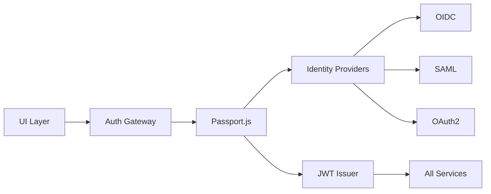
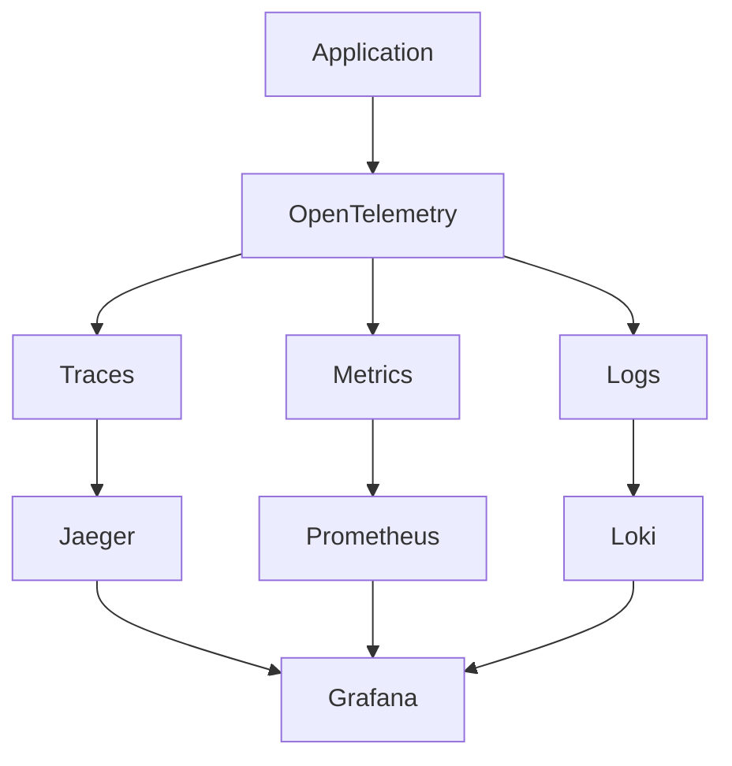
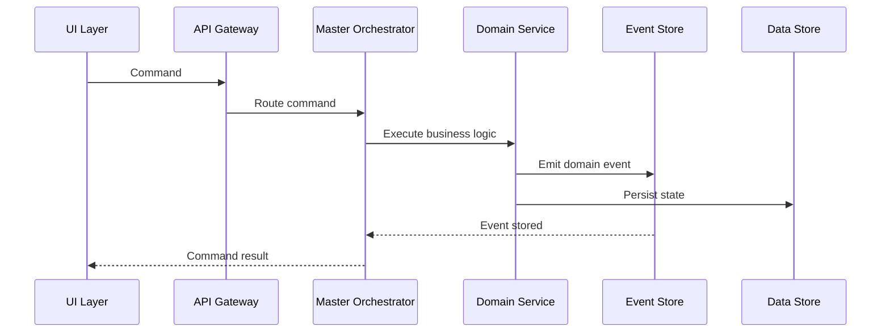
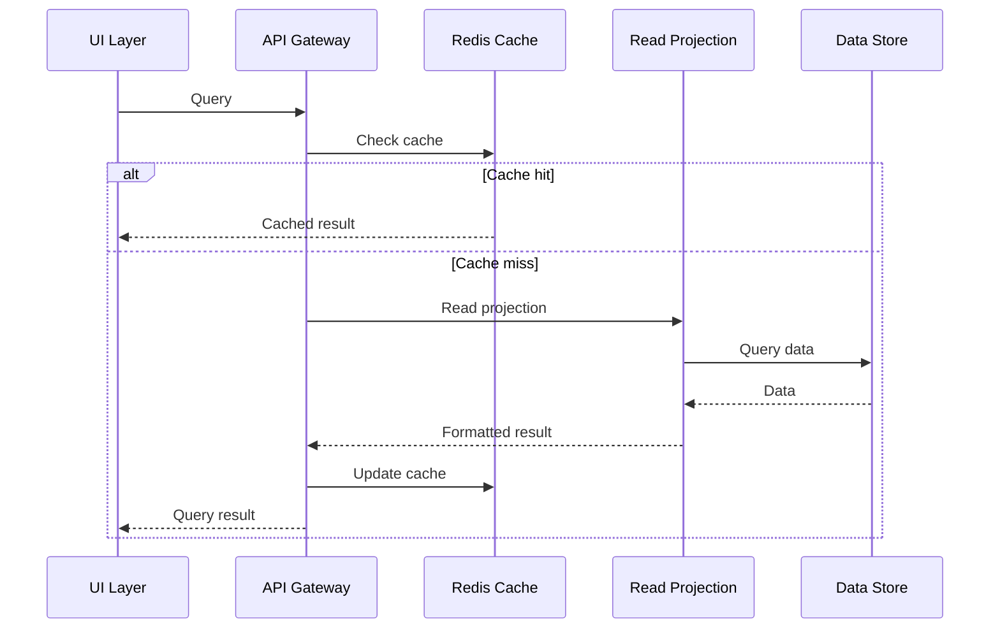

# Component-to-Technology Traceability Matrix

## Overview
This document provides detailed traceability from logical architecture components to their physical implementations, including interfaces, protocols, and data flows.

## Traceability Matrix Format

Each component mapping includes:
- **Logical Component**: From the logical architecture
- **Physical Technology**: Specific implementation choice
- **Interfaces**: How it connects to other components
- **Data Format**: How data is stored/transmitted
- **Dependencies**: Required libraries and services

## Presentation Layer Traceability

### Natural Language Interface
| Aspect | Details |
|--------|---------|
| **Logical Component** | Natural Language Interface |
| **Physical Technology** | Claude Code CLI |
| **Primary Interface** | stdin/stdout, IPC |
| **Secondary Interface** | WebSocket for real-time updates |
| **Data Format** | JSON-RPC 2.0 messages |
| **Key Dependencies** | `@anthropic/claude`, `yargs`, `inquirer` |
| **Integration Points** | Master Orchestrator (via IPC), Agent Coordinator (via CLI commands) |

### Knowledge Base Canvas
| Aspect | Details |
|--------|---------|
| **Logical Component** | Knowledge Base Canvas |
| **Physical Technology** | Obsidian Plugin (TypeScript) |
| **Primary Interface** | Obsidian Plugin API |
| **Secondary Interface** | File system watchers |
| **Data Format** | Markdown files with YAML frontmatter |
| **Key Dependencies** | `obsidian`, `obsidian-dataview`, `d3.js` |
| **Integration Points** | Local file system, MCP Obsidian server |

### Visual Project Canvas
| Aspect | Details |
|--------|---------|
| **Logical Component** | Visual Project Canvas |
| **Physical Technology** | Electron App with React |
| **Primary Interface** | IPC Main/Renderer |
| **Secondary Interface** | REST API to backend |
| **Data Format** | React state + Redux store |
| **Key Dependencies** | `electron`, `react`, `d3`, `react-flow` |
| **Integration Points** | All application services via API Gateway |

## Application Layer Traceability

### Master Orchestrator
| Aspect | Details |
|--------|---------|
| **Logical Component** | Master Orchestrator |
| **Physical Technology** | Node.js service with Bull Queue |
| **Primary Interface** | REST API (Express) |
| **Secondary Interface** | Redis Pub/Sub |
| **Data Format** | Job queues, Event streams |
| **Key Dependencies** | `bull`, `express`, `ioredis`, `eventemitter3` |
| **Integration Points** | All other application services, Domain layer via TypeScript interfaces |

### Agent Coordinator
| Aspect | Details |
|--------|---------|
| **Logical Component** | Agent Coordinator |
| **Physical Technology** | Node.js with Socket.io |
| **Primary Interface** | WebSocket |
| **Secondary Interface** | gRPC for agent communication |
| **Data Format** | Protocol Buffers, JSON |
| **Key Dependencies** | `socket.io`, `@grpc/grpc-js`, `protobufjs` |
| **Integration Points** | Claude Code Runtime, Local Agent Runtime, Agent Registry |

### Project Manager
| Aspect | Details |
|--------|---------|
| **Logical Component** | Project Manager Service |
| **Physical Technology** | Node.js with Temporal |
| **Primary Interface** | Temporal Workflows |
| **Secondary Interface** | GraphQL API |
| **Data Format** | Workflow definitions, State machines |
| **Key Dependencies** | `@temporalio/client`, `@temporalio/worker`, `apollo-server` |
| **Integration Points** | Project Domain, Methodology Engine, Knowledge Synthesizer |

### Synchronization Service
| Aspect | Details |
|--------|---------|
| **Logical Component** | Synchronization Service |
| **Physical Technology** | Y.js with WebRTC and libp2p |
| **Primary Interface** | WebRTC DataChannel |
| **Secondary Interface** | libp2p DHT |
| **Data Format** | CRDT operations, Binary deltas |
| **Key Dependencies** | `yjs`, `y-webrtc`, `libp2p`, `simple-peer` |
| **Integration Points** | All domains for state sync, Conflict resolver, Event store |

### Methodology Engine
| Aspect | Details |
|--------|---------|
| **Logical Component** | Methodology Engine |
| **Physical Technology** | TypeScript with JSON Schema |
| **Primary Interface** | TypeScript API |
| **Secondary Interface** | REST endpoints |
| **Data Format** | JSON Schema definitions, Markdown templates |
| **Key Dependencies** | `ajv`, `json-schema-to-typescript`, `handlebars` |
| **Integration Points** | Methodology Domain, Agent Coordinator, Project Manager |

### Knowledge Synthesizer
| Aspect | Details |
|--------|---------|
| **Logical Component** | Knowledge Synthesizer |
| **Physical Technology** | LangChain.js with LlamaIndex |
| **Primary Interface** | Async TypeScript API |
| **Secondary Interface** | Vector search API |
| **Data Format** | Embeddings, Document chunks |
| **Key Dependencies** | `langchain`, `llamaindex`, `openai`, `tiktoken` |
| **Integration Points** | Knowledge Domain, Vector Store, Document Store |

## Domain Layer Traceability

### Project Domain
| Aspect | Details |
|--------|---------|
| **Logical Component** | Project Domain |
| **Physical Technology** | TypeScript DDD implementation |
| **Primary Interface** | Domain services API |
| **Secondary Interface** | Event emitters |
| **Data Format** | Domain models, Value objects |
| **Key Dependencies** | `class-validator`, `class-transformer`, `reflect-metadata` |
| **Integration Points** | SQLite repository, Event store, File system |

### Methodology Domain
| Aspect | Details |
|--------|---------|
| **Logical Component** | Methodology Domain |
| **Physical Technology** | JSON Schema + Markdown |
| **Primary Interface** | Schema validator API |
| **Secondary Interface** | File system |
| **Data Format** | JSON Schema, Markdown with frontmatter |
| **Key Dependencies** | `ajv`, `gray-matter`, `remark`, `unified` |
| **Integration Points** | Methodology Engine, Marketplace, Version control |

### Agent Domain with Context Management
| Aspect | Details |
|--------|---------|
| **Logical Component** | Agent Domain + Context |
| **Physical Technology** | Markdown files with YAML frontmatter |
| **Primary Interface** | Claude Code compatible format |
| **Secondary Interface** | Git versioning |
| **Data Format** | Markdown agent definitions, YAML context |
| **Key Dependencies** | `gray-matter`, `js-yaml`, `chokidar` |
| **Integration Points** | Claude Code Runtime, Agent Registry, Context Store |

### Marketplace Domain
| Aspect | Details |
|--------|---------|
| **Logical Component** | Marketplace Domain |
| **Physical Technology** | IPFS + Ethereum L2 (Polygon) |
| **Primary Interface** | IPFS HTTP API |
| **Secondary Interface** | Web3 provider |
| **Data Format** | IPLD DAG, Smart contract ABI |
| **Key Dependencies** | `ipfs-http-client`, `ethers`, `@openzeppelin/contracts` |
| **Integration Points** | IPFS nodes, Polygon RPC, MetaMask |

### Knowledge Domain
| Aspect | Details |
|--------|---------|
| **Logical Component** | Knowledge Domain |
| **Physical Technology** | Neo4j Embedded |
| **Primary Interface** | Bolt protocol |
| **Secondary Interface** | Cypher queries |
| **Data Format** | Property graphs, Node relationships |
| **Key Dependencies** | `neo4j-driver`, `graphql-neo4j-js`, `@neo4j/graphql` |
| **Integration Points** | Knowledge Synthesizer, Vector Store, Document Store |

### User Domain
| Aspect | Details |
|--------|---------|
| **Logical Component** | User Domain |
| **Physical Technology** | Passport.js with JWT |
| **Primary Interface** | OAuth2/OIDC |
| **Secondary Interface** | REST API |
| **Data Format** | JWT tokens, User profiles |
| **Key Dependencies** | `passport`, `jsonwebtoken`, `argon2`, `speakeasy` |
| **Integration Points** | API Gateway, Session store, Identity providers |

## Infrastructure Layer Traceability

### File System Storage
| Aspect | Details |
|--------|---------|
| **Logical Component** | File System |
| **Physical Technology** | Node.js fs with Git |
| **Primary Interface** | fs promises API |
| **Secondary Interface** | Chokidar watchers |
| **Data Format** | Various file formats |
| **Key Dependencies** | `fs-extra`, `chokidar`, `simple-git`, `node-watch` |
| **Integration Points** | All domains, Version control, Backup service |

### Event Store
| Aspect | Details |
|--------|---------|
| **Logical Component** | Event Store |
| **Physical Technology** | EventStore DB (embedded) |
| **Primary Interface** | gRPC client |
| **Secondary Interface** | HTTP API |
| **Data Format** | Event streams, Projections |
| **Key Dependencies** | `@eventstore/db-client`, `uuid`, `protobufjs` |
| **Integration Points** | Domain events, Audit trail, Projections |

### Document Store
| Aspect | Details |
|--------|---------|
| **Logical Component** | Document Store |
| **Physical Technology** | MongoDB embedded mode |
| **Primary Interface** | MongoDB driver |
| **Secondary Interface** | GridFS for large files |
| **Data Format** | BSON documents |
| **Key Dependencies** | `mongodb`, `mongoose`, `gridfs-stream` |
| **Integration Points** | Domain repositories, Search indexing, Backup |

### Vector Store
| Aspect | Details |
|--------|---------|
| **Logical Component** | Vector Store |
| **Physical Technology** | ChromaDB |
| **Primary Interface** | REST API |
| **Secondary Interface** | Python client |
| **Data Format** | Embeddings, Metadata |
| **Key Dependencies** | `chromadb`, `openai`, `langchain` |
| **Integration Points** | Knowledge Synthesizer, Search service, LLM queries |

### Agent Framework
| Aspect | Details |
|--------|---------|
| **Logical Component** | Agent Framework |
| **Physical Technology** | Claude Code Runtime |
| **Primary Interface** | CLI commands |
| **Secondary Interface** | MCP protocol |
| **Data Format** | Markdown agents, JSON results |
| **Key Dependencies** | `@anthropic/claude`, MCP servers |
| **Integration Points** | Agent Coordinator, Agent Registry, MCP servers |

### Integration Services
| Aspect | Details |
|--------|---------|
| **Logical Component** | Integration Services |
| **Physical Technology** | MCP Protocol implementation |
| **Primary Interface** | MCP protocol |
| **Secondary Interface** | Adapter pattern |
| **Data Format** | MCP messages |
| **Key Dependencies** | Various MCP server packages |
| **Integration Points** | External services, GitHub, Obsidian, Context7 |

### Local Agent Runtime
| Aspect | Details |
|--------|---------|
| **Logical Component** | Local Agent Runtime |
| **Physical Technology** | Deno Isolates |
| **Primary Interface** | Deno runtime API |
| **Secondary Interface** | Worker threads |
| **Data Format** | TypeScript/JavaScript |
| **Key Dependencies** | `deno`, `@deno/runtime`, `comlink` |
| **Integration Points** | Agent Framework, Resource limiter, Sandbox |

## Cross-Cutting Technology Mappings

### Authentication & Authorization

### Monitoring & Observability

### Data Flow Patterns

#### Command Flow (Write Path)

#### Query Flow (Read Path)

## Technology Integration Points

### MCP Server Integrations
| MCP Server | Integration Point | Data Exchange |
|------------|------------------|---------------|
| GitHub MCP | Project Domain, Version Control | Repository operations, Issues, PRs |
| Obsidian MCP | Knowledge Domain, File System | Markdown files, Vault operations |
| Context7 MCP | Knowledge Synthesizer | Documentation, Code examples |
| Sequential MCP | Methodology Engine | Complex workflows, Multi-step processes |

### External Service Integrations
| Service | Integration Method | Purpose |
|---------|-------------------|---------|
| Anthropic API | REST API | Claude model access |
| OpenAI API | REST API | Embeddings, GPT models |
| Local LLMs | Ollama API | Privacy-preserving inference |
| IPFS | HTTP API | Decentralized storage |
| Ethereum L2 | JSON-RPC | Smart contracts |

## Performance Optimization Mappings

### Caching Strategy
| Layer | Cache Technology | TTL | Use Case |
|-------|-----------------|-----|----------|
| UI | React Query | 5 min | API responses |
| API | Redis | 1 hour | Session data |
| Domain | In-memory LRU | 10 min | Domain objects |
| Data | SQLite WAL | Persistent | Query results |

### Concurrency Patterns
| Component | Concurrency Model | Max Concurrent |
|-----------|------------------|----------------|
| Agent Coordinator | Worker Pool | CPU cores × 2 |
| Sync Service | Event Loop | Unlimited |
| Knowledge Synthesizer | Queue + Workers | 4 |
| File Operations | Thread Pool | 10 |

This traceability matrix ensures every logical component has a clear physical implementation with well-defined interfaces and integration points.