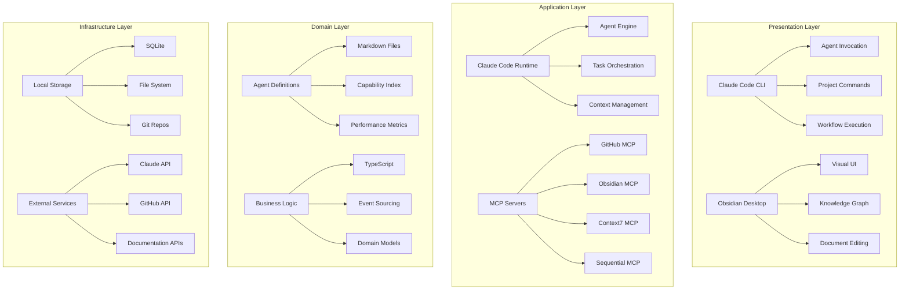
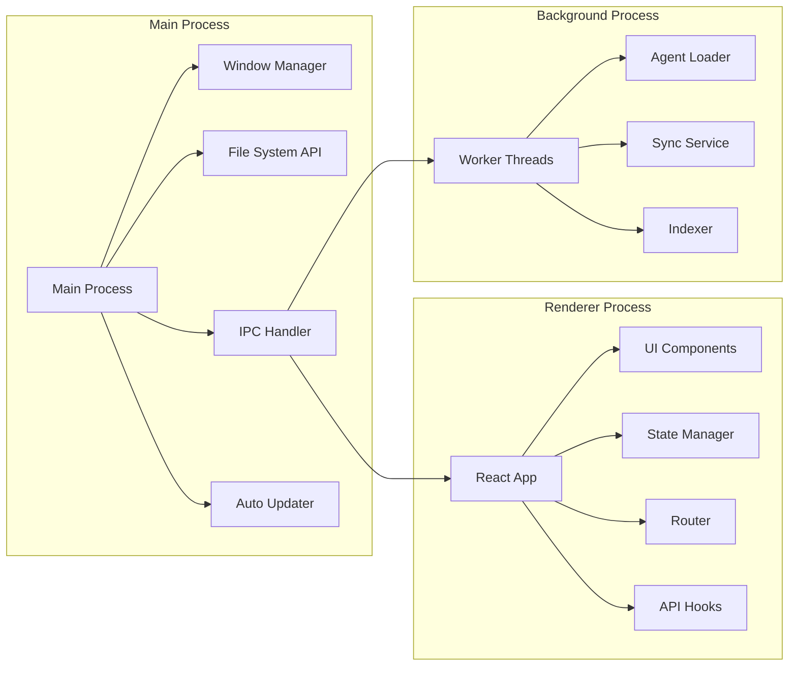
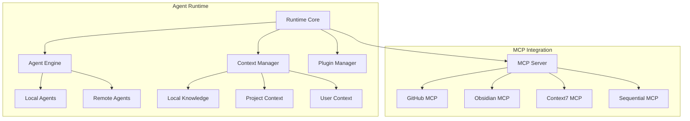
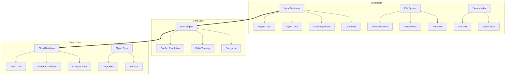
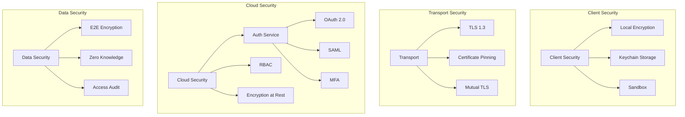
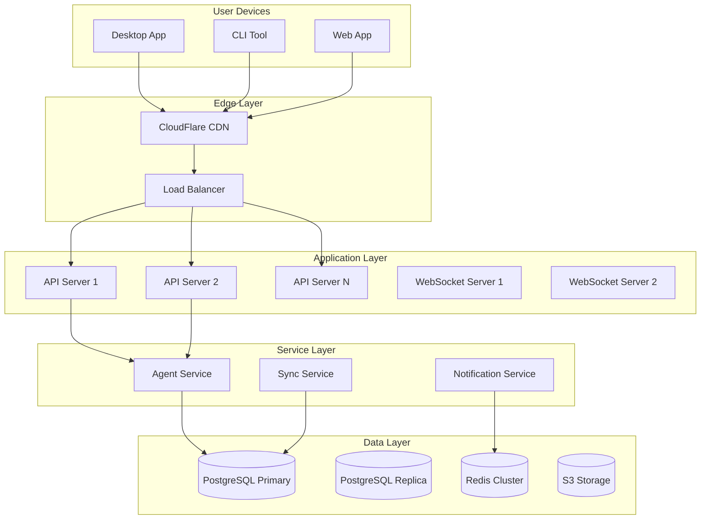
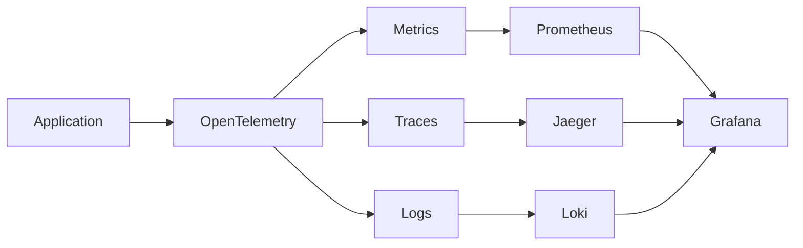

# ClaudeProjects Physical Architecture

## Overview

The physical architecture defines "how" the system is implemented, including technology choices, deployment topology, and infrastructure components. It maps the logical architecture to concrete implementations.

## Architecture Style

**Local-First Agent-Oriented Architecture**
- Claude Code CLI as the primary execution engine
- Obsidian desktop app as the knowledge management UI
- AI agents as markdown-based building blocks
- MCP ecosystem for integrations
- Progressive cloud enhancement for collaboration

## Technology Stack



## Component Architecture

### 1. Desktop Application (Electron)



**Technology Choices**:
- **Electron**: Cross-platform desktop app
- **React**: Modern UI framework
- **TypeScript**: Type safety
- **Redux Toolkit**: State management
- **Tailwind CSS**: Styling
- **Vite**: Build tool

### 2. Local Agent Runtime



**Technology Choices**:
- **Node.js**: JavaScript runtime
- **TypeScript**: Type safety
- **Bull**: Job queue for agent tasks
- **LangChain**: Agent orchestration
- **Ollama**: Local LLM support

### 3. Data Architecture



**Technology Choices**:
- **SQLite**: Local database
- **PostgreSQL**: Cloud database
- **MinIO/S3**: Object storage
- **Redis**: Caching and pub/sub
- **Elasticsearch**: Full-text search
- **Pinecone**: Vector database

### 4. Security Architecture



## Deployment Architecture

### Development Environment

```yaml
version: '3.8'
services:
  app:
    build: ./app
    volumes:
      - ./app:/app
      - /app/node_modules
    ports:
      - "3000:3000"
  
  api:
    build: ./api
    environment:
      - DATABASE_URL=postgresql://...
    ports:
      - "8000:8000"
  
  postgres:
    image: postgres:15
    volumes:
      - postgres_data:/var/lib/postgresql/data
  
  redis:
    image: redis:7-alpine
  
  minio:
    image: minio/minio
    command: server /data
```

### Production Architecture



## Directory Structure

```
ClaudeProjects2/
├── apps/
│   ├── desktop/          # Electron app
│   │   ├── src/
│   │   │   ├── main/    # Main process
│   │   │   ├── renderer/# React app
│   │   │   └── preload/ # Preload scripts
│   │   └── package.json
│   │
│   ├── cli/             # CLI tool
│   │   ├── src/
│   │   │   ├── commands/
│   │   │   ├── agents/
│   │   │   └── utils/
│   │   └── package.json
│   │
│   └── web/             # Web app
│       ├── src/
│       └── package.json
│
├── packages/            # Shared packages
│   ├── core/           # Core business logic
│   ├── agents/         # Agent definitions
│   ├── ui/            # UI components
│   └── types/         # TypeScript types
│
├── services/           # Backend services
│   ├── api/           # Main API
│   ├── sync/          # Sync service
│   ├── agents/        # Agent service
│   └── auth/          # Auth service
│
├── infrastructure/     # IaC and deployment
│   ├── terraform/
│   ├── kubernetes/
│   └── docker/
│
├── docs/              # Documentation
├── scripts/           # Build scripts
└── tests/            # Test suites
```

## Performance Optimizations

### 1. Local-First Performance
- SQLite for instant queries
- In-memory caching
- Background indexing
- Lazy loading

### 2. Network Optimization
- Delta sync only
- Compression (Brotli)
- Request batching
- Offline queue

### 3. Agent Performance
- Local LLM for simple tasks
- Agent result caching
- Parallel execution
- Progressive enhancement

## Scalability Strategy

### Horizontal Scaling
- Stateless API servers
- Distributed agent pools
- Read replicas
- CDN for static assets

### Vertical Scaling
- Agent GPU clusters
- High-memory cache nodes
- SSD-optimized databases

## Monitoring & Observability



**Metrics to Track**:
- Response times
- Agent performance
- Sync latency
- Error rates
- Resource usage

## Disaster Recovery

### Backup Strategy
- Local: Continuous file backup
- Cloud: Daily snapshots
- Critical: Real-time replication

### Recovery Targets
- RPO: 1 hour
- RTO: 4 hours
- Data retention: 90 days

## Cost Optimization

### Infrastructure Costs
- Local-first reduces cloud costs
- Serverless for burst workloads
- Reserved instances for base load
- Spot instances for agents

### Estimated Monthly Costs (1000 users)
- Compute: $2,000
- Storage: $500
- Network: $300
- AI APIs: $1,500
- **Total**: ~$4,300

## Future Considerations

### Phase 1 (Current)
- Desktop app with local agents
- Basic cloud sync
- Core MCP integrations

### Phase 2 (6 months)
- Mobile apps
- Enhanced collaboration
- Custom model training

### Phase 3 (12 months)
- Enterprise features
- On-premise deployment
- Advanced analytics

## Conclusion

This physical architecture provides a robust, scalable, and privacy-focused implementation of ClaudeProjects. The local-first approach ensures performance and data sovereignty while cloud services enable collaboration and advanced AI capabilities.