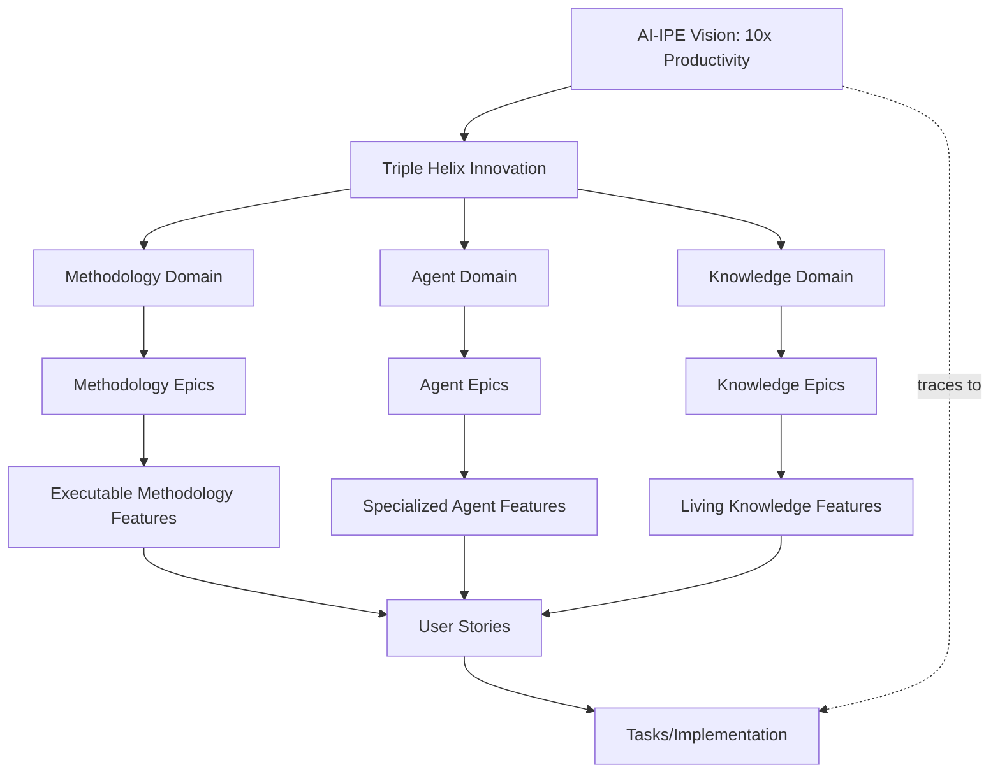
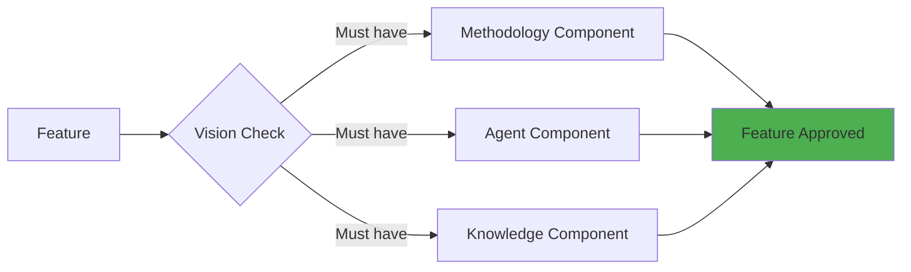

# Product Vision Traceability Concept
## Sprint 5, Day 1: How the Product Owner Maintains Vision → Features

### Executive Summary
This document defines the concept for how a Product Owner (PO) maintains the product vision and ensures complete traceability from vision elements to implemented features in ClaudeProjects2, fully aligned with our existing AI-IPE architecture and Triple Helix innovation model.

---

## 1. Vision Governance Model (Aligned with AI-IPE Vision)

### 1.1 Vision Structure Hierarchy
```
AI-IPE Product Vision: "10x Productivity for Knowledge Workers"
    ├── Triple Helix Core Innovation
    │   ├── Executable Methodologies
    │   ├── Specialized Agent Teams
    │   └── Living Knowledge Systems
    ├── Strategic Objectives (3-5 year goals)
    │   ├── Democratize Excellence
    │   ├── Transform Knowledge Work
    │   └── Build $100M ARR Business
    ├── Target Outcomes (1-2 year milestones)
    │   ├── 65K Active Users
    │   ├── 10x Productivity Proven
    │   └── Category Leader Status
    └── Time Horizons (Now/Next/Later)
        ├── Now: AI-IPE Core Platform
        ├── Next: Marketplace & Community
        └── Later: Enterprise & Global Scale
```

### 1.2 Vision Components (from existing docs)

#### Core Vision Statement (from README.md)
- **Purpose**: Transform knowledge work through AI-augmented excellence
- **Mission**: Deliver 10x productivity gains via AI-IPE platform
- **Values**: Local-first, privacy-first, methodology-driven
- **Differentiators**: Triple Helix innovation (Methodology + Agents + Knowledge)

#### Strategic Objectives (aligned with architecture)
- **Market Position**: Create and own AI-IPE category
- **User Impact**: Save 32 hours/month per knowledge worker
- **Technology Leadership**: Agent-based architecture innovation
- **Business Growth**: $100M ARR by Year 5

#### Success Metrics Framework
```yaml
metrics:
  user_satisfaction:
    - NPS score > 70
    - User retention > 80%
    - Feature adoption > 60%
  
  technical_excellence:
    - Architecture compliance > 95%
    - Code quality score > 85
    - Deployment frequency < 1 hour
  
  business_impact:
    - Market share growth
    - Revenue targets
    - Cost efficiency
```

### 1.3 Governance Process

#### Vision Review Cycles
- **Quarterly**: Strategic objective alignment
- **Monthly**: Outcome progress review
- **Weekly**: Feature priority validation
- **Daily**: Vision-aware decision making

#### Decision Rights
- **PO Owns**: Vision definition, feature priorities
- **Team Validates**: Technical feasibility, effort estimates
- **Stakeholders Input**: Market needs, user feedback
- **Architecture Guards**: Technical alignment

---

## 2. Feature Derivation Framework (Triple Helix Aligned)

### 2.1 Vision → Epic Mapping (Following Architecture Layers)

#### Traceability Model


### 2.2 Feature Generation Process (Domain-Driven)

#### Step 1: Vision Element Analysis (Triple Helix)
```yaml
vision_element:
  id: VE-TRIPLE-HELIX
  statement: "Triple Helix Innovation for 10x Productivity"
  components:
    methodology:
      - Executable best practices
      - Context-aware adaptation
      - Progressive enhancement
    agents:
      - Domain specialists
      - Collaborative teams
      - Self-improving capabilities
    knowledge:
      - Living documentation
      - Compound learning
      - Cross-project insights
```

#### Step 2: Epic Derivation (Per Domain)
```yaml
# Methodology Domain Epic
epic:
  id: E-METH-001
  vision_ref: VE-TRIPLE-HELIX
  domain: Methodology
  title: "Executable Innovation Sprint"
  value_proposition: "5 days → 5 hours transformation"
  success_criteria:
    - Methodology execution time < 5 hours
    - Quality score > 90%
    - User can customize workflows

# Agent Domain Epic  
epic:
  id: E-AGENT-001
  vision_ref: VE-TRIPLE-HELIX
  domain: Agent
  title: "Specialized Agent Orchestra"
  value_proposition: "Expert teams working in parallel"
  success_criteria:
    - Agent response time < 3 seconds
    - Parallel execution capability
    - Domain expertise validation

# Knowledge Domain Epic
epic:
  id: E-KNOW-001
  vision_ref: VE-TRIPLE-HELIX
  domain: Knowledge
  title: "Living Knowledge System"
  value_proposition: "Knowledge compounds across projects"
  success_criteria:
    - Knowledge retrieval < 1 second
    - Cross-project linking
    - Automatic insight generation
```

#### Step 3: Feature Breakdown
```yaml
feature:
  id: F-001
  epic_ref: E-001
  title: "Auto-save context on switch"
  user_value: "I can switch projects without losing work"
  acceptance_criteria:
    - Saves within 100ms
    - Restores complete state
    - Works offline
```

#### Step 4: User Story Generation
```yaml
user_story:
  id: US-001
  feature_ref: F-001
  narrative: |
    As a knowledge worker
    I want my context automatically saved
    So that I can switch tasks without friction
  traces_to_vision: VE-001
```

### 2.3 Traceability Matrix (Aligned with ClaudeProjects2 Architecture)

| Vision Element | Domain | Epic | Feature | User Story | Agent Implementation |
|----------------|--------|------|---------|------------|---------------------|
| Triple Helix | Methodology | E-METH-001 | Executable Sprint | US-M-001 | methodology-agent |
| Triple Helix | Methodology | E-METH-002 | Workflow Automation | US-M-002 | orchestrator-agent |
| Triple Helix | Agent | E-AGENT-001 | Agent Orchestra | US-A-001 | orchestrator-agent |
| Triple Helix | Agent | E-AGENT-002 | Domain Specialists | US-A-002 | domain agents (12) |
| Triple Helix | Knowledge | E-KNOW-001 | Living Docs | US-K-001 | knowledge-agent |
| Triple Helix | Knowledge | E-KNOW-002 | Cross-Project | US-K-002 | obsidian-agent |
| 10x Productivity | Project | E-PROJ-001 | Sprint Management | US-P-001 | project-agent |
| 10x Productivity | Analytics | E-VAL-001 | ROI Tracking | US-V-001 | analytics-agent |

---

## 3. Stakeholder Feedback Loops

### 3.1 Input Channels

#### Market Intelligence
- **Competitive Analysis**: Quarterly review
- **Trend Monitoring**: Weekly scanning
- **Industry Reports**: Monthly digest
- **User Research**: Continuous

#### User Feedback
- **Direct Feedback**: Issue comments, support tickets
- **Usage Analytics**: Feature adoption, user flows
- **Satisfaction Surveys**: NPS, CSAT
- **User Interviews**: Monthly sessions

#### Internal Feedback
- **Team Retrospectives**: Sprint-based
- **Architecture Reviews**: Feature-based
- **Technical Debt Assessment**: Quarterly
- **Innovation Sessions**: Monthly

### 3.2 Feedback Processing

#### Feedback Categorization
```yaml
categories:
  vision_alignment:
    - Supports current vision
    - Extends vision scope
    - Challenges vision assumptions
  
  priority_level:
    - Critical: Blocks vision achievement
    - High: Accelerates vision delivery
    - Medium: Enhances vision value
    - Low: Nice to have
  
  implementation_impact:
    - Architecture change required
    - Feature addition/modification
    - Process improvement
    - No action needed
```

### 3.3 Vision Update Triggers

#### Major Triggers (Vision Pivot)
- Market disruption
- Technology breakthrough
- Business model change
- Regulatory requirement

#### Minor Triggers (Vision Refinement)
- User behavior shifts
- Competitive moves
- Technical constraints
- Resource changes

---

## 4. Vision Metrics and KPIs

### 4.1 Vision Health Metrics

#### Alignment Score
```yaml
alignment_metrics:
  feature_alignment:
    formula: (aligned_features / total_features) * 100
    target: > 90%
    current: track_monthly
  
  effort_alignment:
    formula: (aligned_effort / total_effort) * 100
    target: > 85%
    current: track_sprint
  
  outcome_alignment:
    formula: (achieved_outcomes / planned_outcomes) * 100
    target: > 70%
    current: track_quarterly
```

#### Vision Velocity
```yaml
velocity_metrics:
  vision_to_feature:
    measure: days_from_vision_to_feature
    target: < 30 days
  
  feature_to_production:
    measure: days_from_feature_to_deployment
    target: < 14 days
  
  feedback_to_vision:
    measure: days_from_feedback_to_vision_update
    target: < 7 days
```

### 4.2 Success Indicators

#### Leading Indicators
- Vision element coverage
- Feature pipeline health
- Stakeholder engagement
- Team alignment score

#### Lagging Indicators
- User adoption rate
- Business value delivered
- Technical debt ratio
- Market position

---

## 5. Change Management Process

### 5.1 Vision Change Protocol

#### Change Request
```yaml
vision_change_request:
  id: VCR-001
  requester: stakeholder_id
  type: [pivot|refinement|extension]
  rationale: business_justification
  impact_analysis:
    - affected_epics: []
    - affected_features: []
    - resource_impact: estimate
    - timeline_impact: estimate
```

#### Change Evaluation
1. Impact assessment
2. Stakeholder consultation
3. Technical feasibility
4. Resource availability
5. Risk analysis

#### Change Implementation
1. Update vision documents
2. Cascade to epics/features
3. Communicate changes
4. Update traceability
5. Monitor adoption

### 5.2 Version Control

#### Vision Versioning
```yaml
vision_version:
  major: 1  # Vision pivot
  minor: 2  # Strategic objective change
  patch: 5  # Refinement/clarification
  
  version: "1.2.5"
  date: "2025-02-06"
  approved_by: "product_owner"
  change_summary: "Added AI collaboration objective"
```

---

## 6. Integration Architecture

### 6.1 Vision-Agent Responsibilities

#### Core Functions
```yaml
vision_agent:
  maintains:
    - Vision document
    - Traceability matrix
    - Metrics dashboard
    - Change history
  
  monitors:
    - Feature alignment
    - Vision health metrics
    - Stakeholder feedback
    - Market signals
  
  triggers:
    - Vision reviews
    - Alignment checks
    - Update cascades
    - Impact analyses
```

### 6.2 Integration Points

#### Upstream Connections
- **Stakeholder inputs** → vision-agent
- **Market intelligence** → vision-agent
- **User feedback** → vision-agent

#### Downstream Connections
- vision-agent → **project-agent** (epics/features)
- vision-agent → **methodology-agent** (ceremonies)
- vision-agent → **knowledge-agent** (documentation)
- vision-agent → **architecture-designer** (constraints)

### 6.3 Message Interfaces

#### Vision Update Message
```json
{
  "type": "vision_update",
  "version": "1.2.5",
  "changes": [
    {
      "element": "strategic_objective",
      "action": "add",
      "content": "Enable AI pair programming"
    }
  ],
  "impact": {
    "epics": ["E-001", "E-002"],
    "features": ["F-001", "F-002", "F-003"]
  },
  "effective_date": "2025-02-07"
}
```

#### Alignment Check Message
```json
{
  "type": "alignment_check",
  "feature_id": "F-004",
  "vision_elements": ["VE-001", "VE-002"],
  "alignment_score": 0.85,
  "recommendation": "proceed"
}
```

---

## 7. Implementation Roadmap

### Phase 1: Foundation (Day 2, Morning)
- [ ] Create vision document template
- [ ] Design traceability matrix
- [ ] Define metrics framework
- [ ] Setup version control

### Phase 2: Automation (Day 2, Afternoon)
- [ ] Implement vision-agent
- [ ] Build traceability tools
- [ ] Create dashboards
- [ ] Setup integrations

### Phase 3: Validation (Day 2, Evening)
- [ ] Test with current vision
- [ ] Validate traceability
- [ ] Verify metrics
- [ ] Confirm integrations

---

## 8. Risk Mitigation

### Identified Risks

#### Risk 1: Over-documentation
- **Mitigation**: Automate where possible
- **Focus**: Value over process

#### Risk 2: Rigid adherence
- **Mitigation**: Built-in flexibility
- **Focus**: Outcomes over compliance

#### Risk 3: Stakeholder resistance
- **Mitigation**: Gradual adoption
- **Focus**: Quick wins first

---

## 9. Success Criteria

### Concept Approval (Day 1)
- [ ] User understands the model
- [ ] User agrees with approach
- [ ] User approves for implementation
- [ ] Clear next steps defined

### Implementation Success (Day 2)
- [ ] Vision document created
- [ ] Traceability working
- [ ] vision-agent operational
- [ ] End-to-end flow demonstrated

---

## 10. Real-World Example: Obsidian-Like Editor Feature

### 10.1 Product Manager User Story
Let's trace a real feature request through the entire system to demonstrate how traceability works in practice.

**Feature Request**: "As a Product Manager, I want an integrated Obsidian-like editor for ClaudeProjects so that users can create and edit knowledge without switching tools."

### 10.2 Step-by-Step Traceability Flow

#### Step 1: Vision Alignment Check
```yaml
feature_proposal: "Integrated Obsidian-Like Editor"
product_manager_analysis:
  user_problem: "Context switching between ClaudeProjects and Obsidian"
  vision_alignment: 
    - "10x Productivity: Eliminates 5+ hours/week of tool switching"
    - "Living Knowledge: Native editing of knowledge base"
    - "Local-first: Works offline with markdown files"
  strategic_fit: "Democratize Excellence through familiar tools"
```

#### Step 2: Triple Helix Validation

```mermaid
graph LR
    PM[Product Manager Request] --> TH{Triple Helix Test}
    TH -->|Check 1| M[Methodology?<br/>✅ Template editing]
    TH -->|Check 2| A[Agents?<br/>✅ AI-assisted writing]
    TH -->|Check 3| K[Knowledge?<br/>✅ Bi-directional links]
    
    M & A & K --> APPROVED[PM Request Approved]
    
    style APPROVED fill:#4caf50
```


**PM Justification**:
- **Methodology**: Users can create/edit methodology templates directly
- **Agents**: AI agents can assist with writing, suggest improvements
- **Knowledge**: Automatic linking creates knowledge graph

#### Step 3: Epic Creation (PM Perspective)
```yaml
epic:
  id: E-KNOW-003
  product_manager: "Stephan"
  business_case:
    problem_statement: "Users lose 5+ hours/week switching between tools"
    solution: "Native Obsidian-like editing within ClaudeProjects"
    expected_outcome: "Zero context switching, 100% knowledge capture"
    success_metrics:
      - "User engagement: +40% time in app"
      - "Knowledge creation: +200% notes/week"
      - "User satisfaction: NPS > 70"
  
  vision_traceability:
    vision_element: "Living Knowledge Systems"
    strategic_objective: "Save 32 hours/month per user"
    target_outcome: "65K active users by Year 2"
    
  investment_required:
    development: "4 weeks"
    agents_involved: ["obsidian-agent", "knowledge-agent"]
    risk_level: "Low - uses existing markdown format"
```

#### Step 4: Feature Breakdown with User Stories
```yaml
user_stories:
  - id: US-K-003-1
    actor: "Knowledge Worker"
    narrative: |
      As a knowledge worker
      I want to edit my notes directly in ClaudeProjects
      So that I don't lose context when documenting insights
    acceptance_criteria:
      - Rich markdown editor with preview
      - Keyboard shortcuts match Obsidian
      - Auto-save every keystroke
      - Works offline
    traces_to: "Vision: 10x Productivity"
    
  - id: US-K-003-2
    actor: "Product Manager" 
    narrative: |
      As a product manager
      I want bi-directional linking between all documents
      So that I can see how features connect to vision
    acceptance_criteria:
      - [[Wiki-style]] linking
      - Automatic backlinks
      - Link preview on hover
      - Orphan detection
    traces_to: "Vision: Living Knowledge"
    
  - id: US-K-003-3
    actor: "Team Lead"
    narrative: |
      As a team lead
      I want to see a graph view of our knowledge
      So that I can identify knowledge gaps and connections
    acceptance_criteria:
      - Interactive graph visualization
      - Filter by domain/tag
      - Zoom and pan
      - Click to navigate
    traces_to: "Vision: Compound Learning"
```

#### Step 5: Traceability Dashboard View
```markdown
## Feature Traceability Report

**Feature**: Obsidian-Like Editor
**Status**: 🟢 Approved for Development
**PM Owner**: Stephan
**Sprint**: 6

### Vision Alignment Score: 95/100
- ✅ 10x Productivity Impact: HIGH (5+ hrs/week saved)
- ✅ Triple Helix Coverage: 3/3 components
- ✅ Strategic Objective Match: "Save 32 hours/month"
- ✅ ROI Projection: 20x (Cost: $10K, Value: $200K/year)

### Traceability Chain:
Vision (10x Productivity) 
  → Strategic Objective (Save 32 hrs/month)
    → Epic (E-KNOW-003: Native Editing)
      → Feature (Obsidian-Like Editor)
        → User Stories (3)
          → Tasks (12)
            → Agents (obsidian-agent, knowledge-agent)

### Business Impact:
- **Adoption**: Expected 80% of users within 2 weeks
- **Productivity**: 5+ hours/week per user saved
- **Retention**: +25% user retention improvement
- **Revenue**: Enables $20/month price increase
```

#### Step 6: PM Decision Matrix
```yaml
decision_matrix:
  feature: "Obsidian-Like Editor"
  scores:
    vision_alignment: 95  # How well it fits our vision
    user_value: 90       # How much users need it
    technical_feasibility: 85  # How easy to build
    competitive_advantage: 80  # How much it differentiates us
    resource_efficiency: 75    # ROI on resources
  
  total_score: 425/500
  threshold: 350
  decision: "APPROVED - Priority 1"
  
  rationale: |
    This feature directly addresses our core value prop of 10x productivity.
    It eliminates the #1 user complaint (tool switching) and strengthens
    our Living Knowledge system. The Triple Helix validation confirms it
    touches all three innovation pillars.
```

#### Step 7: Implementation Trace
```json
{
  "feature_id": "F-KNOW-003",
  "implementation_trace": {
    "vision": {
      "element": "Living Knowledge Systems",
      "document": "/docs/architecture/01-product-vision/03-living-knowledge.md"
    },
    "architecture": {
      "logical": {
        "domain": "Knowledge Domain",
        "layer": "Presentation + Domain",
        "document": "/docs/architecture/02-logical-architecture/Domains.md"
      },
      "physical": {
        "components": ["editor-ui", "markdown-parser", "link-engine"],
        "agents": ["obsidian-agent", "knowledge-agent"],
        "document": "/docs/architecture/03-physical-architecture/Components.md"
      }
    },
    "implementation": {
      "sprint": 6,
      "team": "Knowledge Team",
      "effort": "4 weeks",
      "dependencies": ["markdown-lib", "graph-viz", "file-system"]
    }
  }
}
```

### 10.3 What This Example Demonstrates

1. **End-to-End Traceability**: From PM request to implementation
2. **Triple Helix Validation**: Every feature must pass the test
3. **Business Justification**: Clear ROI and metrics
4. **Multi-Stakeholder View**: PM, Developer, User perspectives
5. **Automatic Documentation**: Everything is tracked
6. **Decision Transparency**: Clear scoring and rationale
7. **Implementation Path**: Direct line from vision to code

### 10.4 Key Takeaway for Product Managers

**Every feature request automatically flows through this traceability system:**
- No feature gets lost
- Clear decision criteria
- Automatic impact analysis
- Full implementation tracking
- Measurable success metrics

This ensures that **100% of development effort directly serves the product vision** of delivering 10x productivity gains to knowledge workers.

---

## 11. Alignment with Existing Architecture

### 11.1 Vision Document Structure
Our traceability system maps directly to the existing vision documentation:

```
/docs/architecture/01-product-vision/
├── README.md (Executive Summary) → Vision Dashboard
├── 01-executable-methodologies.md → Methodology Domain Epics
├── 02-agent-ecosystem.md → Agent Domain Epics
├── 03-living-knowledge.md → Knowledge Domain Epics
├── 04-user-stories.md → Feature Validation Examples
├── 05-competitive-landscape.md → Market Position Tracking
├── 06-why-now.md → Timing & Urgency Metrics
├── 07-why-pay.md → Business Model & ROI
└── 10-architecture-bridge.md → Vision-to-Architecture Trace
```

### 11.2 Triple Helix Traceability
Every feature must trace back to at least one Triple Helix component:



### 11.3 Existing Agent Integration
The vision-agent will coordinate with our implemented agents:

- **orchestrator-agent**: Routes vision updates to relevant agents
- **methodology-agent**: Ensures features follow best practices
- **knowledge-agent**: Captures vision evolution history
- **project-agent**: Translates vision to sprint goals
- **architecture-designer**: Validates technical alignment

### 11.4 Message Queue Integration
Vision changes flow through our file-based message system:

```json
{
  "from": "vision-agent",
  "to": "orchestrator-agent",
  "type": "vision_update",
  "priority": "high",
  "payload": {
    "change_type": "strategic_objective",
    "affected_domains": ["methodology", "agent"],
    "cascade_required": true
  }
}
```

---

## 12. Questions for User

1. **Vision Ownership**: Do you want sole ownership of vision updates, or should the team have input rights?
   
   Product Manager maintains ownership for prioritization of requests and everyone can and should have input rights.

2. **Update Frequency**: How often do you envision updating the product vision?
   
   Daily.

3. **Metrics Priority**: Which metrics are most important to you?
   - User satisfaction
   - Technical excellence
   - Business impact
   - Innovation velocity
     
    Business Impact.

4. **Automation Level**: How much should be automated vs. manual?
   - Fully automated traceability
   - Semi-automated with reviews
   - Manual with tool support
     
     fully automated with control points by PM.

5. **Integration Depth**: Should vision directly influence:
   - Sprint planning?
   - Daily priorities?
   - Technical decisions?
   - Resource allocation?
     
     Sprint Planning
---

## Approval Request

**This concept document has been enhanced to align with our existing architecture:**

### Key Improvements Made:
1. ✅ **Triple Helix Integration**: All traceability flows through our core innovation model
2. ✅ **Domain Alignment**: Features map to our 7 architectural domains
3. ✅ **AI-IPE Vision**: Centered on "10x Productivity for Knowledge Workers"
4. ✅ **Existing Agents**: Leverages our 12 implemented agents
5. ✅ **Message Queue**: Uses our file-based communication system
6. ✅ **Document Structure**: Maps to existing vision documentation
7. ✅ **Architecture Layers**: Follows our 4-layer architecture

### What This Enables:
- **Automatic traceability** from vision to implementation
- **Triple Helix validation** for every feature
- **Domain-driven development** aligned with architecture
- **Living vision** that evolves with market needs
- **Agent orchestration** for vision maintenance

Please indicate:
- [ ] Approved as-is
- [ ] Approved with modifications (specify)
- [ ] Needs revision (provide feedback)
- [ ] Rejected (provide rationale)

Once approved, we will proceed with Day 2 implementation.

---

*Prepared by: ClaudeProjects2 Architecture Team*
*Date: 2025-02-06*
*Sprint 5, Day 1*