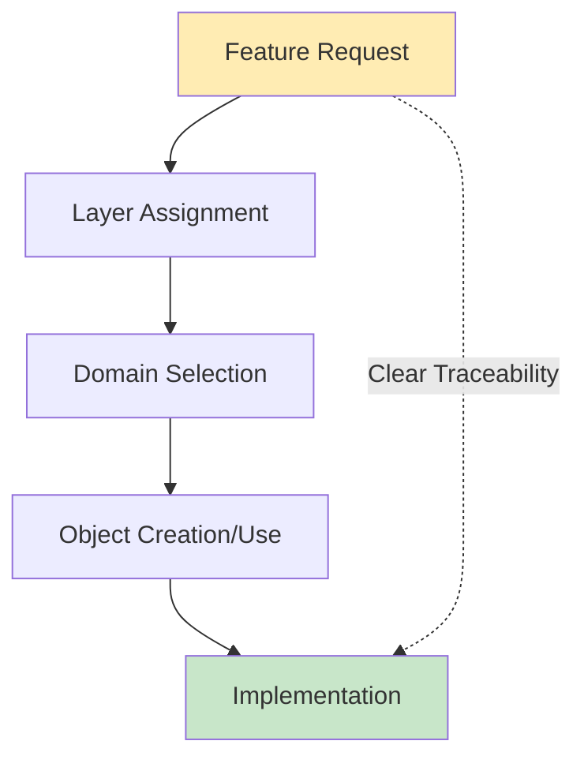
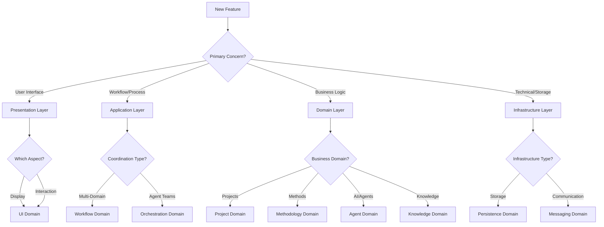
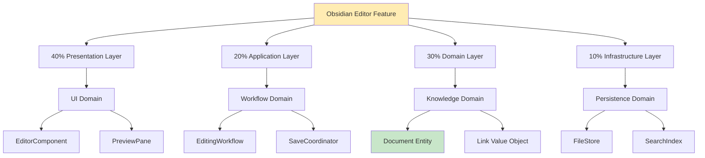

# Logical Architecture Traceability Concept
## Sprint 5, Day 3: Feature → Layer → Domain → Object Mapping

### Executive Summary
This document defines how features flow through our logical architecture with clear, traceable relationships from Layers to Domains to Objects, addressing the current "fuzziness" in our architecture.

---

## 1. The Current Problem

### What's Fuzzy Now
- **Unclear Layer-Domain Ownership**: Which layer "owns" which domain?
- **Missing Domain-Object Definitions**: What objects live in each domain?
- **Ambiguous Feature Routing**: How does a feature know which layer/domain/object to use?
- **Cross-Domain Confusion**: When do domains interact vs. when do layers interact?

### What We Need


---

## 2. Proposed Layer → Domain → Object Hierarchy

### 2.1 Clear Layer-Domain Ownership Model

```yaml
layers:
  presentation:
    owns_domains:
      - user_interface_domain
    references_domains:
      - user_domain (for preferences)
      - project_domain (for display data)
    responsibilities:
      - UI components
      - User interactions
      - Visual feedback
      
  application:
    owns_domains:
      - workflow_domain
      - orchestration_domain
    references_domains:
      - all_domains (for coordination)
    responsibilities:
      - Use case orchestration
      - Workflow management
      - Cross-domain coordination
      
  domain:
    owns_domains:
      - project_domain
      - methodology_domain
      - agent_domain
      - knowledge_domain
      - user_domain
      - value_analytics_domain
      - marketplace_domain
    references_domains: none (this IS the domain layer)
    responsibilities:
      - Business logic
      - Domain rules
      - Entity management
      
  infrastructure:
    owns_domains:
      - persistence_domain
      - messaging_domain
      - integration_domain
    references_domains:
      - all_domains (provides services to)
    responsibilities:
      - Technical services
      - External integrations
      - Data persistence
```

### 2.2 Domain → Object Mapping

```yaml
domain_objects:
  project_domain:
    aggregates:
      - Project:
          root: true
          contains: [Sprint, Task, Milestone]
      - Sprint:
          root: false
          contains: [Story, Task]
    entities:
      - Task
      - Story
      - Milestone
      - Deliverable
    value_objects:
      - ProjectStatus
      - Priority
      - Deadline
      - Progress
    domain_services:
      - ProjectCreationService
      - SprintPlanningService
      - ProgressTrackingService
      
  methodology_domain:
    aggregates:
      - Methodology:
          root: true
          contains: [Phase, Step, Artifact]
      - Workflow:
          root: true
          contains: [Activity, Decision, Gate]
    entities:
      - Phase
      - Step
      - Activity
      - QualityGate
    value_objects:
      - ExecutionContext
      - MethodologyType
      - Complexity
      - Duration
    domain_services:
      - MethodologyExecutor
      - WorkflowEngine
      - GateValidator
      
  agent_domain:
    aggregates:
      - AgentTeam:
          root: true
          contains: [Agent, Role, Capability]
      - Agent:
          root: false
          contains: [Skill, State, History]
    entities:
      - Agent
      - Skill
      - Message
      - Task
    value_objects:
      - AgentType
      - Priority
      - ResponseTime
      - Capability
    domain_services:
      - AgentOrchestrator
      - MessageRouter
      - CapabilityMatcher
      
  knowledge_domain:
    aggregates:
      - KnowledgeBase:
          root: true
          contains: [Document, Link, Tag]
      - Document:
          root: false
          contains: [Section, Reference, Metadata]
    entities:
      - Document
      - Note
      - Insight
      - Reference
    value_objects:
      - DocumentType
      - LinkType
      - Tag
      - Version
    domain_services:
      - KnowledgeIndexer
      - LinkResolver
      - InsightGenerator
```

---

## 3. Feature → Architecture Traceability Flow

### 3.1 Feature Classification



### 3.2 Traceability Decision Tree

```yaml
feature_routing:
  step1_identify_layer:
    question: "What is the primary architectural concern?"
    answers:
      - ui_presentation: → Presentation Layer
      - business_logic: → Domain Layer
      - workflow_coordination: → Application Layer
      - technical_infrastructure: → Infrastructure Layer
      
  step2_identify_domain:
    question: "Which domain owns this capability?"
    presentation_domains:
      - user_interface_domain: "UI components and interactions"
    application_domains:
      - workflow_domain: "Multi-step processes"
      - orchestration_domain: "Agent coordination"
    domain_domains:
      - project_domain: "Project management"
      - methodology_domain: "Best practices"
      - agent_domain: "AI capabilities"
      - knowledge_domain: "Information management"
      - user_domain: "User identity/preferences"
      - value_analytics_domain: "Metrics and ROI"
      - marketplace_domain: "Sharing and monetization"
    infrastructure_domains:
      - persistence_domain: "Data storage"
      - messaging_domain: "Communication"
      - integration_domain: "External systems"
      
  step3_identify_objects:
    question: "Which objects are involved?"
    determine:
      - aggregates: "Root entities with boundaries"
      - entities: "Objects with identity"
      - value_objects: "Immutable descriptors"
      - services: "Domain operations"
```

---

## 4. Real Example: "Obsidian-Like Editor" Feature

### 4.1 Feature Analysis

```yaml
feature: "Obsidian-Like Editor"
analysis:
  primary_concern: "User interface for editing"
  secondary_concerns:
    - "Knowledge storage"
    - "Agent interaction with content"
  triple_helix:
    methodology: "Document templates"
    agents: "AI-assisted writing"
    knowledge: "Bi-directional linking"
```

### 4.2 Layer Assignment

```yaml
layer_distribution:
  presentation_layer:
    responsibility: "Editor UI, preview, commands"
    percentage: 40%
    domains:
      - user_interface_domain
    objects:
      - EditorComponent
      - PreviewPane
      - CommandPalette
      
  application_layer:
    responsibility: "Editing workflows, save coordination"
    percentage: 20%
    domains:
      - workflow_domain
    objects:
      - EditingWorkflow
      - SaveCoordinator
      - VersionManager
      
  domain_layer:
    responsibility: "Document model, linking logic"
    percentage: 30%
    domains:
      - knowledge_domain
    objects:
      - Document (entity)
      - Link (value object)
      - DocumentService
      
  infrastructure_layer:
    responsibility: "File storage, indexing"
    percentage: 10%
    domains:
      - persistence_domain
    objects:
      - FileStore
      - SearchIndex
      - CacheManager
```

### 4.3 Complete Traceability



---

## 5. Proposed Implementation

### 5.1 Architecture Documentation Updates

```yaml
required_updates:
  layers.md:
    - Add explicit domain ownership table
    - Define layer interaction rules
    - Add feature routing guide
    
  domains.md:
    - Add complete object model per domain
    - Define aggregate boundaries
    - Document domain services
    
  cross-cutting.md:
    - Add traceability concern
    - Define feature flow patterns
    - Document decision process
```

### 5.2 Domain Model Templates

```yaml
domain_template:
  name: [Domain Name]
  layer: [Owning Layer]
  purpose: [Why this domain exists]
  
  aggregates:
    - name: [Aggregate Name]
      root: [Root Entity]
      invariants: [Business Rules]
      boundaries: [What's included]
      
  entities:
    - name: [Entity Name]
      identity: [How identified]
      lifecycle: [Creation to deletion]
      relationships: [To other entities]
      
  value_objects:
    - name: [Value Object Name]
      attributes: [Properties]
      immutable: true
      equality: [How compared]
      
  domain_services:
    - name: [Service Name]
      responsibility: [What it does]
      operations: [Methods]
      rules: [Business logic]
      
  domain_events:
    - name: [Event Name]
      trigger: [What causes it]
      payload: [Data included]
      subscribers: [Who listens]
```

### 5.3 Feature Traceability Template

```yaml
feature_trace:
  feature_id: [ID]
  feature_name: [Name]
  
  layer_analysis:
    primary_layer: [Main layer]
    secondary_layers: [Supporting layers]
    distribution: [Percentage per layer]
    
  domain_mapping:
    primary_domain: [Main domain]
    supporting_domains: [Helper domains]
    domain_interactions: [How they collaborate]
    
  object_identification:
    new_objects:
      - type: [aggregate|entity|value|service]
        name: [Object name]
        domain: [Owning domain]
        purpose: [Why needed]
    existing_objects:
      - name: [Object name]
        modification: [What changes]
        impact: [Side effects]
        
  implementation_path:
    sequence:
      1. [Layer] → [Domain] → [Object] → [Method]
      2. [Layer] → [Domain] → [Object] → [Method]
```

---

## 6. Benefits of This Approach

### 6.1 Clear Ownership
- Every domain has exactly one owning layer
- Every object has exactly one owning domain
- No ambiguity about where code belongs

### 6.2 Traceable Features
- Feature → Layer → Domain → Object → Implementation
- Complete visibility of impact
- Easy change management

### 6.3 Reduced Complexity
- Clear boundaries reduce coupling
- Defined interactions prevent spaghetti
- Explicit ownership simplifies maintenance

### 6.4 Better Testing
- Test at appropriate level (unit/integration/e2e)
- Clear mock boundaries
- Isolated domain logic

---

## 7. Migration Strategy

### 7.1 Phase 1: Document Current State
- Map existing code to domains
- Identify domain objects
- Document current relationships

### 7.2 Phase 2: Define Target State
- Apply new layer-domain model
- Create domain object models
- Define clear boundaries

### 7.3 Phase 3: Refactor Gradually
- Move code to proper domains
- Create missing domain objects
- Establish clear interfaces

---

## 8. Success Criteria

### Concept Success
- [ ] Clear layer → domain ownership
- [ ] Complete domain → object models
- [ ] Unambiguous feature routing
- [ ] Traceable implementation paths

### Implementation Success
- [ ] All domains have object models
- [ ] All features have traceability docs
- [ ] Domain boundaries are enforced
- [ ] No cross-domain direct calls

---

## 9. Questions for Approval

1. **Layer-Domain Ownership**: Does the proposed ownership model make sense?
2. **Domain Objects**: Should we define all objects now or incrementally?
3. **Enforcement**: How strict should boundary enforcement be?
4. **Documentation**: What level of detail for object models?
5. **Tooling**: Should we build tools to enforce/validate traceability?

---

## Approval Request

This concept addresses the "fuzziness" in our logical architecture by establishing:

1. ✅ **Clear Layer → Domain ownership**
2. ✅ **Complete Domain → Object models**
3. ✅ **Traceable Feature → Implementation paths**
4. ✅ **Explicit boundaries and interactions**

Please review and indicate:
- [ ] Approved as-is
- [ ] Approved with modifications (specify)
- [ ] Needs revision (provide feedback)

Once approved, Day 4 will implement these models and create the necessary documentation and tooling.

---

*Prepared by: ClaudeProjects2 Architecture Team*
*Date: 2025-02-06*
*Sprint 5, Day 3*