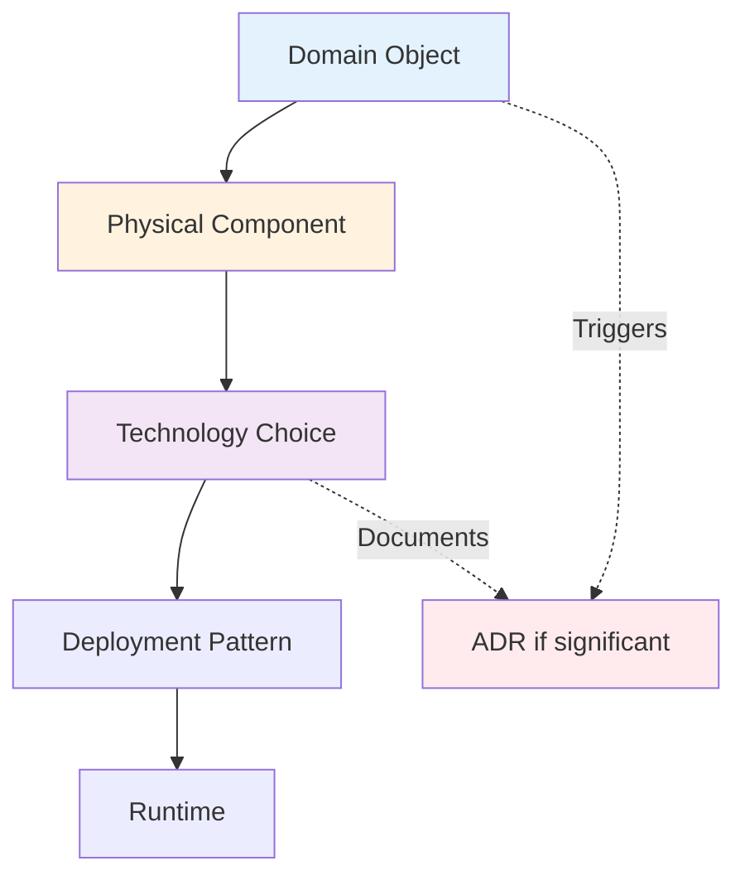

# Physical Architecture Traceability Concept
## Sprint 5, Day 5: Object → Component → Technology → Deployment Mapping

### Executive Summary
This document defines how logical objects (from domains) map to physical components, technology choices, and deployment artifacts, with automatic ADR generation for significant decisions.

---

## 1. Current State Analysis

### What We Have
- **Agent-based architecture**: Everything is a Claude Code agent
- **File-based infrastructure**: No databases, all file storage
- **CLAUDE.md orchestration**: Living configuration
- **12 core agents**: Already implemented and operational

### What's Missing
- **Object → Component mapping**: How domain objects become real code
- **Technology selection criteria**: When to choose what technology
- **ADR triggers**: What decisions need documentation
- **Deployment traceability**: From component to running system

---

## 2. Object → Component → Technology Mapping

### 2.1 Mapping Hierarchy



### 2.2 Object Type → Component Pattern Mapping

```yaml
object_to_component_mapping:
  aggregate:
    maps_to: Agent or Service Module
    technology: 
      - Claude Code agent (for complex logic)
      - TypeScript module (for simple logic)
    storage: File-based aggregate store
    example: "Project aggregate → project-agent"
    
  entity:
    maps_to: Data Model + Repository
    technology:
      - TypeScript class/interface
      - JSON schema for validation
    storage: JSON or Markdown files
    example: "Document entity → document.ts + DocumentRepository"
    
  value_object:
    maps_to: Immutable Type/Class
    technology:
      - TypeScript type or class
      - Frozen objects
    storage: Embedded in entities
    example: "DocumentType → types/document-type.ts"
    
  domain_service:
    maps_to: Stateless Function Module
    technology:
      - Pure TypeScript functions
      - Agent capability (if AI needed)
    storage: No storage (stateless)
    example: "LinkResolutionService → services/link-resolver.ts"
    
  domain_event:
    maps_to: Message Queue Entry
    technology:
      - JSON message format
      - File-based queue
    storage: Message queue directories
    example: "DocumentCreated → messages/document-created.json"
    
  repository:
    maps_to: Storage Adapter
    technology:
      - File system operations
      - Search index (if needed)
    storage: File system + optional index
    example: "DocumentRepository → adapters/document-store.ts"
```

### 2.3 Technology Selection Matrix

```yaml
technology_decisions:
  when_to_use_agent:
    criteria:
      - Complex reasoning required
      - Natural language processing
      - Multi-step workflows
      - Learning/adaptation needed
    examples:
      - methodology-agent (complex workflow execution)
      - research-agent (intelligent search)
      
  when_to_use_typescript:
    criteria:
      - Simple CRUD operations
      - Data transformations
      - Utility functions
      - Performance critical
    examples:
      - File operations
      - JSON parsing
      - Data validation
      
  when_to_use_markdown:
    criteria:
      - Human-readable content
      - Documentation
      - Configuration
    examples:
      - Knowledge documents
      - Agent specifications
      - CLAUDE.md
      
  when_to_use_json:
    criteria:
      - Structured data
      - Message formats
      - State storage
    examples:
      - Message queue entries
      - Configuration files
      - Entity storage
```

---

## 3. ADR (Architecture Decision Record) Automation

### 3.1 ADR Trigger Conditions

```yaml
adr_triggers:
  automatic_triggers:
    - New technology introduced
    - Performance optimization > 50% improvement
    - Security pattern change
    - Data storage pattern change
    - Integration pattern change
    - Agent communication pattern change
    
  threshold_triggers:
    - Component coupling > 5 dependencies
    - Response time requirement < 100ms
    - Data volume > 10GB
    - Concurrent users > 100
    
  manual_triggers:
    - Significant trade-off decision
    - Deviation from standard patterns
    - External dependency added
    - Breaking change introduced
```

### 3.2 ADR Template

```markdown
# ADR-[NUMBER]: [Title]

## Status
[Proposed | Accepted | Deprecated | Superseded]

## Context
[What is the issue/requirement/constraint?]

## Decision
[What technology/pattern/approach chosen?]

## Consequences
### Positive
- [Benefits gained]

### Negative
- [Trade-offs accepted]

### Neutral
- [Other impacts]

## Traceability
- Triggered by: [Object/Component/Feature]
- Affects: [Components list]
- Related ADRs: [ADR numbers]
```

### 3.3 Automated ADR Generation

```yaml
adr_automation:
  detection:
    - Monitor object → component mappings
    - Track technology introductions
    - Measure performance changes
    - Analyze dependency graphs
    
  generation:
    - Create ADR from template
    - Fill known information
    - Link to triggering elements
    - Request human review
    
  tracking:
    - Maintain ADR registry
    - Update traceability links
    - Monitor decision impacts
    - Alert on conflicts
```

---

## 4. Component Implementation Patterns

### 4.1 Agent Component Pattern

```typescript
// For domain logic requiring AI capabilities
interface AgentComponent {
  name: string
  domain: string
  capabilities: Capability[]
  messageHandlers: MessageHandler[]
  stateFile: string
}

// Maps from: Complex aggregates, intelligent services
// Example: methodology-agent handles Methodology aggregate
```

### 4.2 Service Module Pattern

```typescript
// For stateless domain services
interface ServiceModule {
  name: string
  operations: Operation[]
  dependencies: string[]
  pureFunction: boolean
}

// Maps from: Domain services
// Example: LinkResolutionService → link-resolver.ts
```

### 4.3 Repository Pattern

```typescript
// For data persistence
interface Repository {
  aggregateType: string
  storageFormat: 'json' | 'markdown' | 'yaml'
  indexStrategy: 'none' | 'sqlite' | 'full-text'
  cacheStrategy: CacheStrategy
}

// Maps from: Repository interfaces
// Example: DocumentRepository → file system + search index
```

### 4.4 Message Pattern

```typescript
// For domain events and commands
interface Message {
  type: 'command' | 'event' | 'query'
  source: string
  target: string
  payload: object
  timestamp: number
}

// Maps from: Domain events
// Example: DocumentCreated event → message queue
```

---

## 5. Deployment Traceability

### 5.1 Component → Deployment Mapping

```yaml
deployment_mapping:
  agents:
    location: /agents/
    activation: CLAUDE.md references
    runtime: Claude Code CLI
    monitoring: Agent state files
    
  services:
    location: /services/
    activation: Import statements
    runtime: Node.js process
    monitoring: Performance logs
    
  repositories:
    location: /repositories/
    activation: Dependency injection
    runtime: File system access
    monitoring: Access logs
    
  messages:
    location: /.claudeprojects/messages/
    activation: File watchers
    runtime: Event loop
    monitoring: Queue depth metrics
```

### 5.2 Deployment Verification

```yaml
verification:
  pre_deployment:
    - Component dependency check
    - File permission verification
    - Agent specification validation
    - Message queue setup
    
  post_deployment:
    - Agent responsiveness test
    - Message flow verification
    - State persistence check
    - Performance baseline
    
  continuous:
    - Health checks every 60s
    - Queue depth monitoring
    - Error rate tracking
    - Performance metrics
```

---

## 6. Real Example: Document Object → Physical Implementation

### 6.1 Starting Point (Logical)

```yaml
domain_object:
  type: entity
  name: Document
  domain: knowledge_domain
  attributes:
    - id: UUID
    - title: string
    - content: MarkdownContent
    - metadata: DocumentMetadata
```

### 6.2 Physical Mapping

```yaml
physical_implementation:
  components:
    - name: document.ts
      type: data_model
      technology: TypeScript interface
      location: /models/document.ts
      
    - name: DocumentRepository
      type: repository
      technology: File system adapter
      location: /repositories/document-repository.ts
      
    - name: document-indexer
      type: service
      technology: SQLite FTS
      location: /services/document-indexer.ts
      
    - name: knowledge-agent
      type: agent
      technology: Claude Code agent
      location: /agents/domain/knowledge-agent.md
      
  storage:
    format: Markdown files
    location: /knowledge-base/
    naming: {id}-{slug}.md
    index: /indices/documents.sqlite
    
  messages:
    DocumentCreated:
      queue: /.claudeprojects/messages/events/
      format: JSON
      retention: 7 days
```

### 6.3 ADR Triggered

```markdown
# ADR-012: Markdown Storage for Documents

## Status
Accepted

## Context
Document entities need persistent storage that is human-readable,
version-controllable, and supports rich formatting.

## Decision
Store documents as Markdown files in the file system rather than
in a database or as JSON.

## Consequences
### Positive
- Human-readable and editable
- Git-friendly for version control
- Supports rich formatting natively
- No database dependency

### Negative
- Requires parsing for structured data
- Search requires separate index
- No ACID transactions

## Traceability
- Triggered by: Document entity implementation
- Affects: DocumentRepository, knowledge-agent
- Related ADRs: ADR-003 (File-based architecture)
```

---

## 7. Benefits of This Approach

### 7.1 Complete Traceability
```
Vision → Feature → Layer → Domain → Object → Component → Technology → Deployment
```

### 7.2 Automatic Documentation
- ADRs generated for significant decisions
- Technology choices justified
- Trade-offs documented

### 7.3 Consistency
- Standard patterns for object types
- Clear technology selection criteria
- Predictable deployment structure

### 7.4 Maintainability
- Know exactly where code lives
- Understand why technologies chosen
- Track decision evolution

---

## 8. Implementation Plan

### Day 6 Tasks
1. Create physical-architect-agent
2. Build ADR automation tools
3. Document component patterns
4. Create deployment templates
5. Test with real examples

---

## 9. Success Criteria

### Concept Success
- [ ] Clear object → component mapping
- [ ] Technology selection criteria defined
- [ ] ADR triggers identified
- [ ] Deployment patterns established

### Implementation Success
- [ ] physical-architect-agent operational
- [ ] ADR automation working
- [ ] Component templates created
- [ ] Full traceability demonstrated

---

## 10. Questions for Approval

1. **ADR Automation Level**: Should all triggers be automatic or require confirmation?
   
   ADR's requiere confirmation
   
2. **Technology Preferences**: Any specific technology constraints/preferences?
   
   Ideally prepared as ADR's
   
3. **Component Granularity**: How fine-grained should components be?
   
   Decision of physical architecture agent
   
4. **Deployment Validation**: What level of automated testing for deployments?
   
   Fully with demo at end of sprints

---

## Approval Request

This concept provides complete traceability from domain objects to running components:

1. ✅ **Object → Component mapping patterns**
2. ✅ **Technology selection criteria**
3. ✅ **ADR automation triggers**
4. ✅ **Deployment traceability**

Please review and indicate:
- [x] Approved as-is
- [ ] Approved with modifications (specify)
- [ ] Needs revision (provide feedback)

Once approved, Day 6 will implement the physical-architect-agent and ADR automation.

---

*Prepared by: ClaudeProjects2 Architecture Team*
*Date: 2025-02-06*
*Sprint 5, Day 5*