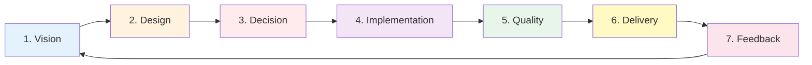
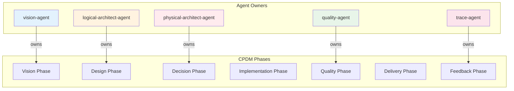

# CPDM: Claude Projects Development Method
## Sprint 5, Day 7: End-to-End Development Methodology with Quality Gates

### Executive Summary
CPDM is a comprehensive development methodology that leverages our complete traceability chain from vision to deployment, with enforced quality gates at each phase transition. It integrates all our architectural agents into a cohesive workflow.

---

## 1. CPDM Overview

### Core Principle
**"Every line of code traces back to the vision, every decision is documented, every phase has quality gates."**

### Documentation Location
The CPDM methodology will be permanently documented at:
- **Primary**: `/docs/methodologies/CPDM/` - Complete methodology reference
- **Quick Reference**: `/docs/methodologies/CPDM-Quick-Reference.md`
- **Integration**: Links from `/docs/Architecture Centric Methodology.md`
- **Templates**: `/docs/methodologies/CPDM/templates/` - Phase templates and checklists

### The Seven Phases of CPDM



---

## 2. Phase Definitions

### Phase 1: Vision
**Purpose**: Align features with product vision and strategic objectives

```yaml
vision_phase:
  owner: vision-agent
  trigger: New feature request or vision update
  
  activities:
    - Vision alignment check
    - Triple Helix validation
    - Business impact analysis
    - ROI calculation
    - Priority assignment
    
  inputs:
    - Feature request
    - Market signals
    - User feedback
    
  outputs:
    - Validated feature
    - Business case
    - Priority ranking
    - Traceability links
    
  quality_gates:
    - Triple Helix test passed (M+A+K)
    - ROI > 10x
    - PM approval received
    
  exit_criteria:
    - Feature traces to vision element
    - Business value quantified
    - Priority confirmed
```

### Phase 2: Design
**Purpose**: Transform features into architectural designs

```yaml
design_phase:
  owner: logical-architect-agent
  trigger: Validated feature from Vision phase
  
  activities:
    - Layer assignment
    - Domain identification
    - Object modeling
    - Boundary definition
    - Interface design
    
  inputs:
    - Validated feature
    - Vision traceability
    - Existing architecture
    
  outputs:
    - Layer distribution
    - Domain models
    - Object specifications
    - Interface contracts
    
  quality_gates:
    - Layer boundaries respected
    - Domain ownership clear
    - Objects fully specified
    - No circular dependencies
    
  exit_criteria:
    - Complete domain model
    - All objects defined
    - Interfaces documented
```

### Phase 3: Decision
**Purpose**: Make and document architectural decisions

```yaml
decision_phase:
  owner: physical-architect-agent
  trigger: Domain objects from Design phase
  
  activities:
    - Component mapping
    - Technology selection
    - ADR generation
    - Confirmation requests
    - Deployment planning
    
  inputs:
    - Domain objects
    - Quality requirements
    - Constraints
    
  outputs:
    - Component specifications
    - Technology choices
    - ADRs (confirmed)
    - Deployment plans
    
  quality_gates:
    - All ADRs confirmed
    - Technology consistency
    - No architecture violations
    - Deployment feasible
    
  exit_criteria:
    - Components specified
    - ADRs documented
    - Technologies selected
```

### Phase 4: Implementation
**Purpose**: Build components according to specifications

```yaml
implementation_phase:
  owner: development-team + agents
  trigger: Component specifications from Decision phase
  
  activities:
    - Code development
    - Agent creation
    - Unit testing
    - Documentation
    - Code review
    
  inputs:
    - Component specs
    - ADRs
    - Interface contracts
    
  outputs:
    - Working code
    - Configured agents
    - Unit tests
    - Documentation
    
  quality_gates:
    - Code review passed
    - Unit tests passing
    - Documentation complete
    - Traceability maintained
    
  exit_criteria:
    - All components built
    - Tests passing
    - Docs updated
```

### Phase 5: Quality
**Purpose**: Ensure implementation meets all quality standards

```yaml
quality_phase:
  owner: quality-agent
  trigger: Completed implementation
  
  activities:
    - Integration testing
    - Performance testing
    - Security scanning
    - Architecture validation
    - Traceability verification
    
  inputs:
    - Implemented components
    - Test scenarios
    - Quality criteria
    
  outputs:
    - Test results
    - Performance metrics
    - Validation report
    - Quality certificate
    
  quality_gates:
    - Integration tests pass
    - Performance targets met
    - Security scan clean
    - Architecture compliant
    - Traceability complete
    
  exit_criteria:
    - All tests passing
    - Quality certified
    - Ready for delivery
```

### Phase 6: Delivery
**Purpose**: Deploy to production environment

```yaml
delivery_phase:
  owner: deployment-team
  trigger: Quality certification
  
  activities:
    - Deployment preparation
    - Environment setup
    - Deployment execution
    - Smoke testing
    - Monitoring setup
    
  inputs:
    - Quality-certified components
    - Deployment plans
    - Environment configs
    
  outputs:
    - Deployed system
    - Monitoring dashboards
    - Deployment report
    - Rollback plan
    
  quality_gates:
    - Deployment successful
    - Smoke tests pass
    - Monitoring active
    - Rollback tested
    
  exit_criteria:
    - System operational
    - Users can access
    - Metrics flowing
```

### Phase 7: Feedback
**Purpose**: Collect metrics and feedback to improve

```yaml
feedback_phase:
  owner: trace-agent
  trigger: System in production
  
  activities:
    - Usage monitoring
    - Performance tracking
    - User feedback collection
    - Issue identification
    - Improvement proposals
    
  inputs:
    - Production metrics
    - User feedback
    - Error logs
    
  outputs:
    - Performance reports
    - User satisfaction metrics
    - Improvement backlog
    - Vision updates (if needed)
    
  quality_gates:
    - Metrics collected
    - Feedback analyzed
    - Actions identified
    
  exit_criteria:
    - Feedback loop closed
    - Improvements queued
    - Vision updated (if needed)
```

---

## 3. Quality Gates Framework

### Gate Enforcement Levels

```yaml
enforcement_levels:
  mandatory:
    description: "Cannot proceed without passing"
    examples:
      - Triple Helix validation
      - ADR confirmation
      - Security scan
    action_on_failure: "Block progression"
    
  recommended:
    description: "Should pass but can override"
    examples:
      - Code coverage > 80%
      - Performance optimization
    action_on_failure: "Warning + justification required"
    
  optional:
    description: "Nice to have"
    examples:
      - Documentation enhancements
      - Additional test scenarios
    action_on_failure: "Log for future improvement"
```

### Gate Automation

```yaml
automated_gates:
  vision_phase:
    - triple_helix_check: automated
    - roi_calculation: automated
    - pm_approval: manual
    
  design_phase:
    - boundary_validation: automated
    - dependency_check: automated
    - completeness_check: automated
    
  decision_phase:
    - adr_generation: automated
    - confirmation_request: automated
    - consistency_check: automated
    
  implementation_phase:
    - unit_tests: automated
    - lint_checks: automated
    - code_review: manual
    
  quality_phase:
    - integration_tests: automated
    - performance_tests: automated
    - security_scan: automated
    
  delivery_phase:
    - deployment_validation: automated
    - smoke_tests: automated
    - rollback_test: automated
```

---

## 4. Agent Orchestration

### Phase Ownership



### Agent Collaboration

```yaml
phase_transitions:
  vision_to_design:
    from: vision-agent
    to: logical-architect-agent
    handoff:
      - Validated feature
      - Vision traceability
      - Business case
      
  design_to_decision:
    from: logical-architect-agent
    to: physical-architect-agent
    handoff:
      - Domain objects
      - Layer distribution
      - Interface specs
      
  decision_to_implementation:
    from: physical-architect-agent
    to: development-team
    handoff:
      - Component specs
      - ADRs
      - Technology stack
      
  implementation_to_quality:
    from: development-team
    to: quality-agent
    handoff:
      - Completed code
      - Unit tests
      - Documentation
      
  quality_to_delivery:
    from: quality-agent
    to: deployment-team
    handoff:
      - Quality certificate
      - Test results
      - Performance metrics
      
  delivery_to_feedback:
    from: deployment-team
    to: trace-agent
    handoff:
      - Deployment status
      - System metrics
      - Access points
      
  feedback_to_vision:
    from: trace-agent
    to: vision-agent
    handoff:
      - User feedback
      - Performance data
      - Improvement suggestions
```

---

## 5. Workflow Patterns

### Standard Feature Flow

```yaml
standard_flow:
  duration: 5-10 days
  pattern:
    day_1: Vision phase
    day_2-3: Design phase
    day_4: Decision phase
    day_5-7: Implementation phase
    day_8: Quality phase
    day_9: Delivery phase
    day_10: Feedback phase
    
  parallelization:
    - Design can start before Vision fully complete
    - Decision can overlap with Design refinement
    - Quality can begin during Implementation
```

### Fast Track (Bug Fixes)

```yaml
fast_track:
  duration: 1-2 days
  pattern:
    - Skip Vision phase (pre-approved)
    - Minimal Design phase
    - Quick Decision (standard patterns)
    - Implementation
    - Quality (focused testing)
    - Delivery
    
  quality_gates: "Reduced but not eliminated"
```

### Experimental Flow

```yaml
experimental:
  duration: Variable
  pattern:
    - Vision phase (hypothesis)
    - Design phase (prototype)
    - Decision phase (temporary)
    - Implementation (spike)
    - Quality (basic validation)
    - Delivery (limited/beta)
    - Feedback (extensive)
    
  quality_gates: "Relaxed for learning"
```

---

## 6. Metrics and Reporting

### Phase Metrics

```yaml
phase_metrics:
  vision:
    - Features validated per sprint
    - Average ROI score
    - Triple Helix pass rate
    
  design:
    - Design time per feature
    - Domain model completeness
    - Architecture violations
    
  decision:
    - ADRs generated
    - Confirmation time
    - Technology changes
    
  implementation:
    - Velocity (story points)
    - Code quality score
    - Test coverage
    
  quality:
    - Defect detection rate
    - Test pass rate
    - Performance metrics
    
  delivery:
    - Deployment success rate
    - Time to production
    - Rollback frequency
    
  feedback:
    - User satisfaction
    - System performance
    - Improvement velocity
```

### CPDM Dashboard

```yaml
dashboard_components:
  phase_status:
    - Current phase for each feature
    - Time in phase
    - Blocked items
    
  quality_gates:
    - Gate pass/fail rates
    - Override frequency
    - Gate performance
    
  traceability:
    - Vision coverage
    - End-to-end traces
    - Orphaned components
    
  metrics:
    - Cycle time
    - Lead time
    - Throughput
    - Quality trends
```

---

## 7. Tool Integration

### Required Tools

```yaml
tools:
  vision_phase:
    - Vision dashboard
    - ROI calculator
    - Priority matrix
    
  design_phase:
    - Domain modeler
    - Architecture validator
    - Dependency analyzer
    
  decision_phase:
    - ADR generator
    - Technology matrix
    - Confirmation system
    
  implementation_phase:
    - IDE/Editor
    - Version control
    - Code review tools
    
  quality_phase:
    - Test runners
    - Performance profilers
    - Security scanners
    
  delivery_phase:
    - Deployment pipeline
    - Monitoring tools
    - Rollback system
    
  feedback_phase:
    - Analytics platform
    - Feedback collector
    - Report generator
```

---

## 8. Success Criteria

### CPDM Success Metrics

```yaml
success_criteria:
  efficiency:
    - Cycle time reduced by 50%
    - Quality gates automated > 80%
    - Rework reduced by 70%
    
  quality:
    - Defect escape rate < 5%
    - Architecture compliance > 95%
    - Test coverage > 80%
    
  traceability:
    - 100% features trace to vision
    - 100% code traces to features
    - 100% decisions documented
    
  satisfaction:
    - Developer NPS > 70
    - Stakeholder satisfaction > 90%
    - User satisfaction > 85%
```

---

## 9. Implementation Plan

### Day 8 Implementation Tasks

1. **Create quality-agent**
   - Gate enforcement
   - Test orchestration
   - Metrics collection

2. **Create trace-agent**
   - Traceability tracking
   - Feedback collection
   - Report generation

3. **Build workflow engine**
   - Phase transitions
   - Gate evaluation
   - Status tracking

4. **Setup dashboards**
   - Phase status
   - Metrics display
   - Traceability view

---

## 10. Questions for Approval

1. **Phase Duration**: Are the suggested phase durations appropriate?
2. **Gate Strictness**: Is the mandatory/recommended/optional classification correct?
3. **Fast Track**: What criteria should qualify for fast track?
4. **Metrics Priority**: Which metrics are most important to track?
5. **Tool Requirements**: Any specific tools to integrate?

---

## Approval Request

CPDM provides a complete development methodology that:

1. ✅ **Seven clear phases** from Vision to Feedback
2. ✅ **Quality gates** at each phase transition
3. ✅ **Full traceability** throughout
4. ✅ **Agent orchestration** for automation
5. ✅ **Flexible workflows** for different scenarios

Please review and indicate:
- [ ] Approved as-is
- [x] Approved with modifications (specify)
      
      first diagram has parsing errors.
      
- [ ] Needs revision (provide feedback)

Once approved, Day 8 will implement the quality-agent, trace-agent, and workflow engine.

---

*Prepared by: ClaudeProjects2 Architecture Team*
*Date: 2025-02-06*
*Sprint 5, Day 7*