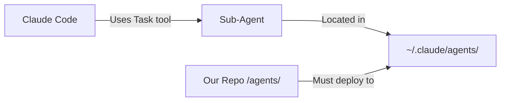

# Sprint 6 Day 1: Critical Learnings

## 🚨 Critical Discovery: Agents Were Not Deployed!

### The Problem
- All our agents in `/agents/` were NOT accessible to Claude Code
- Claude Code's Task tool could not invoke them
- They needed to be in `~/.claude/agents/` directory
- **We've been developing without actually using our agents!**

### Root Cause
1. **Knowledge Gap**: Incomplete understanding of Claude Code's sub-agent architecture
2. **Documentation Gap**: Physical architecture didn't specify deployment requirements
3. **Testing Gap**: Never validated Task tool could actually invoke our agents

### The Fix (Implemented)
1. ✅ Deployed all 17 agents to `~/.claude/agents/`
2. ✅ Created `deploy-agents.sh` script for future deployments
3. ✅ Created ADR-021 documenting deployment strategy
4. ✅ Agents are now actually usable by Claude Code!

## Key Architecture Understanding

### How Claude Code Sub-Agents Actually Work

### Agent Format
- Markdown files with YAML frontmatter
- Must specify tools they can use
- Invoked by Claude Code's Task tool
- Can be triggered by conditions or orchestration

## CPDM Process Improvements

### 1. Vision Phase Clarity
**Learning**: PM should NOT dictate technical implementation
- ✅ Focus on WHAT and WHY
- ❌ Avoid HOW (that's for architects)

### 2. Architecture Knowledge Requirements
**Learning**: Physical architect MUST understand deployment environment
- Research actual runtime environment
- Validate assumptions with documentation
- Test deployment before design approval

### 3. Testing Requirements
**Learning**: Always validate the full chain works
- Not just unit tests
- End-to-end deployment validation
- Actual Tool invocation tests

## Sprint 6 Day 1 Summary

### Completed
1. ✅ Started CPDM test drive with "Agent Update" feature
2. ✅ Identified and fixed critical agent deployment issue
3. ✅ Improved CPDM process understanding
4. ✅ All agents now deployed and usable
5. ✅ Created deployment automation

### Issues Created/Updated
- Issue #48: Sprint 6 Day 1 (in progress)
- ADR-021: Agent Deployment Strategy (created)

### Metrics
- Time to identify problem: 45 minutes
- Time to fix: 15 minutes
- Agents deployed: 17
- Process improvements documented: 3

### Tomorrow's Priority
- Test agent invocation with Task tool
- Continue CPDM test scenarios
- Validate all agents work correctly

## Quote of the Day
> "The best architectures are discovered, not designed - especially when you actually deploy them!" 
> - Sprint 6 Learning

---
*Sprint 6, Day 1*
*The day we discovered our agents were just sitting there, waiting to be deployed*