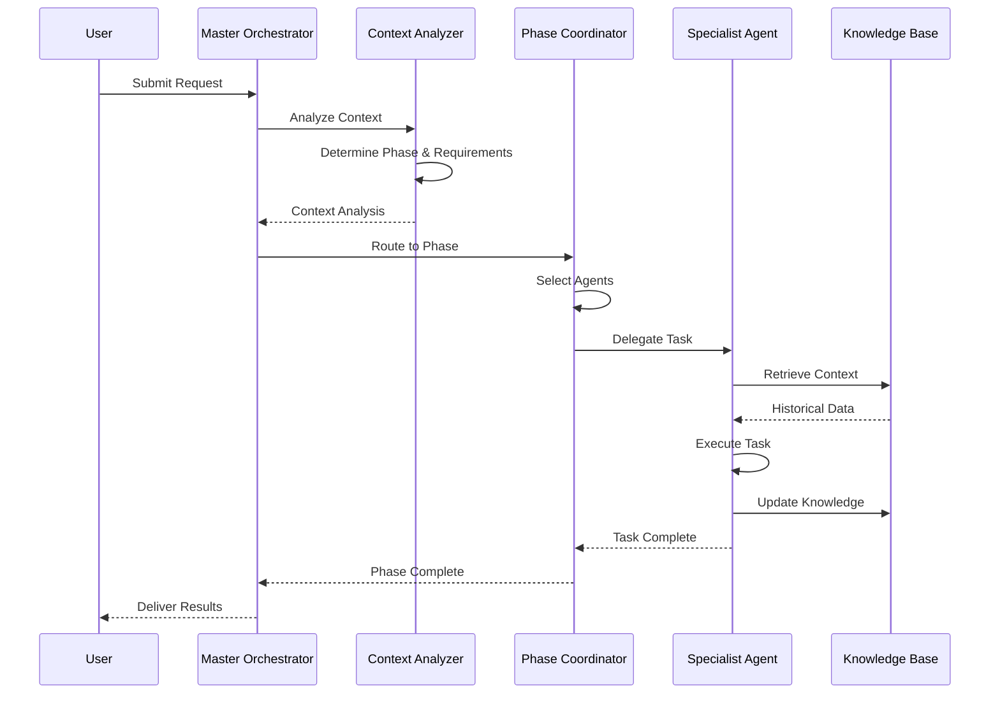
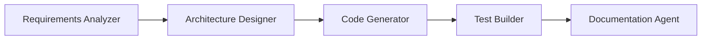
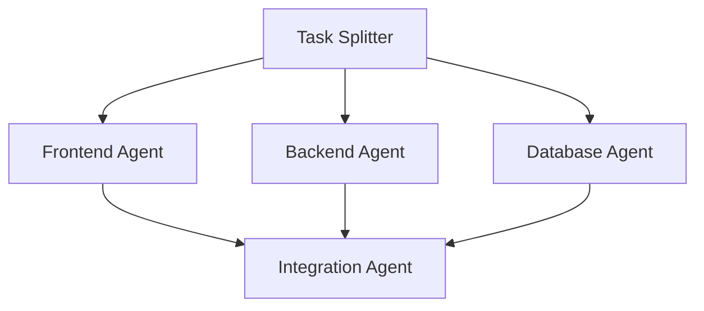
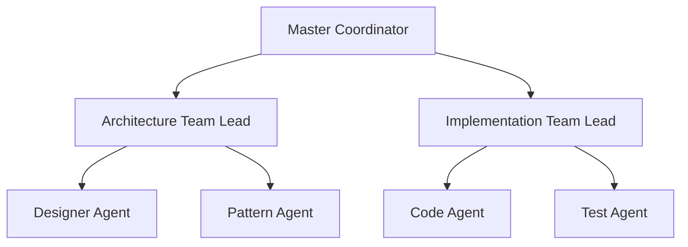
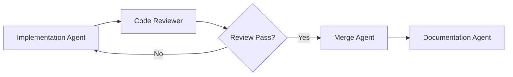
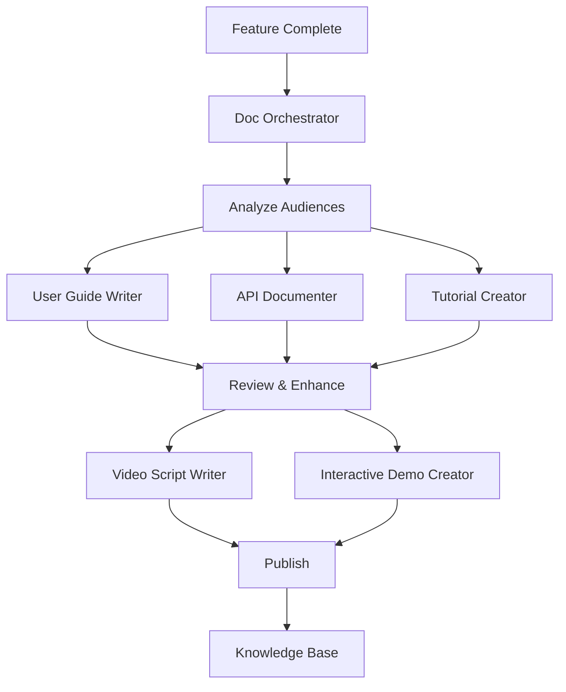

# Agent Ecosystem Overview

## ClaudeProjects2 Agent Architecture

```mermaid
graph TB
    subgraph "User Interface Layer"
        U[User] --> CLI[Claude Code CLI]
        U --> OBS[Obsidian Interface]
        U --> GH[GitHub Issues]
    end
    
    subgraph "Orchestration Layer"
        CLI --> MO[Master Orchestrator]
        OBS --> MO
        GH --> MO
        
        MO --> CS[Context Selector]
        CS --> PC[Phase Coordinator]
    end
    
    subgraph "Agent Categories"
        PC --> AA[Architecture Agents]
        PC --> IA[Implementation Agents]
        PC --> DOA[Documentation Agents]
        PC --> VA[Validation Agents]
        PC --> EA[Evolution Agents]
        
        subgraph "Architecture Agents"
            AA --> AD[Architecture Designer]
            AA --> PS[Pattern Selector]
            AA --> AW[ADR Writer]
            AA --> CM[Component Mapper]
        end
        
        subgraph "Implementation Agents"
            IA --> CG[Code Generator]
            IA --> TB[Test Builder]
            IA --> APD[API Designer]
            IA --> DA[Data Modeler]
        end
        
        subgraph "Documentation Agents"
            DOA --> DO[Doc Orchestrator]
            DOA --> UGW[User Guide Writer]
            DOA --> TC[Tutorial Creator]
            DOA --> APID[API Documenter]
            DOA --> ME[Methodology Explainer]
            DOA --> VSW[Video Script Writer]
            DOA --> IDC[Interactive Demo Creator]
        end
        
        subgraph "Validation Agents"
            VA --> CC[Conformance Checker]
            VA --> QG[Quality Gate]
            VA --> PA[Performance Analyzer]
            VA --> SS[Security Scanner]
        end
        
        subgraph "Evolution Agents"
            EA --> RP[Refactoring Planner]
            EA --> TD[Tech Debt Analyzer]
            EA --> MA[Migration Assistant]
            EA --> KC[Knowledge Curator]
        end
    end
    
    subgraph "Knowledge Layer"
        AD --> KB[Knowledge Base]
        PS --> KB
        AW --> KB
        CG --> KB
        DO --> KB
        UGW --> KB
        TC --> KB
        CC --> KB
        KC --> KB
        
        KB --> OD[Obsidian Docs]
        KB --> GI[GitHub Issues]
        KB --> CD[CLAUDE.md]
        KB --> UD[User Documentation]
        KB --> VT[Video Tutorials]
    end
    
    subgraph "Integration Layer"
        MO --> MCP1[Context7 MCP]
        MO --> MCP2[GitHub MCP]
        MO --> MCP3[Obsidian MCP]
        MO --> MCP4[Sequential MCP]
    end
```

## Agent Communication Flow

## Agent Capability Matrix

| Agent | Primary Function | Inputs | Outputs | Dependencies |
|-------|-----------------|---------|----------|--------------|
| Architecture Designer | System design creation | Requirements, constraints | Component diagrams, deployment views | Pattern Selector, ADR Writer |
| Pattern Selector | Architectural pattern selection | Problem context, quality attributes | Pattern recommendations, rationale | Knowledge Base |
| ADR Writer | Decision documentation | Decisions, context, alternatives | ADR documents | Knowledge Base |
| Code Generator | Implementation from design | Architectural specs, APIs | Source code | Test Builder |
| Doc Orchestrator | Coordinate documentation | Feature changes, user needs | Documentation plan | All doc agents |
| User Guide Writer | End-user documentation | Features, workflows | User guides, help content | Doc Orchestrator |
| Tutorial Creator | Learning materials | Features, learning objectives | Tutorials, exercises | Interactive Demo Creator |
| API Documenter | Technical documentation | API specs, code | API docs, SDKs | Code Generator |
| Methodology Explainer | Process documentation | Methodologies, patterns | Process guides, templates | Knowledge Base |
| Video Script Writer | Multimedia content | Features, concepts | Video scripts, storyboards | Tutorial Creator |
| Interactive Demo Creator | Hands-on experiences | Features, scenarios | Interactive demos, sandboxes | Code Generator |
| Conformance Checker | Validate implementation | Code, architecture specs | Conformance report | Knowledge Base |
| Knowledge Curator | Maintain knowledge base | All agent outputs | Organized knowledge | Obsidian MCP |

## Agent Interaction Patterns

### 1. Sequential Pattern
Used for linear workflows where output of one agent feeds into the next.

### 2. Parallel Pattern
Used when multiple agents can work independently on different aspects.

### 3. Hierarchical Pattern
Used for complex tasks requiring coordination and sub-delegation.

### 4. Review Pattern
Used for quality assurance and validation workflows.

### 5. Documentation Pattern
Used for comprehensive documentation creation across multiple formats and audiences.

## Integration Points

### MCP Server Integration
- **Context7**: Provides latest documentation for frameworks and libraries
- **GitHub MCP**: Manages issues, PRs, and repository operations
- **Obsidian MCP**: Handles knowledge base operations
- **Sequential MCP**: Orchestrates complex multi-step workflows

### Knowledge Flow
1. Agents generate artifacts (code, docs, diagrams)
2. Knowledge Curator processes and organizes
3. Obsidian MCP stores in knowledge base
4. Future agents query for context
5. Continuous learning and improvement

## Success Metrics

### Agent Performance
- Response time: < 5 seconds for simple tasks
- Accuracy: > 95% for well-defined tasks
- Collaboration: Seamless handoffs between agents

### System Health
- Knowledge base growth: Daily updates
- Decision traceability: 100% coverage
- Architecture conformance: > 95%

## Future Enhancements

1. **Learning Agents**: Agents that improve based on feedback
2. **Predictive Agents**: Anticipate needs based on patterns
3. **Optimization Agents**: Continuously improve system performance
4. **Custom Domain Agents**: Industry-specific specialists