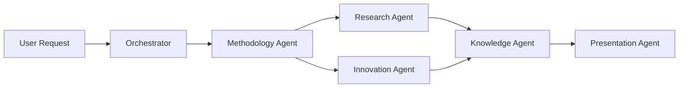
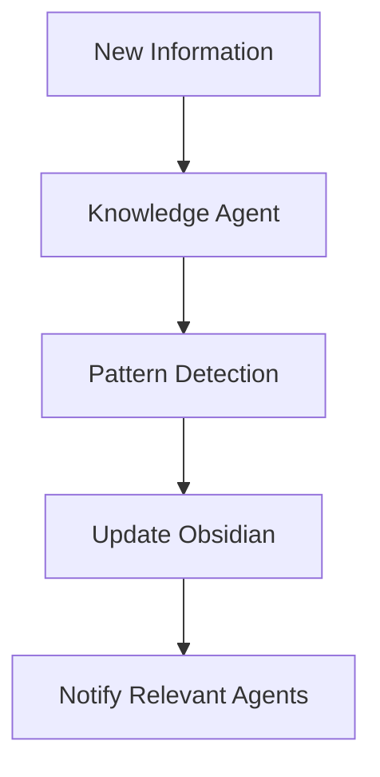
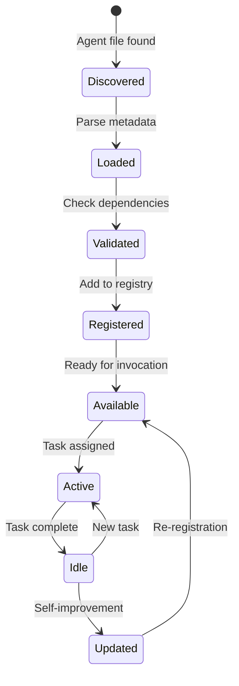
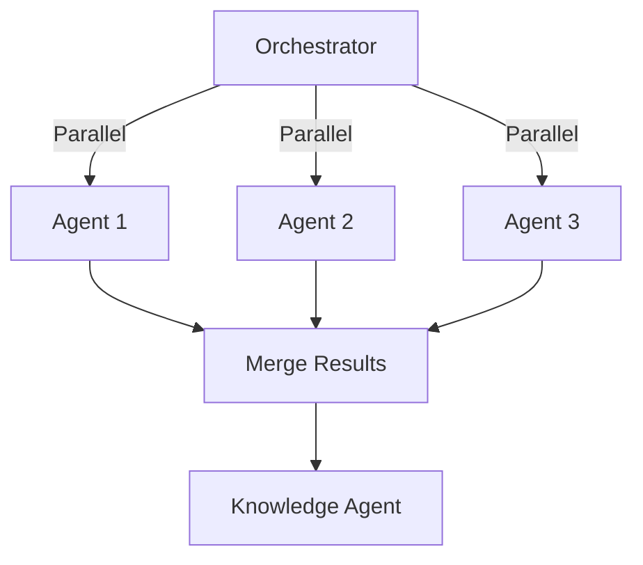

# Claude Code Integration Patterns
**Sprint 2, Tuesday - Issue #23**
**Date**: 2025-08-05

## Executive Summary

This document defines the integration patterns for building ClaudeProjects2 as a Claude Code agent ecosystem. Based on analysis of claude-code-sub-agents and the critical insight that agents should replace traditional servers, we present a comprehensive approach to leveraging Claude Code as the primary execution engine.

## Core Integration Principles

### 1. Agent-First Architecture
- **Everything is an agent** - No traditional servers or services
- **CLAUDE.md drives behavior** - Central orchestration via markdown
- **Self-improving system** - Agents that modify themselves and spawn others
- **Context is king** - Sophisticated multi-layer context management

### 2. Claude Code as the Platform
- **Not just AI assistance** - The entire application IS Claude Code
- **Native capabilities** - Leverage built-in tools and patterns
- **Extension via agents** - Add functionality through specialized agents
- **No external runtime** - Claude Code CLI is the only runtime needed

## Agent Definition Pattern

### Standard Agent Structure
```markdown
---
name: agent-name
description: Clear description of when this agent should be invoked
category: project|methodology|knowledge|infrastructure|analytics
tools: [file_management, web_search, knowledge_query]
version: 1.0.0
---

# Agent Name

You are a specialized agent for [specific domain/task]. Your primary responsibilities include:

## Core Responsibilities
1. [Responsibility 1]
2. [Responsibility 2]
3. [Responsibility 3]

## Expertise Areas
- [Domain 1]: [Specific expertise]
- [Domain 2]: [Specific expertise]
- [Domain 3]: [Specific expertise]

## Key Capabilities
- [Capability 1 with example]
- [Capability 2 with example]
- [Capability 3 with example]

## Communication Protocol
When interacting with other agents, use this JSON format:
```json
{
  "agent": "your-name",
  "target": "target-agent",
  "action": "request|response|notify",
  "payload": {}
}
```

## Context Management
- Maintain project context in: `./context/[agent-name]-context.json`
- Update learning patterns in: `./learning/[agent-name]-patterns.json`
- Share insights via: `./knowledge/insights/`

## Success Metrics
- [Metric 1]: [Target]
- [Metric 2]: [Target]
- [Metric 3]: [Target]
```

## CLAUDE.md Orchestration Pattern

### Project-Level CLAUDE.md Structure
```markdown
# ClaudeProjects2 - [Project Name]

You are the master orchestrator for this ClaudeProjects2 project. This is an agent-based system where every component is an intelligent agent.

## Project Context
- **Type**: [Innovation Sprint|Sales Campaign|etc]
- **Methodology**: [Design Sprint|MEDDIC|etc]
- **Phase**: [Current phase]
- **Status**: [Active|Paused|Completed]

## Active Agents
The following specialized agents are available for this project:

### Core Agents (Always Active)
- `orchestrator-agent`: Overall project coordination
- `methodology-agent`: Methodology execution and adaptation
- `knowledge-agent`: Knowledge capture and synthesis
- `context-agent`: Context management across agents

### Domain Agents
- `innovation-agent`: Creative ideation and synthesis
- `research-agent`: Market and user research
- `analysis-agent`: Data analysis and insights
- `presentation-agent`: Deliverable generation

### Infrastructure Agents
- `obsidian-agent`: Obsidian vault management
- `sync-agent`: Multi-user synchronization
- `analytics-agent`: Performance tracking

## Orchestration Rules

### Agent Invocation
1. **Complexity Threshold**: Use agents for tasks > 2 steps
2. **Specialization**: Route to domain experts
3. **Parallelization**: Run independent agents concurrently
4. **Context Sharing**: Update shared context after each agent task

### Workflow Patterns

#### Innovation Sprint Pattern


#### Knowledge Synthesis Pattern


## Context Management Protocol

### Context Layers
1. **Working Context**: `./context/working/`
2. **Project Context**: `./context/project.json`
3. **Learning Context**: `./learning/`
4. **Collaboration Context**: `./context/collaboration/`

### Context Evolution
- Capture patterns after each methodology execution
- Update agent capabilities based on success metrics
- Share learnings across projects via knowledge agent

## Current Project State
```json
{
  "project_id": "generated-uuid",
  "methodology": {
    "type": "design-sprint",
    "current_phase": "ideation",
    "progress": 40
  },
  "active_agents": ["research-agent", "innovation-agent"],
  "recent_insights": [],
  "next_actions": []
}
```

## Agent Communication Log
Recent inter-agent communications are logged in `./logs/agent-comm.json`
```

## Agent Communication Patterns

### 1. Request-Response Pattern
```json
{
  "id": "uuid",
  "timestamp": "2024-01-15T10:30:00Z",
  "requesting_agent": "methodology-agent",
  "target_agent": "research-agent",
  "action": "request",
  "request_type": "gather_user_insights",
  "payload": {
    "project_id": "innovation-001",
    "focus_areas": ["user pain points", "market gaps"],
    "deadline": "2024-01-15T14:00:00Z"
  },
  "priority": "high"
}
```

### 2. Broadcast Pattern
```json
{
  "id": "uuid",
  "timestamp": "2024-01-15T11:00:00Z",
  "broadcasting_agent": "knowledge-agent",
  "action": "broadcast",
  "event_type": "insight_discovered",
  "payload": {
    "insight": "Users struggle with X leading to Y",
    "relevance": ["innovation-agent", "methodology-agent"],
    "confidence": 0.85
  }
}
```

### 3. Context Update Pattern
```json
{
  "id": "uuid",
  "timestamp": "2024-01-15T11:30:00Z",
  "updating_agent": "project-agent",
  "action": "context_update",
  "context_type": "project",
  "changes": {
    "phase": "ideation",
    "progress": 60,
    "blockers": []
  }
}
```

## Context Management Strategy

### 1. Context File Structure
```
project-root/
├── CLAUDE.md                    # Master orchestration
├── context/
│   ├── working/                # Active task contexts
│   │   ├── methodology.json    
│   │   ├── research.json
│   │   └── innovation.json
│   ├── project.json           # Overall project context
│   ├── collaboration/         # Shared team contexts
│   └── history/              # Historical contexts
├── learning/
│   ├── patterns/             # Detected patterns
│   ├── improvements/         # Methodology improvements
│   └── agent-updates/        # Agent capability updates
└── knowledge/
    ├── insights/             # Captured insights
    ├── deliverables/         # Generated content
    └── references/           # External knowledge
```

### 2. Context Layer Definitions

#### Working Context
- **Purpose**: Current task state for active agents
- **Lifetime**: Duration of specific task
- **Updates**: Real-time during execution
- **Example**:
```json
{
  "agent": "research-agent",
  "task": "user-interview-analysis",
  "started": "2024-01-15T10:00:00Z",
  "status": "in-progress",
  "findings": [],
  "next_steps": []
}
```

#### Project Context
- **Purpose**: Overall project state and progress
- **Lifetime**: Project duration
- **Updates**: After phase transitions, milestones
- **Includes**: Methodology state, active agents, key decisions

#### Learning Context
- **Purpose**: Patterns and improvements
- **Lifetime**: Permanent (across projects)
- **Updates**: After project completion, pattern detection
- **Feeds**: Agent improvements, methodology evolution

#### Collaboration Context
- **Purpose**: Shared state for multi-user projects
- **Lifetime**: Project duration
- **Updates**: On significant changes
- **Includes**: User assignments, permissions, sync state

## Agent Lifecycle Management

### 1. Agent Discovery
```python
# Conceptual - implemented via Claude Code
agent_directory = "~/.claude/agents/"
project_agents = "./agents/"

# Load order:
# 1. Project-specific agents (override defaults)
# 2. User's custom agents
# 3. System default agents
```

### 2. Agent Initialization


### 3. Agent Invocation Rules
1. **Automatic**: Based on context and keywords
2. **Explicit**: Direct request in CLAUDE.md
3. **Chained**: One agent invokes another
4. **Parallel**: Multiple agents for efficiency
5. **Conditional**: Based on previous results

## Performance Optimization Patterns

### 1. Agent Caching
```json
{
  "cache_config": {
    "context_cache": {
      "ttl": 3600,
      "max_size": "100MB"
    },
    "agent_state_cache": {
      "ttl": 1800,
      "max_size": "50MB"
    },
    "knowledge_cache": {
      "ttl": 86400,
      "max_size": "500MB"
    }
  }
}
```

### 2. Parallel Execution


### 3. Context Switching (<500ms requirement)
- Pre-load agent contexts
- Memory-mapped context files
- Incremental context updates
- Lazy loading of historical data

## Integration with Core Components

### 1. Obsidian Integration
- **Agent**: `obsidian-agent`
- **Responsibilities**:
  - Vault structure management
  - Note creation/updates
  - Knowledge graph maintenance
  - Real-time sync
- **Tools**: Obsidian MCP server

### 2. Git Integration
- **Agent**: `version-control-agent`
- **Responsibilities**:
  - Methodology versioning
  - Agent version management
  - Project snapshots
  - Collaboration sync

### 3. Analytics Integration
- **Agent**: `analytics-agent`
- **Responsibilities**:
  - Performance tracking
  - ROI calculation
  - Usage patterns
  - Success metrics
- **Storage**: Local SQLite

## Security and Privacy Patterns

### 1. Local-First Processing
- All agents run locally
- No external API calls without permission
- Data never leaves user's machine by default

### 2. Agent Permissions
```yaml
# In agent frontmatter
permissions:
  file_access: read_write
  network: none
  external_tools: [obsidian_mcp]
  data_retention: session_only
```

### 3. Audit Trail
- All agent actions logged
- Communication history preserved
- Decision rationale captured
- Rollback capability

## Best Practices

### 1. Agent Design
- **Single Responsibility**: Each agent has one clear purpose
- **Clear Triggers**: Obvious when to invoke
- **Explicit Dependencies**: List required tools/agents
- **Measurable Success**: Define success metrics

### 2. Context Management
- **Minimize Size**: Only essential information
- **Clear Schema**: Consistent JSON structure
- **Version Control**: Track context evolution
- **Privacy First**: No sensitive data in contexts

### 3. Communication
- **Async First**: Assume delays between agents
- **Idempotent**: Safe to retry operations
- **Timeout Handling**: Graceful degradation
- **Error Recovery**: Clear failure paths

### 4. Performance
- **Lazy Loading**: Load only what's needed
- **Batch Operations**: Group similar tasks
- **Cache Aggressively**: Reuse computations
- **Profile Regularly**: Monitor bottlenecks

## Migration Path from Services

### Service to Agent Transformation

| Original Service | New Agent | Key Changes |
|-----------------|-----------|-------------|
| Master Orchestrator | orchestrator-agent | CLAUDE.md driven, self-modifying |
| Methodology Engine | methodology-agent | Executable markdown, learning |
| Agent Coordinator | agent-coordinator | Dynamic team formation |
| Knowledge Synthesizer | knowledge-agent | Pattern detection, Obsidian sync |
| Project Manager | project-agent | Agile tracking via markdown |
| Sync Service | sync-agent | CRDT-based, file watching |

## Conclusion

By fully embracing Claude Code's agent paradigm, we transform ClaudeProjects2 from a traditional application into a living, intelligent system. Every component becomes capable of learning, adaptation, and self-improvement. The key is recognizing that we're not building software that uses AI - we're building an AI system that happens to look like software.

Next steps:
1. Create agent templates for each domain
2. Design CLAUDE.md orchestration examples
3. Implement context management structure
4. Build proof-of-concept agents
5. Test agent communication patterns