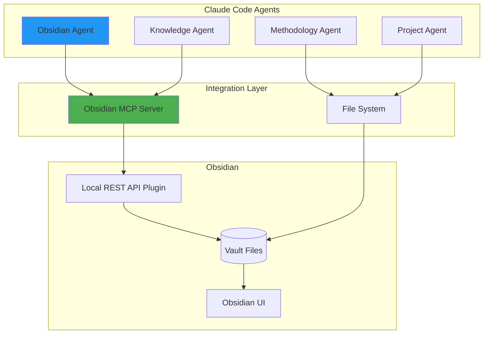

# Obsidian Integration Strategies
**Sprint 2, Tuesday - Issue #23**
**Date**: 2025-08-05

## Executive Summary

This document outlines integration strategies for Obsidian as the knowledge management platform for ClaudeProjects2. Based on research into Obsidian's capabilities, MCP servers, and plugin architecture, we recommend a hybrid approach using the Obsidian MCP server for agent-to-vault communication and direct file system access for performance-critical operations.

## Integration Options Analysis

### Option 1: Obsidian MCP Server (Recommended)
**Approach**: Use existing MCP servers (e.g., cyanheads/obsidian-mcp-server) that bridge to Obsidian's Local REST API

**Pros**:
- Already built and maintained by community
- Comprehensive API coverage
- Clean separation of concerns
- Works with Claude Code out of the box
- Supports all major operations (read, write, search, manage)

**Cons**:
- Requires Local REST API plugin
- Additional dependency
- Network overhead (even locally)
- API key management

**Best For**: Agent-to-Obsidian communication, complex operations

### Option 2: Direct File System Access
**Approach**: Agents directly manipulate vault files

**Pros**:
- Maximum performance
- No dependencies
- Simple implementation
- Full control

**Cons**:
- Must handle Obsidian's file format
- No access to Obsidian-specific features
- Risk of conflicts with open Obsidian instance
- Must implement search, indexing ourselves

**Best For**: Bulk operations, initial vault setup, backups

### Option 3: Obsidian Plugin Development
**Approach**: Create custom Obsidian plugin

**Pros**:
- Deep integration
- Access to all Obsidian APIs
- Native UI integration
- Real-time sync

**Cons**:
- Complex development
- Maintenance burden
- Platform lock-in
- Distribution challenges

**Best For**: Future enhancement (not MVP)

## Recommended Hybrid Architecture



### Integration Strategy by Use Case

| Use Case | Method | Rationale |
|----------|--------|-----------|
| Create/update notes | MCP Server | Clean API, conflict handling |
| Search vault | MCP Server | Leverages Obsidian's search |
| Bulk import | File System | Performance for large ops |
| Read templates | File System | Simple file reads |
| Knowledge graph | MCP Server | Access to link data |
| Real-time sync | File System + Watcher | Low latency updates |
| Manage tags | MCP Server | Obsidian-aware operations |
| Create daily notes | MCP Server | Follows Obsidian conventions |

## Vault Structure Design

### Proposed Directory Structure
```
ClaudeProjects2-Vault/
├── Projects/
│   ├── {project-id}/
│   │   ├── README.md           # Project overview
│   │   ├── Context.md          # Current context
│   │   ├── Methodology.md      # Active methodology
│   │   ├── Progress.md         # Progress tracking
│   │   ├── Insights/           # Captured insights
│   │   ├── Deliverables/       # Generated outputs
│   │   └── Archive/            # Historical data
├── Methodologies/
│   ├── Templates/              # Methodology templates
│   ├── Custom/                 # User customizations
│   └── Learnings/              # Evolution tracking
├── Knowledge/
│   ├── Domains/                # Domain knowledge
│   ├── Patterns/               # Detected patterns
│   ├── References/             # External references
│   └── Index.md                # Knowledge map
├── Agents/
│   ├── Profiles/               # Agent configurations
│   ├── Logs/                   # Agent activity
│   └── Learning/               # Agent improvements
├── Analytics/
│   ├── Dashboards/             # Visual analytics
│   ├── Reports/                # Generated reports
│   └── Metrics.md              # Key metrics
└── .obsidian/
    ├── plugins/                # Required plugins
    └── workspace.json          # UI configuration
```

### Metadata Standards

#### Frontmatter for Projects
```yaml
---
id: "project-uuid"
type: "innovation-sprint"
methodology: "design-sprint"
status: "active"
created: 2024-01-15
modified: 2024-01-16
agents: ["research-agent", "innovation-agent"]
tags: ["client-x", "q1-2024", "product-design"]
metrics:
  estimated_hours: 40
  actual_hours: 4
  productivity_multiplier: 10x
---
```

#### Frontmatter for Knowledge
```yaml
---
type: "insight"
source: "project-uuid"
confidence: 0.85
validated: true
applications: ["future-projects"]
tags: ["user-research", "pain-point"]
---
```

## MCP Server Configuration

### Installation and Setup
```bash
# Install MCP server
npx -y @smithery/cli install obsidian-mcp --client claude

# Or manual installation
npm install -g obsidian-mcp-server
```

### Configuration for Claude Desktop
```json
{
  "mcpServers": {
    "obsidian": {
      "command": "npx",
      "args": ["obsidian-mcp-server"],
      "env": {
        "OBSIDIAN_API_KEY": "your-api-key",
        "OBSIDIAN_HOST": "127.0.0.1",
        "OBSIDIAN_PORT": "27124",
        "OBSIDIAN_VAULT_PATH": "/path/to/vault"
      }
    }
  }
}
```

### Available MCP Operations
Based on research, modern Obsidian MCP servers provide:

1. **File Operations**
   - `list_files_in_vault`
   - `list_files_in_directory`
   - `get_file_content`
   - `create_note`
   - `update_note`
   - `delete_note`

2. **Search Operations**
   - `search_documents`
   - `search_by_tag`
   - `find_backlinks`

3. **Metadata Operations**
   - `get_frontmatter`
   - `update_frontmatter`
   - `manage_tags`

4. **Advanced Operations**
   - `get_vault_structure`
   - `analyze_note_connections`
   - `batch_operations`

## Integration Patterns

### 1. Knowledge Capture Pattern


### 2. Project Creation Pattern


### 3. Real-time Sync Pattern


## Performance Optimization

### 1. Caching Strategy
- Cache frequently accessed notes in memory
- Use file system cache for templates
- Implement TTL for search results
- Lazy load large vaults

### 2. Batch Operations
```javascript
// Conceptual - implemented in agent
const batchCreate = async (notes) => {
  const operations = notes.map(note => ({
    path: note.path,
    content: note.content,
    metadata: note.metadata
  }));
  
  return await mcp.batchOperation('create', operations);
};
```

### 3. Indexing Strategy
- Maintain lightweight index of note titles and tags
- Update incrementally on changes
- Full reindex on demand
- Use for quick lookups without API calls

## Security and Privacy

### 1. API Key Management
- Store in environment variables
- Never commit to repository
- Rotate regularly
- Audit access logs

### 2. Access Control
- Read-only access for analytics agents
- Write access for knowledge/project agents
- No deletion rights for most agents
- Audit trail for all operations

### 3. Data Privacy
- All data stays local
- No cloud sync unless explicit
- Encrypt sensitive project data
- Respect .gitignore patterns

## Migration and Adoption

### 1. Initial Setup
```bash
# 1. Install Obsidian
# 2. Install Local REST API plugin
# 3. Generate API key
# 4. Install MCP server
# 5. Configure Claude Desktop
# 6. Create vault structure
# 7. Run setup agent
```

### 2. Import Existing Data
- Batch import from current tools
- Preserve metadata where possible
- Generate frontmatter automatically
- Create index of imported content

### 3. Progressive Enhancement
- Start with basic note creation
- Add search capabilities
- Implement knowledge graph
- Enable advanced analytics

## Error Handling

### 1. Connection Failures
```javascript
// Fallback to file system if MCP fails
const createNote = async (path, content) => {
  try {
    return await mcp.createNote(path, content);
  } catch (error) {
    console.warn('MCP failed, using file system', error);
    return await fs.writeFile(path, content);
  }
};
```

### 2. Conflict Resolution
- Detect simultaneous edits
- Merge non-conflicting changes
- Prompt user for conflicts
- Maintain version history

### 3. Recovery Procedures
- Regular vault backups
- Transaction logs
- Rollback capability
- Repair tools

## Future Enhancements

### Phase 1 (MVP)
- Basic MCP integration
- Simple vault structure
- Core operations
- File system fallback

### Phase 2
- Advanced search
- Knowledge graph visualization
- Batch operations
- Performance optimization

### Phase 3
- Custom Obsidian plugin
- Real-time collaboration
- Mobile sync
- Advanced analytics

## Best Practices

### 1. Note Naming
- Use consistent conventions
- Include dates where relevant
- Avoid special characters
- Keep names descriptive

### 2. Linking Strategy
- Use [[wikilinks]] for internal refs
- Maintain backlinks
- Create hub notes
- Use aliases for variations

### 3. Metadata Usage
- Always include frontmatter
- Use consistent tag taxonomy
- Track creation/modification
- Include source attribution

### 4. Performance Tips
- Limit vault size (< 10K notes)
- Archive old projects
- Optimize image storage
- Regular maintenance

## Conclusion

The hybrid approach using Obsidian MCP server for agent operations and direct file system access for performance-critical tasks provides the best balance of functionality, performance, and maintainability. This strategy leverages existing tools while maintaining flexibility for future enhancements.

Key advantages:
1. **Immediate availability** - MCP servers exist today
2. **Clean separation** - Agents don't need Obsidian internals
3. **Performance options** - File system for bulk ops
4. **Future-proof** - Can add custom plugin later
5. **User-friendly** - Works with standard Obsidian

Next steps:
1. Set up development vault structure
2. Configure MCP server
3. Create obsidian-agent
4. Test core operations
5. Implement caching layer