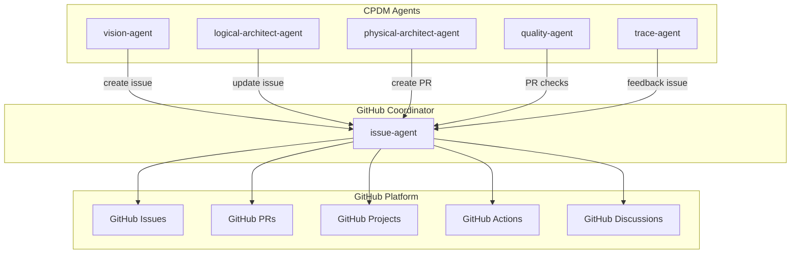

# CPDM GitHub Integration Specification

> **How CPDM leverages GitHub as its native platform**

## Overview

CPDM is designed to work **natively with GitHub**, using it as the single source of truth for all product development activities. This eliminates tool fragmentation and keeps everything in one place.

---

## Integration Architecture



---

## Phase-by-Phase GitHub Integration

### Phase 1: Vision
**GitHub Actions:**
- Create issue for new feature
- Add to Sprint milestone
- Apply labels: `feature`, `vision-phase`, `roi-{level}`
- Assign to PM for approval

**Example:**
```bash
gh issue create \
  --title "Feature: Obsidian Editor" \
  --body "Triple Helix: 27/30, ROI: 18x" \
  --label "feature,vision-phase,roi-high" \
  --milestone "Sprint 6" \
  --assignee "@sdh07"
```

### Phase 2: Design
**GitHub Actions:**
- Update issue with design details
- Add architecture diagrams
- Apply label: `design-complete`
- Link to related issues

**Example:**
```bash
gh issue comment $ISSUE_ID \
  --body "Design complete:
  - Layers: 60% Presentation, 25% Application
  - Domain: knowledge_domain
  - Objects: MarkdownDocument, EditorSession"
```

### Phase 3: Decision
**GitHub Actions:**
- Create ADR issue for confirmation
- Generate ADR PR when confirmed
- Link ADR to feature issue
- Apply label: `adr-required`

**Example:**
```bash
# Create ADR issue
gh issue create \
  --title "ADR-020: Markdown Parser Selection" \
  --label "adr,needs-confirmation" \
  --body "Requires PM confirmation for technology choice"

# After confirmation, create PR
gh pr create \
  --title "Add ADR-020: Markdown Parser" \
  --body "Implements decision from issue #$ISSUE_ID"
```

### Phase 4: Implementation
**GitHub Actions:**
- Create feature branch
- Open draft PR
- Link PR to issue
- Update PR description with progress

**Example:**
```bash
gh pr create \
  --draft \
  --title "Implement Obsidian Editor" \
  --body "Implements #$ISSUE_ID
  
  - [ ] Create markdown-editor-agent
  - [ ] Add React components
  - [ ] Write tests"
```

### Phase 5: Quality
**GitHub Actions:**
- Run GitHub Actions CI/CD
- Update PR checks
- Add quality metrics comment
- Block merge if gates fail

**Example:**
```bash
gh pr review $PR_ID \
  --comment \
  --body "Quality Gates Report:
  ✅ Unit tests: 98% coverage
  ✅ Integration tests: All passing
  ⚠️ Performance: 180ms (target: 100ms)
  
  Status: Approved with warnings"
```

### Phase 6: Delivery
**GitHub Actions:**
- Merge PR
- Create release
- Deploy via Actions
- Update issue status

**Example:**
```bash
gh pr merge $PR_ID --squash
gh release create v1.2.0 --notes "Includes Obsidian Editor"
gh issue close $ISSUE_ID --comment "Deployed in v1.2.0"
```

### Phase 7: Feedback
**GitHub Actions:**
- Create feedback issues
- Link to original feature
- Update project board
- Generate metrics

**Example:**
```bash
gh issue create \
  --title "Feedback: Editor Performance" \
  --label "feedback,enhancement" \
  --body "Users report slow preview. Related to #$ISSUE_ID"
```

---

## GitHub Projects Integration

### Sprint Board Configuration
```yaml
columns:
  - name: Vision
    automation: 
      - Add new issues with label 'vision-phase'
  - name: Design
    automation:
      - Move when label 'design-phase' added
  - name: Decision
    automation:
      - Move when label 'adr-required' added
  - name: Implementation
    automation:
      - Move when PR opened
  - name: Quality
    automation:
      - Move when label 'testing' added
  - name: Delivery
    automation:
      - Move when PR approved
  - name: Done
    automation:
      - Move when issue closed
```

---

## Automation with GitHub Actions

### CPDM Workflow Action
```yaml
name: CPDM Phase Transition
on:
  issues:
    types: [labeled]
  pull_request:
    types: [opened, review_requested, approved]

jobs:
  phase-transition:
    runs-on: ubuntu-latest
    steps:
      - name: Check Phase
        run: |
          # Determine current phase from labels
          # Validate quality gates
          # Transition to next phase if passed
          
      - name: Update GitHub
        run: |
          # Update issue/PR
          # Move in project board
          # Notify stakeholders
```

---

## Benefits of GitHub-Native Approach

### For Product Managers
- **Single Dashboard**: GitHub Projects shows everything
- **Familiar Tools**: No new systems to learn
- **Real-time Updates**: See progress as it happens
- **Direct Communication**: Comment on issues/PRs

### for Developers
- **Stay in Flow**: No context switching
- **Integrated Workflow**: Code, issues, docs in one place
- **Automated Processes**: Actions handle repetitive tasks
- **Clear Requirements**: Issues contain all context

### For the Organization
- **Complete Audit Trail**: Every decision in Git history
- **No Tool Costs**: GitHub included in existing plan
- **Better Compliance**: All data in one system
- **Simplified Onboarding**: Everyone knows GitHub

---

## Implementation Checklist

### Immediate (No Agent Changes)
- [x] Use GitHub issues for feature tracking
- [x] Create Sprint milestones
- [x] Setup project board
- [x] Configure labels

### Short-term (Agent Updates)
- [ ] Add GitHub CLI to vision-agent
- [ ] Update quality-agent for PR checks
- [ ] Configure issue-agent as coordinator
- [ ] Test message queue integration

### Long-term (Full Automation)
- [ ] GitHub Actions for phase transitions
- [ ] Automated project board updates
- [ ] PR check integration
- [ ] Metrics dashboard

---

## Example: Complete Feature Flow

```bash
# 1. PM starts feature
cpdm start "dark-mode" "Add dark theme support"
# → Creates GitHub issue #123

# 2. Vision approval
vision-agent approve "dark-mode"
# → Updates issue #123 with approval
# → Adds label 'vision-approved'

# 3. Design phase
logical-architect-agent design "dark-mode"
# → Comments on issue #123 with design
# → Adds label 'design-complete'

# 4. ADR creation
physical-architect-agent create-adr "dark-mode"
# → Creates issue #124 for ADR
# → Links to issue #123

# 5. Implementation
developer implement "dark-mode"
# → Creates PR #125
# → Links to issue #123

# 6. Quality check
quality-agent validate PR#125
# → Updates PR checks
# → Comments with metrics

# 7. Deployment
deploy PR#125
# → Merges PR
# → Closes issue #123
# → Creates release

# 8. Feedback
trace-agent collect-feedback
# → Creates issue #126 for improvements
# → Links back to #123
```

---

## Conclusion

CPDM's GitHub integration means:
- **Everything is in GitHub** - no external tools needed
- **Automatic tracking** - all transitions create GitHub artifacts
- **Developer-friendly** - stays in their natural workflow
- **PM-friendly** - familiar GitHub interface
- **Complete traceability** - Git history captures everything

This native integration is what makes CPDM uniquely powerful for teams already using GitHub.

---

*Specification Version: 1.0*
*Updated: 2025-02-06*