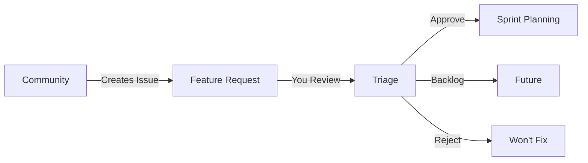

# CPDM User Guide for Product Managers

> **Your complete guide to managing features through the Claude Projects Development Method**

## Table of Contents
1. [Quick Start](#quick-start)
2. [Feature Request Management](#feature-request-management)
3. [Your Role in Each Phase](#your-role-in-each-phase)
4. [Key Decision Points](#key-decision-points)
5. [Using the PM Dashboard](#using-the-pm-dashboard)
6. [Common Workflows](#common-workflows)
7. [Commands You Need](#commands-you-need)
8. [What to Expect](#what-to-expect)
9. [Using Helper Agents](#using-helper-agents)
10. [Troubleshooting](#troubleshooting)

---

## Quick Start

As a Product Manager, you drive the vision and approve key decisions. CPDM automates the technical flow while keeping you in control at critical points.

### Your Primary Responsibilities
1. **Maintain the Product Vision** - Keep it current and aligned with business goals
2. **Approve Features** - Validate that new features align with vision
3. **Confirm ADRs** - Approve significant architectural decisions
4. **Review Feedback** - Use metrics and user feedback to refine vision

### GitHub Integration Advantage
CPDM is **fully integrated with GitHub**, meaning:
- Every feature creates a GitHub issue automatically
- You can track progress in GitHub Projects
- All decisions are recorded in Git history
- Team collaboration happens in PR reviews
- No need to learn new tools - it's all in GitHub!

### Your First Day with CPDM

```bash
# 1. Check new feature requests from community
gh issue list --label "needs-triage" --label "feature-request"

# 2. Check your active features
./scripts/cpdm-workflow-engine.sh status

# 3. View the vision dashboard (or ask pm-guide-agent)
cat docs/architecture/01-product-vision/vision-dashboard.md
# OR: Use Task tool with pm-guide-agent "Show me today's dashboard"

# 4. Start a new feature (from approved request)
./scripts/cpdm-workflow-engine.sh start "feature-name" "description"
```

---

## Feature Request Management

### NEW: Community-Driven Features

Features now flow from community/team requests through GitHub:



### Weekly Feature Review Process

```bash
# Every Monday morning:
# 1. View pending requests
gh issue list --label "needs-triage" --label "feature-request"

# 2. For each request, evaluate
./scripts/cpdm-workflow-engine.sh evaluate-feature [issue-number]

# 3. Apply decision labels
gh issue edit [number] --add-label "approved,priority-2-important"
# OR
gh issue close [number] --comment "Not aligned with vision"
```

### Priority Labels
- `priority-1-critical`: Next sprint
- `priority-2-important`: Within 2 sprints
- `priority-3-nice`: When possible
- `priority-4-later`: Future consideration

---

## Your Role in Each Phase

### Phase 1: Vision ⭐ **You Own This**
**Your Actions:**
- Update vision when market/strategy changes
- Review feature proposals
- Approve/reject based on alignment
- Set priorities

**What Happens Automatically:**
- Triple Helix validation (Methodology + Agents + Knowledge)
- ROI calculation
- Business impact assessment

**Your Decision Gate:**
```
❓ Does this feature align with our vision?
❓ Is the ROI acceptable (target > 10x)?
❓ What priority should this have?

✅ APPROVE → Proceeds to Design
❌ REJECT → Feature archived with reason
```

### Phase 2: Design 👀 **You Monitor**
**What's Happening:**
- Logical architecture being designed
- Domains and layers assigned
- Interfaces defined

**Your Involvement:**
- Review design summaries (optional)
- No approval needed unless flagged

**Notification Example:**
```
📧 "Feature 'user-auth' design complete:
   - 60% Presentation Layer
   - 25% Domain Layer
   - Assigned to security_domain
   No issues detected."
```

### Phase 3: Decision ⭐ **You Approve ADRs**
**Your Actions:**
- Review and confirm Architecture Decision Records
- Especially for new technologies or major changes

**Decision Request Example:**
```
🔔 ADR Confirmation Required: "OAuth2 Integration"

Context: User authentication needs enterprise SSO
Decision: Implement OAuth2 with Azure AD
Impact: New dependency, 2-week implementation
Cost: $500/month for Azure AD

[ CONFIRM ] [ MODIFY ] [ REJECT ] [ DEFER ]
```

### Phase 4: Implementation 👀 **You Monitor**
**What's Happening:**
- Code being written
- Tests being created
- Documentation updated

**Your Dashboard Shows:**
- Progress percentage
- Blockers (if any)
- Estimated completion

### Phase 5: Quality 🚦 **You're Notified of Issues**
**Automatic Checks:**
- All tests passing
- Performance metrics met
- Security scans clean

**You're Alerted If:**
- Quality gates fail
- Override needed for production

### Phase 6: Delivery ✅ **You Approve Production**
**Your Final Check:**
```
🚀 Ready for Production: "user-auth"
- All quality gates: PASSED
- Tests: 98% coverage
- Performance: Meets SLA
- Rollback plan: Ready

[ DEPLOY TO PRODUCTION ] [ DEPLOY TO STAGING ] [ HOLD ]
```

### Phase 7: Feedback 📊 **You Review & Act**
**Your Actions:**
- Review user feedback summaries
- Analyze usage metrics
- Update vision based on learnings
- Prioritize improvements

**Weekly Report Example:**
```
📊 Feature Performance: "user-auth"
- Adoption: 87% of users
- Satisfaction: 4.6/5
- Issues: 3 minor bugs
- Suggested improvements: 5

[ UPDATE VISION ] [ CREATE IMPROVEMENTS ] [ ARCHIVE ]
```

---

## Key Decision Points

### 1. Feature Approval (Vision Phase)

**You See:**
```
New Feature Request: "AI-Powered Search"

Triple Helix Score: 28/30 ✅
- Methodology: 9/10
- Agents: 9/10
- Knowledge: 10/10

ROI Calculation: 18x ✅
Development Cost: 5 days
Expected Benefit: $90k/year

Business Impact: HIGH
- User satisfaction: +30%
- Competitive advantage: Strong
- Strategic alignment: Core feature

Your Decision: [ APPROVE ] [ REJECT ] [ DEFER ]
```

### 2. ADR Confirmation (Decision Phase)

**You See:**
```
Architecture Decision Required

Title: "Real-time Collaboration Framework"
Cost: Medium (10 dev days)
Risk: Low
Benefits:
- Enables live editing
- Improves team productivity
- Future-proof architecture

Technical Details: [View More]

Your Decision: [ CONFIRM ] [ REQUEST CHANGES ] [ REJECT ]
```

### 3. Production Deployment (Delivery Phase)

**You See:**
```
Deployment Approval Request

Feature: "AI-Powered Search"
Environment: Production
Quality Score: 98/100 ✅
Risk Assessment: Low
Rollback Time: < 5 minutes

Checklist:
✅ All tests passing
✅ Performance validated
✅ Security approved
✅ Documentation complete

Your Decision: [ DEPLOY NOW ] [ SCHEDULE ] [ CANCEL ]
```

---

## Using the PM Dashboard

### Main Dashboard View
```
┌─────────────────────────────────────────────────────────┐
│ Product Manager Dashboard         📊 Last Update: 2 min │
├─────────────────────────────────────────────────────────┤
│ VISION HEALTH: 92/100 🟢         Alignment: 96%        │
├─────────────────────────────────────────────────────────┤
│ Active Features: 12                                      │
│ ├─ In Vision: 2 (Awaiting your approval)                │
│ ├─ In Development: 8                                     │
│ └─ In Production: 2                                      │
├─────────────────────────────────────────────────────────┤
│ REQUIRES YOUR ATTENTION:                                 │
│ 🔴 Feature approval needed: "Mobile App"                 │
│ 🟡 ADR confirmation: "Database Migration"                │
│ 🟢 Weekly metrics ready for review                       │
├─────────────────────────────────────────────────────────┤
│ Key Metrics:                                             │
│ • Cycle Time: 6.5 days ↓                                │
│ • User Satisfaction: 4.6/5 ↑                            │
│ • Feature Adoption: 78% →                               │
│ • ROI Achievement: 125% ✅                               │
└─────────────────────────────────────────────────────────┘
```

### Vision Alignment View
```
Vision Element          Features    Status    Health
━━━━━━━━━━━━━━━━━━━━━━━━━━━━━━━━━━━━━━━━━━━━━━━━
Knowledge Excellence    8 features  Active    95% 🟢
Seamless Integration   5 features  Active    88% 🟢
10x Productivity       6 features  Active    92% 🟢
Privacy First          3 features  Planning  78% 🟡
```

---

## Common Workflows

### 1. Processing Feature Requests (NEW)

```bash
# Weekly review of community requests
# Step 1: View pending
gh issue list --label "needs-triage"

# Step 2: Evaluate each
./scripts/cpdm-workflow-engine.sh evaluate-feature [issue-number]

# Step 3: Label decision
gh issue edit [number] --add-label "approved,priority-2"

# Step 4: Convert approved to sprint work
./scripts/cpdm-workflow-engine.sh feature-to-sprint [issue-number] [sprint-number]
```

### 2. Starting a New Feature (From Approved Request)

```bash
# Step 1: Start from approved issue
./scripts/cpdm-workflow-engine.sh start-from-issue [issue-number]

# Step 2: System validates automatically
# You'll receive notification if approval needed

# Step 3: Monitor progress
./scripts/cpdm-workflow-engine.sh status "feature-name"
```

### 2. Updating the Vision

```bash
# Step 1: Edit vision document
edit docs/architecture/01-product-vision/Product Vision.md

# Step 2: Notify system of update
vision-agent update-vision

# Step 3: System re-evaluates all features
# You'll see alignment report
```

### 3. Handling Blocked Features

```bash
# See what's blocked
./scripts/cpdm-workflow-engine.sh status

# Get details on specific blockage
quality-agent diagnose-gate --feature="blocked-feature"

# Override if necessary (with justification)
./scripts/cpdm-workflow-engine.sh override "feature" "Business critical" "PM"
```

### 4. Weekly Review Process

```bash
# 1. Get weekly summary
trace-agent generate-report --type="weekly-pm"

# 2. Review metrics
cat reports/weekly-metrics.md

# 3. Update priorities
vision-agent update-priorities

# 4. Approve queued items
pm-dashboard review-queue
```

---

## Commands You Need

### Essential Commands

| Command | Purpose | When to Use |
|---------|---------|-------------|
| `cpdm-workflow-engine.sh status` | See all features | Daily check |
| `cpdm-workflow-engine.sh start` | Begin new feature | New initiative |
| `vision-agent validate-feature` | Check alignment | Before approval |
| `trace-agent generate-report` | Get insights | Weekly review |
| `pm-dashboard` | Open dashboard | Start of day |

### Quick Commands

```bash
# Morning routine
alias morning='./scripts/cpdm-workflow-engine.sh status && cat docs/methodologies/CPDM/cpdm-dashboard.md'

# Check what needs attention
alias inbox='pm-dashboard show-pending'

# Weekly review
alias weekly='trace-agent generate-report --type=weekly-pm'
```

---

## What to Expect

### Week 1: Learning Phase
- 2-3 approval requests per day
- Familiarizing with Triple Helix scoring
- Understanding ROI calculations
- Learning dashboard navigation

### Week 2: Rhythm Established
- Morning: Check dashboard (5 min)
- Midday: Approve/reject features (10 min)
- End of day: Review progress (5 min)
- Weekly: Strategic review (30 min)

### Week 3+: Optimized Flow
- Automated notifications only for critical items
- Vision updates drive automatic re-prioritization
- Feedback loops provide continuous insights
- Strategic focus rather than tactical management

---

## Troubleshooting

### Common Issues and Solutions

**"I don't see my feature in the dashboard"**
```bash
# Check if it was started correctly
./scripts/cpdm-workflow-engine.sh status | grep "your-feature"

# If not found, start it
./scripts/cpdm-workflow-engine.sh start "your-feature" "description"
```

**"Feature is stuck in a phase"**
```bash
# Diagnose the issue
quality-agent diagnose-gate --feature="stuck-feature"

# See blockers
./scripts/cpdm-workflow-engine.sh status "stuck-feature"

# Override if business critical
./scripts/cpdm-workflow-engine.sh override "stuck-feature" "reason" "PM"
```

**"I need to change priority"**
```bash
# Update in vision
vision-agent update-priority "feature-name" "critical"

# System automatically re-orders backlog
```

**"ROI calculation seems wrong"**
```bash
# Get detailed calculation
vision-agent show-roi-details "feature-name"

# Update if needed
vision-agent recalculate-roi "feature-name" --cost=X --benefit=Y
```

---

## Sprint 6 Test Scenarios

To prepare for Sprint 6 where we'll test drive CPDM:

### Scenario 1: Emergency Feature
- Hot fix needed for production
- How to fast-track through CPDM
- Override gates safely

### Scenario 2: Vision Pivot
- Major strategy change
- Update vision
- See automatic re-prioritization

### Scenario 3: Failed Quality Gate
- Feature fails performance test
- Review options
- Make informed decision

### Scenario 4: Competing Priorities
- Multiple critical features
- Use data to prioritize
- Communicate decisions

---

## Using Helper Agents

### NEW: pm-guide-agent
Your personal CPDM assistant that helps you navigate the process:

```bash
# Use with Task tool:
"pm-guide-agent: Where are we in the sprint?"
"pm-guide-agent: What needs my attention today?"
"pm-guide-agent: Help with quality gate override"
"pm-guide-agent: Show me pending feature requests"
"pm-guide-agent: Explain this CPDM phase"
```

### NEW: sprint-cleanup-agent
Automatically manages sprint artifacts:

```bash
# Runs automatically at sprint end, or manually:
"sprint-cleanup-agent: Archive sprint 6"
"sprint-cleanup-agent: Clean up current directory"
"sprint-cleanup-agent: Generate sprint summary"
```

### Feature Request Dashboard
```bash
# See all feature requests at different stages
gh issue list --label "feature-request" --label "approved"
gh issue list --label "feature-request" --label "backlog"
gh issue list --label "feature-request" --label "in-progress"
```

---

## Support & Help

### Getting Help
```bash
# Built-in help
cpdm-workflow-engine.sh help

# Check documentation
cat docs/methodologies/CPDM/README.md

# Get AI assistance
orchestrator-agent help "your question"
```

### Key Contacts
- **Technical Issues**: development-team
- **Process Questions**: methodology-agent
- **Vision Alignment**: vision-agent
- **Quality Concerns**: quality-agent

---

## Quick Reference Card

Print and keep handy:

```
┌──────────────────────────────────────────┐
│         PM Quick Reference Card          │
├──────────────────────────────────────────┤
│ Daily Tasks:                             │
│ □ Check dashboard (5 min)                │
│ □ Approve/reject features                │
│ □ Confirm ADRs if any                    │
│ □ Review blocked items                   │
├──────────────────────────────────────────┤
│ Weekly Tasks:                            │
│ □ Review metrics report                  │
│ □ Update vision if needed                │
│ □ Adjust priorities                      │
│ □ Team sync on roadmap                   │
├──────────────────────────────────────────┤
│ Key Commands:                            │
│ • status: See all features               │
│ • start: Begin new feature               │
│ • override: Unblock feature              │
│ • report: Get insights                   │
└──────────────────────────────────────────┘
```

---

*This guide is part of the CPDM methodology*
*Version: 2.0*
*Updated: 2025-08-06*
*Sprint 7: Now with community feature requests and helper agents*