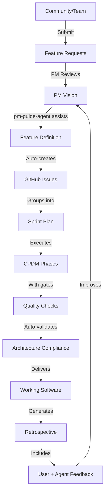

# CPDM v2 Improvements
Based on Sprint 6 Retrospective Feedback

## Major Improvements

### 1. Sprint vs Feature Planning Clarity
**Issue**: Confusion about whether to start with sprint planning or feature definition
**Solution**: 
- Start with **Feature Vision** (PM defines WHAT and WHY)
- Features automatically generate GitHub issues
- Sprint planning groups features into manageable chunks
- Clear flow: Vision → Features → Issues → Sprint

### 2. PM Agent Guidance
**Issue**: No sub-agent guiding PM through the process
**Solution**: Create `pm-guide-agent` that:
- Explains where we are in CPDM
- Shows what comes next
- Provides templates and examples
- Tracks PM decisions

### 3. Agent Self-Verification
**Issue**: PM needs to manually verify agent outputs match architecture
**Solution**:
- Agents must self-verify their outputs
- Quality gates automatically check compliance
- Architecture agents validate conformance
- PM only reviews exceptions

### 4. Sprint Artifact Management
**Issue**: `/sprints/current/` folder filling up without cleanup
**Solution**: 
- `sprint-cleanup-agent` automatically archives completed sprint artifacts
- Moves files to `/docs/archives/sprint-N/`
- Maintains clean working directory

### 5. User & Agent Feedback Loop
**Issue**: Missing user feedback and agent feedback in retrospectives
**Solution**:
- Retrospectives must include user experience section
- Agents provide performance metrics and improvement suggestions
- Feedback directly influences agent updates

## CPDM v2 Process Flow

## New Agent Responsibilities

### pm-guide-agent
- Guides PM through CPDM process
- Provides context on current phase
- Suggests next actions
- Templates for each phase

### sprint-cleanup-agent
- Archives completed sprint artifacts
- Maintains clean working directories
- Generates sprint summaries
- Updates documentation

### quality-gate-agent
- Automated architecture compliance checks
- Validates agent outputs
- Reports exceptions to PM
- Enforces standards

## Regular Agent Engineering Lab
**New Process for Agent Excellence**

Weekly lab sessions to:
1. Review agent performance metrics
2. A/B test agent improvements
3. Apply latest Claude Code patterns
4. Implement prompt engineering advances
5. Update MCP tool usage
6. Measure quality and token efficiency

## Updated CPDM Phases

### Phase 1: Vision (PM-Led)
- PM defines WHAT and WHY
- pm-guide-agent provides templates
- Auto-generates feature issues
- No technical implementation details

### Phase 2: Design (Architect-Led)
- Architects define HOW
- Must validate runtime environment
- Deploy and test before approval
- Document all requirements

### Phase 3: Decision
- ADRs auto-generated
- Quality gates enforced
- Compliance validated
- PM approves exceptions only

### Phase 4: Implementation
- Agents self-verify outputs
- Architecture compliance automatic
- Deployment verification required
- End-to-end testing mandatory

### Phase 5: Quality
- Automated checks
- Agent performance metrics
- User experience validation
- Token efficiency measurement

### Phase 6: Delivery
- Auto-deployment of agents
- Sprint artifact archival
- Documentation updates
- Feedback collection

### Phase 7: Feedback
- User experience rating
- Agent performance metrics
- Improvement suggestions
- Auto-updates vision

## Success Metrics

### Process Metrics
- PM guidance satisfaction: >8/10
- Auto-validation success: >90%
- Sprint cleanup automation: 100%
- Feedback incorporation: 100%

### Agent Excellence Metrics
- Agent effectiveness: 100%
- Agent efficiency: 95%
- Quality improvement via A/B: >10%
- Token reduction via optimization: >20%

## Implementation Priority

1. **Immediate** (Sprint 7 Day 1):
   - Create pm-guide-agent
   - Implement sprint-cleanup-agent
   - Document Agent Engineering Lab

2. **Short-term** (Sprint 7):
   - Quality gate automation
   - Agent self-verification
   - Feedback loop integration

3. **Long-term** (Sprint 8+):
   - A/B testing framework
   - Performance analytics
   - Continuous agent improvement

---
*CPDM v2 - Making the process self-guiding and self-improving*