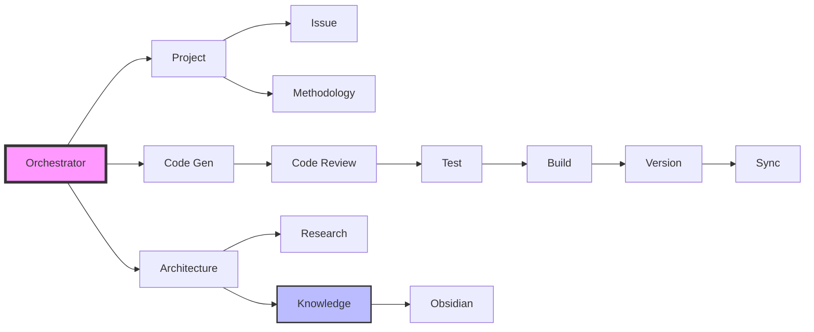

# Agent Capability Matrix

## Core Capabilities

| Agent | Primary Skills | Tools | Input Types | Output Types | Integration Points |
|-------|---------------|-------|-------------|--------------|-------------------|
| **Orchestrator** | Request routing, Multi-agent coordination, Workflow management | message_queue, file_management | User requests, Agent responses | Routed tasks, Status updates | All agents, CLAUDE.md |
| **Context** | State management, Context switching, Cache management | file_management, cache | Context requests, State updates | Context data, Cache hits | All agents, .claudeprojects/ |
| **Methodology** | Agile practices, Sprint ceremonies, Process enforcement | file_management | Process requests, Ceremony triggers | Sprint artifacts, Reports | Project agent, Knowledge agent |
| **Knowledge** | Documentation, Learning capture, Pattern recognition | obsidian_mcp, file_management | Decisions, Insights | Obsidian notes, Templates | All agents, Obsidian vault |

## Domain Capabilities

| Agent | Primary Skills | Tools | Input Types | Output Types | Integration Points |
|-------|---------------|-------|-------------|--------------|-------------------|
| **Project** | Sprint planning, Task management, Roadmapping | github_mcp, file_management | Feature requests, Bug reports | Sprint plans, Tasks | Issue agent, Methodology agent |
| **Research** | Technology analysis, Best practices, Trend analysis | web_search, file_management | Research queries | Analysis reports, Recommendations | Knowledge agent, Architecture designer |
| **Innovation** | Creative solutions, Pattern discovery, Optimization | file_management | Problem statements | Innovation proposals, Patterns | Architecture designer, Knowledge agent |
| **Analytics** | Data analysis, Metrics, Performance monitoring | sqlite, file_management | Performance data, Logs | Reports, Dashboards | All agents, Monitoring systems |

## Infrastructure Capabilities

| Agent | Primary Skills | Tools | Input Types | Output Types | Integration Points |
|-------|---------------|-------|-------------|--------------|-------------------|
| **Obsidian** | Vault management, Note linking, Knowledge graph | obsidian_mcp | Notes, Links | Updated vault, Backlinks | Knowledge agent, All documentation |
| **Sync** | Data synchronization, Conflict resolution, Backup | file_management, git | Sync requests | Sync status, Conflict reports | Version agent, All data stores |
| **Version** | Git operations, Branching, Merging | git, github_mcp | Code changes, Commits | Version tags, Branches | Build agent, All code |
| **License** | License compliance, Dependency scanning, Attribution | file_management | Dependencies, Code | Compliance reports, Attributions | Build agent, Legal requirements |

## Delivery Capabilities

| Agent | Primary Skills | Tools | Input Types | Output Types | Integration Points |
|-------|---------------|-------|-------------|--------------|-------------------|
| **Code Review** | Code quality, Standards enforcement, Security review | file_management, ast_parser | Code changes | Review feedback, Approval status | Code generator, Test agent |
| **Test** | Unit testing, Integration testing, Coverage analysis | test_runners, file_management | Code, Test specs | Test results, Coverage reports | Code review, Build agent |
| **Build** | Compilation, Bundling, Optimization | build_tools, file_management | Source code | Build artifacts, Packages | Test agent, Version agent |
| **Issue** | Issue tracking, Bug management, Feature requests | github_mcp | Issues, PRs | Status updates, Assignments | Project agent, GitHub |

## Capability Levels

### Expertise Scale
- **Expert (5)**: Deep domain knowledge, handles complex scenarios
- **Advanced (4)**: Strong capabilities, handles most scenarios
- **Intermediate (3)**: Good capabilities, may need guidance
- **Basic (2)**: Limited capabilities, requires supervision
- **Learning (1)**: New capability, under development

## Cross-Agent Capabilities

| Capability | Orchestrator | Project | Architecture | Code Gen | Review | Test | Build | Version | Issue | Knowledge |
|------------|-------------|---------|--------------|----------|--------|------|-------|---------|-------|-----------|
| **Planning** | 3 | 5 | 4 | 2 | 2 | 2 | 1 | 2 | 3 | 3 |
| **Design** | 2 | 3 | 5 | 3 | 3 | 2 | 1 | 1 | 2 | 3 |
| **Implementation** | 1 | 2 | 2 | 5 | 3 | 3 | 3 | 2 | 2 | 2 |
| **Quality** | 3 | 3 | 4 | 3 | 5 | 5 | 3 | 2 | 3 | 3 |
| **Documentation** | 3 | 3 | 4 | 3 | 3 | 3 | 2 | 2 | 3 | 5 |
| **Automation** | 4 | 3 | 2 | 4 | 4 | 5 | 5 | 4 | 3 | 2 |
| **Communication** | 5 | 4 | 3 | 2 | 4 | 3 | 2 | 2 | 4 | 4 |

## Agent Dependencies

## Capability Gaps & Improvements

### Current Gaps
1. **Security Agent**: No dedicated security scanning
2. **Performance Agent**: No performance profiling
3. **UX Agent**: No user experience validation
4. **Database Agent**: No database schema management
5. **Cloud Agent**: No cloud deployment automation

### Improvement Opportunities
1. **Cross-training**: Agents learning from each other
2. **Capability sharing**: Reusable components
3. **Parallel processing**: Better multi-agent coordination
4. **Error recovery**: Self-healing capabilities
5. **Learning loop**: Continuous improvement from feedback

## Performance Characteristics

| Agent | Avg Response Time | Success Rate | Throughput | Resource Usage |
|-------|------------------|--------------|------------|----------------|
| Orchestrator | < 100ms | 99.9% | 1000 req/min | Low |
| Project | < 2s | 98% | 30 req/min | Medium |
| Architecture | < 5s | 95% | 10 req/min | Medium |
| Code Generator | < 10s | 90% | 6 req/min | High |
| Code Review | < 3s | 97% | 20 req/min | Medium |
| Test | < 30s | 95% | 2 req/min | High |
| Build | < 60s | 98% | 1 req/min | High |
| Version | < 1s | 99% | 60 req/min | Low |
| Issue | < 2s | 98% | 30 req/min | Low |
| Knowledge | < 1s | 99% | 100 req/min | Low |

## Usage Patterns

### High-Frequency Pairs
1. **Code Gen ↔ Review**: Every code change
2. **Review ↔ Test**: After approval
3. **Test ↔ Build**: On test success
4. **Orchestrator ↔ All**: Routing everything
5. **Knowledge ↔ Obsidian**: Documentation sync

### Workflow Patterns
1. **Sequential**: Design → Code → Review → Test → Build
2. **Parallel**: Multiple features simultaneously
3. **Iterative**: Review → Fix → Review cycles
4. **Hierarchical**: Orchestrator delegates to specialists
5. **Collaborative**: Multiple agents on complex tasks