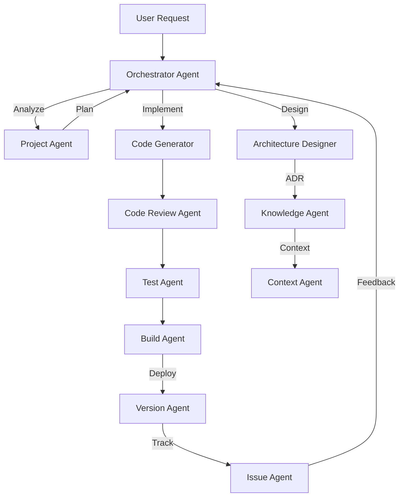

# Agent-Based Development Process

## Overview
The ClaudeProjects2 development process leverages 10 specialized agents working in concert to deliver high-quality software.

## Process Flow



## Agent Roles & Responsibilities

### 1. Orchestrator Agent
- **Role**: Request router and workflow coordinator
- **Input**: User requests, agent responses
- **Output**: Routed tasks, aggregated results
- **Decision Points**: Complexity assessment, agent selection

### 2. Project Agent
- **Role**: Sprint planning and task management
- **Input**: Feature requests, bug reports
- **Output**: Sprint plans, task breakdowns
- **Decision Points**: Priority, effort estimation

### 3. Architecture Designer
- **Role**: System design and pattern selection
- **Input**: Requirements, constraints
- **Output**: Design documents, ADRs
- **Decision Points**: Trade-offs, quality attributes

### 4. Code Generator Enhanced
- **Role**: Implementation from specifications
- **Input**: Design docs, user stories
- **Output**: Production code
- **Decision Points**: Framework selection, optimization

### 5. Code Review Agent
- **Role**: Quality assurance and standards
- **Input**: Code changes
- **Output**: Review feedback, approval status
- **Decision Points**: Pass/fail, refactor suggestions

### 6. Test Agent
- **Role**: Automated testing and validation
- **Input**: Code, test specifications
- **Output**: Test results, coverage reports
- **Decision Points**: Test strategy, failure analysis

### 7. Build Agent
- **Role**: Compilation and packaging
- **Input**: Source code, dependencies
- **Output**: Build artifacts, deployment packages
- **Decision Points**: Build configuration, optimization

### 8. Version Agent
- **Role**: Git operations and version control
- **Input**: Code changes, commit messages
- **Output**: Version tags, branches
- **Decision Points**: Branching strategy, merge conflicts

### 9. Issue Agent
- **Role**: GitHub issue management
- **Input**: Bug reports, feature requests
- **Output**: Issue tracking, status updates
- **Decision Points**: Issue categorization, assignment

### 10. Knowledge Agent
- **Role**: Documentation and knowledge capture
- **Input**: Decisions, learnings
- **Output**: Obsidian notes, documentation
- **Decision Points**: Knowledge organization, relevance

## Communication Protocols

### Message Format
```json
{
  "id": "msg-uuid",
  "type": "request|response|notification",
  "from": "agent-name",
  "to": "agent-name",
  "timestamp": "ISO-8601",
  "correlation_id": "request-uuid",
  "priority": "high|normal|low",
  "data": {
    "action": "specific-action",
    "parameters": {},
    "context": {}
  },
  "metadata": {
    "timeout": 30000,
    "retry_count": 0
  }
}
```

### Priority Levels
- **High**: Security issues, production bugs, user-blocking
- **Normal**: Feature development, improvements
- **Low**: Documentation, cleanup, optimizations

## Quality Gates

### Gate 1: Requirements → Design
- **Owner**: Architecture Designer
- **Criteria**: 
  - Requirements documented
  - Constraints identified
  - Quality attributes defined
- **Output**: Design approval

### Gate 2: Design → Implementation
- **Owner**: Code Generator
- **Criteria**:
  - Design reviewed
  - Patterns selected
  - Dependencies available
- **Output**: Implementation plan

### Gate 3: Implementation → Review
- **Owner**: Code Review Agent
- **Criteria**:
  - Code complete
  - No syntax errors
  - Follows conventions
- **Output**: Review feedback

### Gate 4: Review → Testing
- **Owner**: Test Agent
- **Criteria**:
  - Review passed
  - Tests written
  - Coverage adequate
- **Output**: Test results

### Gate 5: Testing → Build
- **Owner**: Build Agent
- **Criteria**:
  - All tests pass
  - No blocking issues
  - Dependencies resolved
- **Output**: Build artifacts

### Gate 6: Build → Deploy
- **Owner**: Version Agent
- **Criteria**:
  - Build successful
  - Version tagged
  - Changelog updated
- **Output**: Deployment ready

## Handoff Procedures

### Standard Handoff
1. Source agent completes work
2. Creates handoff message with:
   - Work summary
   - Output location
   - Next steps
   - Context data
3. Sends to orchestrator
4. Orchestrator routes to next agent
5. Target agent acknowledges receipt
6. Target agent begins work

### Error Handoff
1. Agent encounters error
2. Documents error details
3. Attempts recovery (if possible)
4. Escalates to orchestrator
5. Orchestrator determines:
   - Retry with same agent
   - Route to different agent
   - Return error to user

## Process Workflows

### Feature Development
```
User Story → Project Agent → Architecture Designer → Code Generator 
→ Code Review → Test Agent → Build Agent → Version Agent → Issue Agent
```

### Bug Fix
```
Bug Report → Issue Agent → Project Agent → Code Generator 
→ Code Review → Test Agent → Build Agent → Version Agent
```

### Documentation Update
```
Doc Request → Knowledge Agent → Review Agent → Version Agent
```

### Emergency Hotfix
```
Critical Bug → Orchestrator → Code Generator → Test Agent 
→ Build Agent → Version Agent (fast track)
```

## Performance Metrics

### SLAs (Service Level Agreements)
- Orchestrator routing: < 100ms
- Agent response time: < 3s
- End-to-end feature: < 30min
- Bug fix turnaround: < 15min
- Build time: < 5min

### Quality Metrics
- Code review pass rate: > 80%
- Test coverage: > 80%
- Build success rate: > 95%
- Deployment success: > 99%

## Monitoring & Observability

### Agent Health Checks
- Message queue depth
- Response times
- Error rates
- Resource usage

### Process Metrics
- Throughput (tasks/hour)
- Cycle time (request to deploy)
- Defect escape rate
- Rework percentage

## Continuous Improvement

### Retrospective Process
1. Weekly agent performance review
2. Identify bottlenecks
3. Optimize handoffs
4. Update orchestration rules
5. Refine quality gates

### Learning Capture
- Failed attempts → Knowledge base
- Successful patterns → Templates
- Performance data → Optimization
- User feedback → Process updates