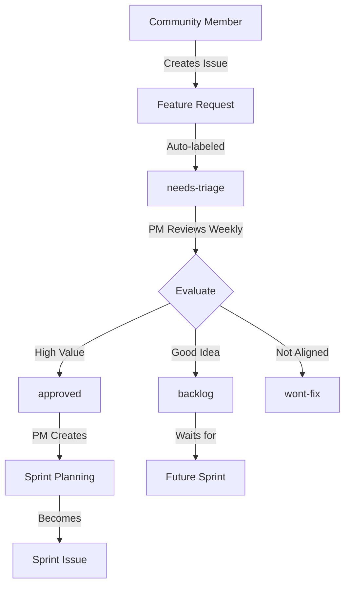

# Feature Request Workflow

## Overview
Community and team members submit feature requests via GitHub Issues. The PM reviews, prioritizes, and converts approved features into sprint work.

## Process Flow



## 1. Feature Submission (Community/Team)

### How to Submit
1. Go to Issues → New Issue
2. Select "🚀 Feature Request" template
3. Fill out all required fields:
   - Problem Statement
   - Proposed Solution
   - Expected Impact
   - Urgency

### What Happens Next
- Auto-labeled: `feature-request`, `needs-triage`
- PM notified via GitHub
- Added to review queue

## 2. PM Review Process

### Weekly Review (Every Monday)
```bash
# PM views all pending feature requests
gh issue list --label "needs-triage" --label "feature-request"

# For each request, PM evaluates using Triple Helix
./scripts/cpdm-workflow-engine.sh evaluate-feature [issue-number]
```

### Triple Helix Evaluation
1. **Methodology Fit**: Does it align with CPDM?
2. **Agent Capability**: Can our agents handle it?
3. **Knowledge Value**: Does it create reusable knowledge?

### Decision Labels
- `approved` - Will be implemented
- `backlog` - Good idea for later
- `needs-discussion` - Requires more info
- `wont-fix` - Not aligned with vision

## 3. Feature Prioritization

### Priority Matrix
```
         High Impact
              |
    P1        |        P2
  Critical    |     Important
  ------------|-------------
    P3        |        P4
  Nice-to-    |     Consider
    have      |      Later
              |
         Low Impact
```

### Priority Labels
- `priority-1-critical` - Next sprint
- `priority-2-important` - Within 2 sprints  
- `priority-3-nice` - When possible
- `priority-4-later` - Future consideration

## 4. Sprint Planning Integration

### Converting Features to Sprint Work
When a feature is approved:

```bash
# PM converts feature to sprint issue
./scripts/cpdm-workflow-engine.sh feature-to-sprint [issue-number] [sprint-number]
```

This automatically:
1. Updates labels
2. Adds to sprint milestone
3. Creates sub-tasks if needed
4. Notifies assignees

## 5. Community Visibility

### Public Roadmap View
Community can see:
- What's approved (`approved` label)
- What's in progress (`in-progress` label)
- What's completed (`done` label)
- What won't be done (`wont-fix` with reason)

### Query Examples
```bash
# See approved features not yet started
gh issue list --label "approved" --label "feature-request" --state open

# See features in current sprint
gh issue list --label "sprint-7" --label "feature-request"

# See completed features
gh issue list --label "feature-request" --label "done" --state closed
```

## 6. Automation Support

### GitHub Actions (Future)
```yaml
name: Feature Request Triage
on:
  issues:
    types: [opened, labeled]

jobs:
  auto-triage:
    if: contains(github.event.issue.labels.*.name, 'feature-request')
    steps:
      - Add to project board
      - Notify PM
      - Check for duplicates
```

### PM Dashboard Integration
The pm-guide-agent can help:
- Show pending feature requests
- Calculate ROI estimates
- Suggest prioritization
- Track feature metrics

## 7. Feedback Loop

### After Implementation
1. Original requester notified
2. Asked to validate solution
3. Feedback captured for retrospective
4. Success metrics tracked

### Metrics to Track
- Time from request to implementation
- Feature adoption rate
- Requester satisfaction
- Value delivered vs estimated

## 8. Best Practices

### For Requesters
- Search existing issues first
- Be specific about the problem
- Provide real-world examples
- Offer to help implement

### For PM
- Review weekly (don't let them pile up)
- Provide clear feedback on decisions
- Thank contributors
- Keep roadmap updated

### For Team
- Link PRs to feature issues
- Update issue status regularly
- Capture implementation notes
- Measure actual vs estimated effort

## Example Feature Request Lifecycle

1. **Day 1**: User creates issue #54 "Add dark mode"
2. **Day 3**: PM reviews, marks `approved`, `priority-2-important`
3. **Day 8**: Added to Sprint 8 planning
4. **Day 10**: Sprint 8 starts, work begins
5. **Day 14**: PR #102 implements feature
6. **Day 15**: Merged, issue closed, requester notified
7. **Day 20**: Metrics show 80% adoption rate

## Integration with CPDM

Feature requests flow through CPDM phases:

1. **Vision**: Request aligned with product vision?
2. **Design**: How should we implement?
3. **Decision**: ADR for significant features
4. **Implementation**: Development work
5. **Quality**: Tests and validation
6. **Delivery**: Release to users
7. **Feedback**: Measure success

---
*This workflow ensures community input while maintaining PM control over prioritization*