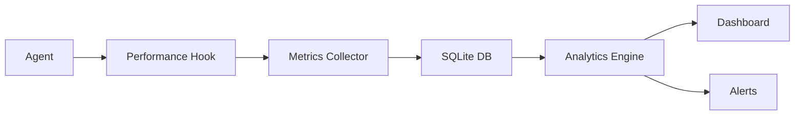

# Sprint 10: Optimization - Performance & Recovery Patterns

## Sprint Overview
- **Goal**: Implement performance tracking, sophisticated recovery, and continuous learning
- **Duration**: 1 week (5 days)
- **Focus**: Production-grade reliability and self-improvement
- **Success Criteria**: Full observability, graceful degradation, learning system operational

## Sprint Objectives
1. Complete performance tracking system
2. Implement sophisticated error recovery patterns
3. Build learning and pattern recognition system
4. Create comprehensive monitoring dashboard
5. Establish continuous improvement pipeline

## Day-by-Day Plan

### Day 1: Performance Tracking System
**Morning:**
- [ ] Enhance agent-performance-tracker.sh with metrics collection
- [ ] Implement performance database schema (SQLite)
- [ ] Create performance hooks for all agents
- [ ] Build metric aggregation pipeline

**Afternoon:**
- [ ] Implement real-time performance monitoring
- [ ] Create performance alert system
- [ ] Build performance API for queries
- [ ] Add performance regression detection

**Deliverables:**
- Complete performance tracking system
- Performance database operational
- Alert system configured

### Day 2: Error Recovery Patterns
**Morning:**
- [ ] Implement circuit breaker pattern
- [ ] Create retry with exponential backoff
- [ ] Build fallback agent chains
- [ ] Implement graceful degradation

**Afternoon:**
- [ ] Create error classification system
- [ ] Build recovery strategy selector
- [ ] Implement compensation patterns
- [ ] Add error recovery monitoring

**Deliverables:**
- Circuit breaker implementation
- Retry mechanisms
- Fallback chains configured
- Recovery monitoring

### Day 3: Learning System Implementation
**Morning:**
- [ ] Create pattern recognition engine
- [ ] Build success/failure classifier
- [ ] Implement pattern database
- [ ] Create recommendation engine

**Afternoon:**
- [ ] Build antipattern detection
- [ ] Implement pattern promotion logic
- [ ] Create learning feedback loops
- [ ] Add A/B testing framework

**Deliverables:**
- Pattern recognition operational
- Learning database
- Recommendation engine

### Day 4: Monitoring Dashboard
**Morning:**
- [ ] Create agent-dashboard.sh script
- [ ] Build real-time metrics visualization
- [ ] Implement team composition viewer
- [ ] Add performance trending

**Afternoon:**
- [ ] Create suggest-team.sh script
- [ ] Build agent-analytics.sh script
- [ ] Implement health check dashboard
- [ ] Add predictive analytics

**Deliverables:**
- Complete monitoring dashboard
- Analytics scripts
- Health monitoring

### Day 5: Integration & Optimization
**Morning:**
- [ ] End-to-end testing of all systems
- [ ] Performance optimization
- [ ] Load testing with concurrent agents
- [ ] Stress testing recovery patterns

**Afternoon:**
- [ ] Documentation finalization
- [ ] Create operations runbook
- [ ] Sprint demo preparation
- [ ] Retrospective and handoff

**Deliverables:**
- All systems integrated
- Operations documentation
- Sprint 10 demo

## Technical Implementation

### Performance Tracking Architecture


### Circuit Breaker States
```
CLOSED -> OPEN (on failure threshold)
OPEN -> HALF_OPEN (after timeout)
HALF_OPEN -> CLOSED (on success)
HALF_OPEN -> OPEN (on failure)
```

### Recovery Strategy Matrix
| Error Type | Primary Strategy | Fallback Strategy |
|------------|-----------------|-------------------|
| Timeout | Retry with backoff | Alternative agent |
| Capability Missing | Find equivalent agent | Decompose task |
| Agent Failure | Circuit breaker | Manual escalation |
| Context Loss | Restore from checkpoint | Rebuild context |
| Performance Degradation | Scale resources | Reduce scope |

### Learning System Flow
```python
def learn_from_execution(task, team, result):
    # Record execution
    record = create_execution_record(task, team, result)
    
    # Extract patterns
    patterns = extract_patterns(record)
    
    # Update pattern database
    update_patterns(patterns, result.success)
    
    # Generate recommendations
    recommendations = generate_recommendations(patterns)
    
    # Promote successful patterns
    if result.success and pattern.count > 10:
        promote_to_default(pattern)
    
    return recommendations
```

## Implementation Components

### Performance Metrics
- Response time (p50, p95, p99)
- Success rate
- Error rate by type
- Resource utilization
- Queue depth
- Context size
- Team composition efficiency

### Recovery Patterns
1. **Retry Pattern**
   - Max attempts: 3
   - Backoff: exponential (1s, 2s, 4s)
   - Jitter: ±10%

2. **Circuit Breaker**
   - Failure threshold: 5 in 1 minute
   - Open duration: 30 seconds
   - Half-open test: 1 request

3. **Bulkhead Pattern**
   - Isolate critical agents
   - Resource pools per domain
   - Prevent cascade failures

### Dashboard Features
- Real-time agent status
- Performance trends
- Error heat map
- Team composition history
- Pattern effectiveness
- Cost analysis
- Predictive alerts

## Success Metrics
- [ ] Performance tracking < 50ms overhead
- [ ] Error recovery success > 80%
- [ ] Pattern recognition accuracy > 85%
- [ ] Dashboard refresh < 1 second
- [ ] Learning improvement > 15% monthly
- [ ] Alert accuracy > 90%

## Risk Mitigation
- **Risk**: Performance overhead
  - **Mitigation**: Async metrics, sampling
- **Risk**: Complex recovery logic
  - **Mitigation**: Simple fallbacks, clear escalation
- **Risk**: Learning system drift
  - **Mitigation**: Human review, bounded changes

## Dependencies
- Sprint 8 & 9 completion
- SQLite for metrics storage
- Existing agent infrastructure
- Performance baseline from Sprint 8

## GitHub Issues to Create
- [ ] Task: Implement Performance Tracking System
- [ ] Task: Build Error Recovery Patterns
- [ ] Task: Create Learning System
- [ ] Task: Develop Monitoring Dashboard
- [ ] Task: Integration Testing & Optimization

## Operations Runbook Outline
1. Daily health checks
2. Performance monitoring
3. Alert response procedures
4. Recovery pattern selection
5. Pattern promotion process
6. Dashboard maintenance
7. Troubleshooting guide

## Definition of Done
- [ ] All components implemented and tested
- [ ] Performance targets met
- [ ] Recovery patterns working
- [ ] Learning system operational
- [ ] Dashboard deployed
- [ ] Documentation complete
- [ ] Operations runbook created
- [ ] Sprint demo delivered