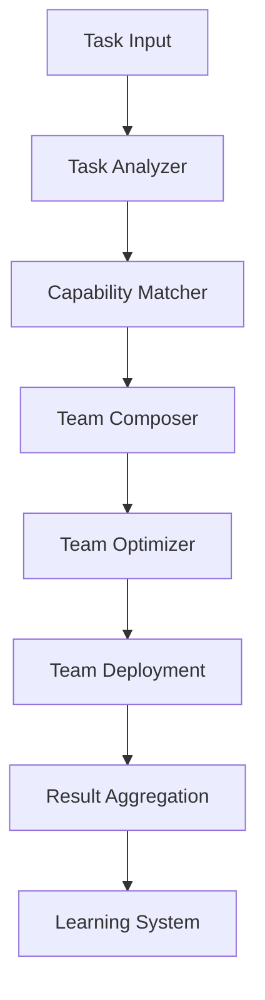

# Sprint 9: Intelligence - Agent Organizer & Dynamic Composition

## Sprint Overview
- **Goal**: Implement intelligent agent team composition and task decomposition
- **Duration**: 1 week (5 days)
- **Focus**: Dynamic agent selection based on task requirements
- **Success Criteria**: Agent-organizer operational, dynamic teams working

## Sprint Objectives
1. Port agent-organizer pattern from blueprint
2. Implement task decomposition engine
3. Create dynamic team composition logic
4. Build agent collaboration patterns
5. Implement learning from successful compositions

## Day-by-Day Plan

### Day 1: Agent Organizer Foundation
**Morning:**
- [ ] Study claude-code-sub-agents agent-organizer pattern
- [ ] Create `/agents/core/agent-organizer.md`
- [ ] Design task analysis framework
- [ ] Define team composition rules

**Afternoon:**
- [ ] Implement capability matching algorithm
- [ ] Create agent scoring system
- [ ] Build team optimization logic
- [ ] Write unit tests for organizer

**Deliverables:**
- Agent-organizer implementation
- Capability matching algorithm
- Team scoring system

### Day 2: Task Decomposition Engine
**Morning:**
- [ ] Design task breakdown patterns
- [ ] Create task complexity analyzer
- [ ] Implement dependency detection
- [ ] Build task-to-capability mapper

**Afternoon:**
- [ ] Create decomposition strategies per domain
- [ ] Implement parallel vs sequential detection
- [ ] Add task estimation logic
- [ ] Build decomposition validator

**Deliverables:**
- Task decomposition engine
- Complexity analysis tools
- Dependency graphs

### Day 3: Dynamic Team Composition
**Morning:**
- [ ] Implement team builder algorithm
- [ ] Create role assignment logic
- [ ] Build coordination patterns
- [ ] Add team size optimization

**Afternoon:**
- [ ] Implement team templates for common tasks
- [ ] Create team performance predictor
- [ ] Build team conflict resolver
- [ ] Add team monitoring capabilities

**Deliverables:**
- Dynamic team builder
- Team templates library
- Performance prediction model

### Day 4: Agent Collaboration Patterns
**Morning:**
- [ ] Design inter-agent communication protocols
- [ ] Implement handoff patterns
- [ ] Create shared workspace management
- [ ] Build result aggregation logic

**Afternoon:**
- [ ] Implement pipeline patterns
- [ ] Create map-reduce patterns
- [ ] Build consensus mechanisms
- [ ] Add collaboration monitoring

**Deliverables:**
- Collaboration protocol library
- Pattern implementations
- Monitoring dashboard

### Day 5: Learning & Optimization
**Morning:**
- [ ] Implement success metric collection
- [ ] Create composition history tracking
- [ ] Build pattern recognition system
- [ ] Add recommendation engine

**Afternoon:**
- [ ] Integration testing with real tasks
- [ ] Performance optimization
- [ ] Documentation completion
- [ ] Sprint demo preparation

**Deliverables:**
- Learning system
- Pattern library
- Sprint 9 demo

## Technical Architecture

### Agent Organizer Flow


### Team Composition Algorithm
```python
def compose_team(task):
    # Analyze task requirements
    requirements = analyze_task(task)
    
    # Match capabilities to requirements
    candidates = match_capabilities(requirements)
    
    # Optimize team composition
    team = optimize_team(candidates, requirements)
    
    # Assign roles and coordination
    team = assign_roles(team, task)
    
    return team
```

### Collaboration Patterns

#### Pipeline Pattern
```
Agent A -> Agent B -> Agent C -> Result
```

#### Parallel Pattern
```
       -> Agent A ->
Task ->  Agent B  -> Aggregator -> Result
       -> Agent C ->
```

#### Hierarchical Pattern
```
Lead Agent
    ├── Sub-Agent A
    ├── Sub-Agent B
    └── Sub-Agent C
```

## Implementation Tasks

### Core Components
1. **Task Analyzer**
   - Complexity scoring
   - Domain detection
   - Requirement extraction

2. **Capability Matcher**
   - Skill matching
   - Tool requirement checking
   - Performance history

3. **Team Optimizer**
   - Cost minimization
   - Performance maximization
   - Resource balancing

4. **Learning System**
   - Pattern recognition
   - Success tracking
   - Recommendation engine

## Success Metrics
- [ ] Task decomposition accuracy > 90%
- [ ] Team composition time < 500ms
- [ ] Successful task completion > 95%
- [ ] Agent utilization > 80%
- [ ] Learning improvement > 10% week-over-week

## Risk Mitigation
- **Risk**: Over-complex team compositions
  - **Mitigation**: Simplicity bias in optimizer
- **Risk**: Poor task decomposition
  - **Mitigation**: Fallback to manual decomposition
- **Risk**: Agent conflicts
  - **Mitigation**: Clear role boundaries, conflict resolution

## Dependencies
- Sprint 8 completion (context-manager, capabilities)
- Access to task history for learning
- Performance metrics from Sprint 8

## GitHub Issues to Create
- [ ] Epic: Intelligent Agent Organization System
- [ ] Task: Implement Agent Organizer Core
- [ ] Task: Build Task Decomposition Engine
- [ ] Task: Create Dynamic Team Composition
- [ ] Task: Implement Collaboration Patterns
- [ ] Task: Build Learning System

## Test Scenarios
1. **Simple Task**: Single agent selection
2. **Complex Task**: Multi-agent pipeline
3. **Parallel Task**: Concurrent agent execution
4. **Adaptive Task**: Learning from failures
5. **Large Task**: 10+ agent coordination

## Definition of Done
- [ ] All components implemented and tested
- [ ] Integration with existing agents complete
- [ ] Performance metrics meeting targets
- [ ] Documentation complete
- [ ] Demo showcasing dynamic composition