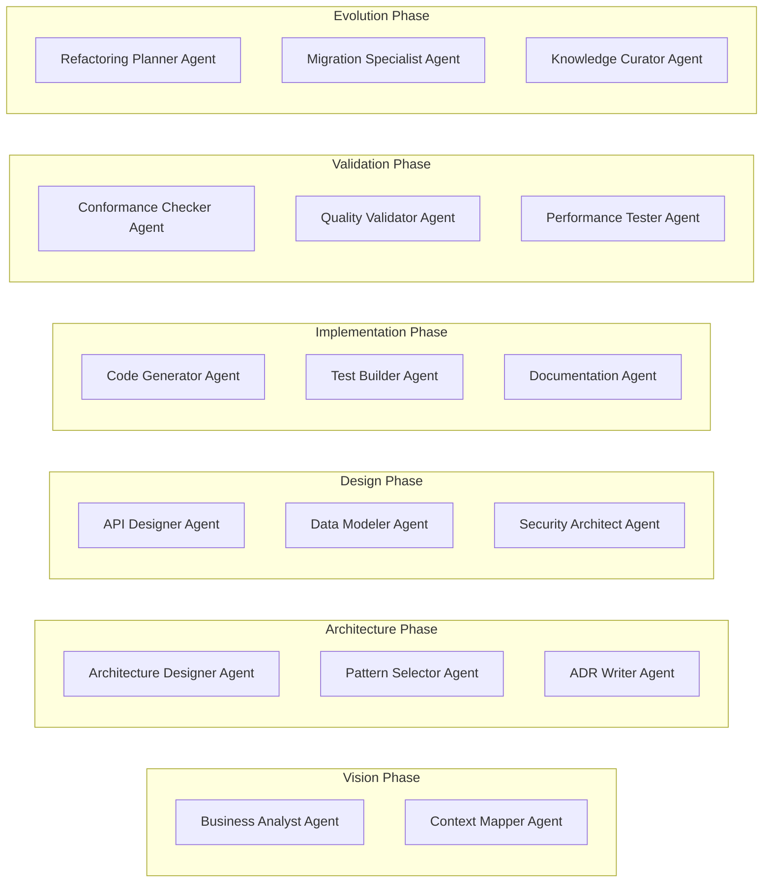
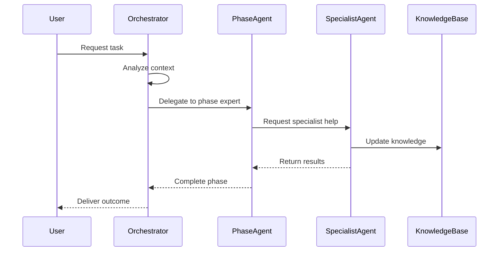

# Claude Code Sub-Agents Integration & Customization

## Overview
This document outlines how we integrate and customize the claude-code-sub-agents project for our architecture-centric methodology, and how we'll use their design pattern as a blueprint for building our own agents.

## Analysis of Existing Sub-Agents

### Current Agent Categories (33 agents)

#### 1. Development Agents
- **Frontend Specialist**: React, Vue, Angular expertise
- **Backend Engineer**: API design, server architecture
- **Full-Stack Developer**: End-to-end implementation
- **Language Experts**: Python, TypeScript, Go, Rust, etc.

#### 2. Infrastructure Agents
- **Cloud Architect**: AWS, Azure, GCP design
- **DevOps Engineer**: CI/CD, automation
- **Site Reliability**: Monitoring, scaling

#### 3. Quality Agents
- **Code Reviewer**: Standards, best practices
- **Security Auditor**: Vulnerability analysis
- **Performance Engineer**: Optimization specialist

#### 4. Specialized Agents
- **API Documentation**: OpenAPI, integration guides
- **Technical Writer**: User documentation
- **Data Engineer**: ETL, data architecture

## Customization for Architecture-Centric Methodology

### Phase-Aligned Agent Mapping



### Custom Agent Specifications

#### 1. Architecture Designer Agent
```yaml
name: architecture-designer
category: workflow
expertise: 
  - system-design
  - pattern-recognition
  - quality-attributes
capabilities:
  - Generate component diagrams
  - Select architectural patterns
  - Define system boundaries
  - Create deployment views
triggers:
  - "design the architecture"
  - "create system design"
  - "architectural blueprint"
```

#### 2. ADR Writer Agent
```yaml
name: adr-writer
category: capability
expertise:
  - decision-documentation
  - technical-writing
  - rationale-capture
capabilities:
  - Generate ADR documents
  - Link decisions to requirements
  - Track decision evolution
  - Maintain decision log
triggers:
  - "document decision"
  - "create ADR"
  - "architecture decision"
```

#### 3. Conformance Checker Agent
```yaml
name: conformance-checker
category: validation
expertise:
  - architecture-validation
  - code-analysis
  - pattern-matching
capabilities:
  - Verify implementation matches design
  - Check architectural constraints
  - Identify deviations
  - Generate conformance reports
triggers:
  - "check conformance"
  - "validate architecture"
  - "verify implementation"
```

## Integration Strategy

### 1. Installation & Setup
```bash
# Clone our customized agents
git clone https://github.com/sdh07/ClaudeProjects2
cd ClaudeProjects2/agents

# Install in Claude Code agents directory
cp -r custom-agents/* ~/.claude/agents/

# Verify installation
claude code --list-agents
```

### 2. Agent Orchestration Flow



### 3. Context Sharing Protocol
```json
{
  "context": {
    "project": "ClaudeProjects2",
    "phase": "architecture",
    "previousDecisions": ["ADR-001", "ADR-002"],
    "constraints": ["must-use-obsidian", "github-integration"],
    "qualityAttributes": ["maintainability", "scalability"]
  },
  "task": {
    "type": "design",
    "description": "Create component architecture",
    "expectedOutputs": ["component-diagram", "interface-specs"]
  },
  "orchestration": {
    "primaryAgent": "architecture-designer",
    "supportingAgents": ["pattern-selector", "adr-writer"],
    "workflow": "sequential"
  }
}
```

## Building New Agents: The Blueprint

### Agent Development Lifecycle

1. **Identify Need**: Gap in current capabilities
2. **Define Scope**: Clear boundaries and responsibilities
3. **Design Interface**: Input/output contracts
4. **Implement Core**: Primary functionality
5. **Add Intelligence**: Context awareness and learning
6. **Test Integration**: Work with other agents
7. **Document**: Usage and examples

### Agent Template Structure
```
agents/
├── {agent-name}/
│   ├── metadata.yaml        # Agent configuration
│   ├── capabilities.md      # What the agent can do
│   ├── prompts/            # Core prompts
│   │   ├── analyze.txt
│   │   ├── execute.txt
│   │   └── validate.txt
│   ├── examples/           # Usage examples
│   ├── tests/             # Validation tests
│   └── integrations.yaml  # Other agent dependencies
```

### Quality Criteria for Agents

1. **Single Responsibility**: One clear purpose
2. **Composable**: Works well with others
3. **Deterministic**: Predictable outputs
4. **Documented**: Clear usage guidelines
5. **Testable**: Validation criteria
6. **Versioned**: Backward compatibility

## Implementation Roadmap

### Phase 1: Core Architecture Agents (Sprint 1)
- [ ] Architecture Designer Agent
- [ ] ADR Writer Agent
- [ ] Pattern Selector Agent
- [ ] Component Mapper Agent

### Phase 2: Implementation Agents (Sprint 2)
- [ ] Code Generator Agent (customized)
- [ ] Test Builder Agent
- [ ] API Designer Agent
- [ ] Documentation Agent (enhanced)

### Phase 3: Validation Agents (Sprint 3)
- [ ] Conformance Checker Agent
- [ ] Quality Gate Agent
- [ ] Performance Analyzer Agent
- [ ] Security Scanner Agent

### Phase 4: Evolution Agents (Sprint 4)
- [ ] Refactoring Planner Agent
- [ ] Technical Debt Analyzer
- [ ] Migration Assistant Agent
- [ ] Knowledge Curator Agent

## Metrics and Success Criteria

### Agent Performance Metrics
- Task completion rate: > 95%
- Context understanding accuracy: > 90%
- Integration success rate: > 98%
- User satisfaction: > 4.5/5

### Methodology Alignment Metrics
- Architecture conformance: 100%
- Documentation coverage: 100%
- Decision traceability: All changes linked
- Knowledge capture rate: > 90%

## Conclusion

By customizing the claude-code-sub-agents pattern and creating our own specialized agents, we establish a powerful, scalable system that enforces our architecture-centric methodology while maintaining flexibility and extensibility. This blueprint ensures consistent agent development and seamless integration within our ClaudeProjects ecosystem.