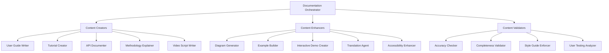
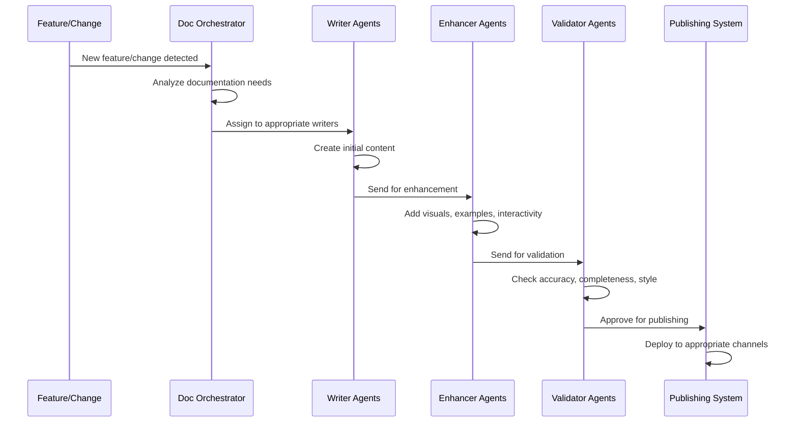
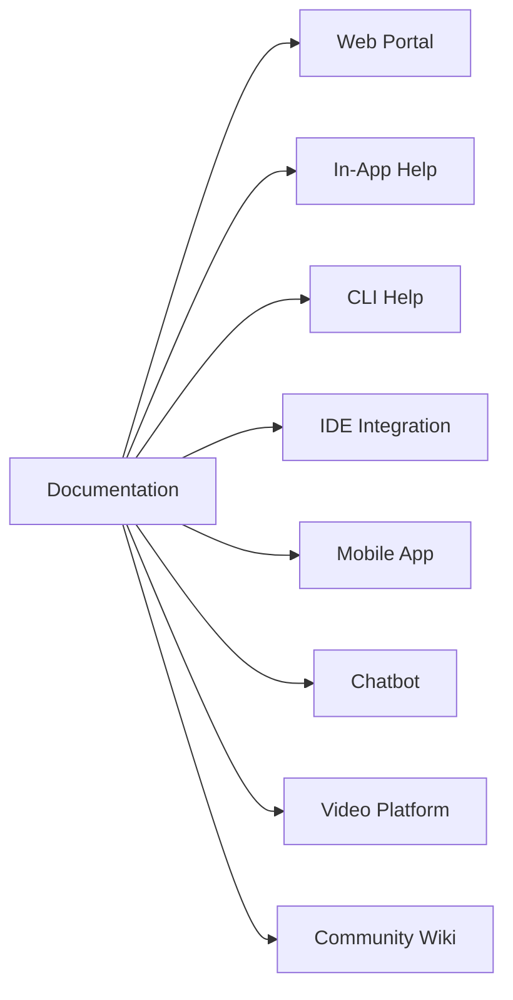

# Documentation Agent Strategy

## Overview

Documentation is critical for ClaudeProjects' success. We need specialized documentation agents that create different types of documentation for different audiences, maintaining consistency while adapting tone and depth.

## Documentation Philosophy

> "Documentation is not an afterthought; it's a first-class deliverable that enables user success."

### Core Principles
1. **User-Centric**: Written from the user's perspective
2. **Progressive Disclosure**: Simple start, deep details available
3. **Multi-Modal**: Text, visuals, videos, interactive examples
4. **Living Documentation**: Updates automatically with changes
5. **Contextual**: Right information at the right time

## Documentation Agent Taxonomy



## Specialized Documentation Agents

### 1. User Guide Writer Agent
```yaml
name: user-guide-writer
expertise:
  - end-user documentation
  - feature explanation
  - workflow documentation
capabilities:
  - Analyze feature functionality
  - Create step-by-step guides
  - Generate screenshots/GIFs
  - Write troubleshooting sections
  - Create FAQ sections
output_types:
  - Getting Started guides
  - Feature documentation
  - Best practices guides
  - Troubleshooting guides
```

### 2. Tutorial Creator Agent
```yaml
name: tutorial-creator
expertise:
  - learning path design
  - progressive complexity
  - hands-on exercises
capabilities:
  - Design learning objectives
  - Create exercise scenarios
  - Build sample projects
  - Generate validation tests
  - Track learning progress
output_types:
  - Interactive tutorials
  - Video tutorials
  - Workshop materials
  - Certification paths
```

### 3. API Documenter Agent
```yaml
name: api-documenter
expertise:
  - technical documentation
  - API specification
  - code examples
capabilities:
  - Generate OpenAPI specs
  - Create code snippets
  - Document authentication
  - Show request/response examples
  - Generate SDKs
output_types:
  - API references
  - Integration guides
  - SDK documentation
  - Postman collections
```

### 4. Methodology Explainer Agent
```yaml
name: methodology-explainer
expertise:
  - process documentation
  - framework explanation
  - pattern documentation
capabilities:
  - Explain methodology steps
  - Create process diagrams
  - Document best practices
  - Show real-world examples
  - Compare methodologies
output_types:
  - Methodology guides
  - Process templates
  - Decision frameworks
  - Case studies
```

### 5. Video Script Writer Agent
```yaml
name: video-script-writer
expertise:
  - multimedia content
  - narrative structure
  - visual storytelling
capabilities:
  - Write engaging scripts
  - Create storyboards
  - Design animations
  - Generate captions
  - Optimize for platforms
output_types:
  - Tutorial videos
  - Feature demos
  - Onboarding videos
  - Marketing content
```

## Documentation Workflow



## Documentation Types Matrix

| Documentation Type | Primary Agent | Target Audience | Update Frequency | Format |
|-------------------|---------------|-----------------|------------------|---------|
| Quick Start Guide | User Guide Writer | New users | Major releases | Web, PDF |
| Feature Docs | User Guide Writer | All users | Per feature | Web, In-app |
| API Reference | API Documenter | Developers | Real-time | Web, OpenAPI |
| Tutorials | Tutorial Creator | Learners | Quarterly | Interactive |
| Methodology Guides | Methodology Explainer | Practitioners | Per methodology | Web, PDF |
| Video Tutorials | Video Script Writer | Visual learners | Monthly | Video |
| Troubleshooting | User Guide Writer | Support users | As needed | Web, KB |
| Best Practices | Methodology Explainer | Power users | Quarterly | Web, PDF |

## Documentation Quality Framework

### Quality Metrics
1. **Readability Score**: Flesch-Kincaid < 8th grade
2. **Completeness**: All features documented
3. **Accuracy**: 100% technically correct
4. **Freshness**: Updated within 24h of changes
5. **Findability**: 3-click rule to any info
6. **Usefulness**: >90% helpful ratings

### Documentation Standards
```markdown
# Feature Name

## What it does (1 sentence)
[Clear, simple explanation]

## Why use it (Benefits)
- Benefit 1
- Benefit 2
- Benefit 3

## How to use it (Steps)
1. Step one with screenshot
2. Step two with example
3. Step three with result

## Examples
[Real-world scenario]

## Common issues
[Troubleshooting]

## Related features
[Links to related docs]
```

## Multi-Language Support

### Translation Agent
```yaml
name: translation-agent
expertise:
  - multi-language support
  - cultural adaptation
  - terminology consistency
capabilities:
  - Translate documentation
  - Adapt examples culturally
  - Maintain glossaries
  - Check context accuracy
supported_languages:
  - English (primary)
  - Spanish
  - French
  - German
  - Japanese
  - Mandarin
```

## Interactive Documentation

### Interactive Demo Creator
```yaml
name: interactive-demo-creator
expertise:
  - interactive content
  - sandbox environments
  - guided experiences
capabilities:
  - Create live playgrounds
  - Build interactive tours
  - Generate practice environments
  - Track user progress
output_types:
  - CodeSandbox demos
  - Interactive tutorials
  - Guided tours
  - Practice environments
```

## Documentation Delivery Channels



## Metrics and Analytics

### User Engagement Metrics
- Page views per feature
- Time on page
- Search queries
- Feedback ratings
- Support ticket reduction

### Content Performance
- Most/least viewed pages
- Search success rate
- Bounce rate
- User pathways
- Completion rates

## Implementation Roadmap

### Phase 1: Foundation (Month 1)
- [ ] Deploy User Guide Writer Agent
- [ ] Create initial documentation structure
- [ ] Set up documentation portal
- [ ] Establish style guide

### Phase 2: Enhancement (Month 2)
- [ ] Add Tutorial Creator Agent
- [ ] Create interactive demos
- [ ] Add video documentation
- [ ] Implement search

### Phase 3: Scale (Month 3)
- [ ] Deploy all documentation agents
- [ ] Add multi-language support
- [ ] Implement analytics
- [ ] Create feedback loops

### Phase 4: Intelligence (Month 4+)
- [ ] Personalized documentation
- [ ] Predictive help
- [ ] AI-powered search
- [ ] Automated updates

## Success Criteria

1. **User Onboarding**: 80% complete setup in <30 minutes
2. **Feature Adoption**: 70% use new features within 1 week
3. **Support Reduction**: 50% fewer documentation-related tickets
4. **User Satisfaction**: >4.5/5 documentation rating
5. **Coverage**: 100% features documented

## Conclusion

Our documentation agent strategy ensures that every user, regardless of their technical level or learning style, can successfully use ClaudeProjects. By treating documentation as a first-class citizen and employing specialized AI agents, we create a living documentation system that grows and improves with our platform.