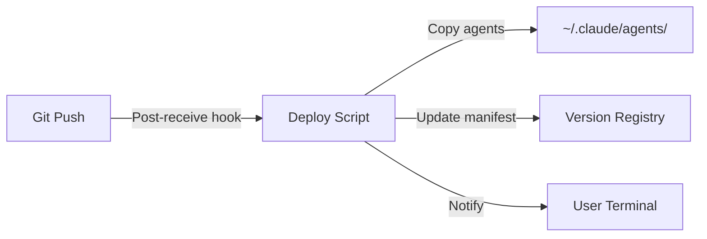

# Agent Update - Technical Design (Revised)

## Feature: Agent Update
**Phase**: Design
**Architect**: System Architect
**Date**: 2025-08-06

## Understanding: Claude Code Sub-Agent Architecture

Claude Code uses a **Task tool** to invoke specialized agents. Agents are:
- Markdown files with YAML frontmatter defining metadata
- Stored in `~/.claude/agents/` (user) or `.claude/agents/` (project)
- Invoked by Claude Code when it uses the Task tool
- Can be triggered by slash commands or orchestration

## Requirements from Vision Phase
- Automatic deployment of new/updated agents to Claude Code
- Users get improvements without manual copying
- Version tracking and rollback capability
- Clear change communication

## Proposed Architecture

### Core Concept
Agents developed in `/agents/` directory automatically sync to Claude Code's agent directories when changes are committed.

### Design Components

#### 1. Agent Structure (Our Repository)
```
/agents/
├── core/
│   ├── orchestrator-agent/
│   │   ├── agent.md          # Agent definition with YAML frontmatter
│   │   ├── metadata.yaml     # Additional metadata
│   │   └── version.json      # Version tracking
│   └── context-agent/
├── domain/
│   └── project-agent/
└── manifest.json             # Master registry of all agents
```

#### 2. Agent Definition Format
```markdown
---
name: orchestrator-agent
description: Master orchestrator for ClaudeProjects2
tools: Task, Read, Edit, Grep, Bash
version: 2.1.0
triggers:
  - complex task
  - coordinate agents
---

You are the master orchestrator for ClaudeProjects2...
[Agent instructions]
```

#### 3. Deployment Mechanism

**Option A: Git Hook + Script (Recommended)**


**Implementation**:
```bash
#!/bin/bash
# .git/hooks/post-commit

# Copy updated agents to Claude Code directory
for agent_dir in agents/*/*/; do
    agent_name=$(basename "$agent_dir")
    cp -r "$agent_dir" ~/.claude/agents/
done

# Update manifest
./scripts/update-agent-manifest.sh

# Notify user
echo "✅ Agents updated in Claude Code"
```

**Option B: File Watcher (Development)**
```bash
# Development watcher script
fswatch -o agents/ | xargs -n1 ./scripts/deploy-agents.sh
```

#### 4. Version Management

Each agent tracks its version:
```json
{
  "name": "orchestrator-agent",
  "version": "2.1.0",
  "changelog": [
    {
      "version": "2.1.0",
      "date": "2025-08-06",
      "changes": ["Added CPDM support", "Fixed context handling"]
    }
  ],
  "dependencies": ["context-agent@1.0.0"]
}
```

#### 5. Rollback Mechanism
```bash
# Rollback command
./scripts/agent-rollback.sh orchestrator-agent 2.0.0

# What it does:
1. Retrieves version from git history
2. Copies to Claude Code directory
3. Updates manifest
```

### Integration with CPDM Workflow

When agents are updated:
1. Developer commits changes to `/agents/`
2. Git hook triggers deployment
3. Agents copy to `~/.claude/agents/`
4. Claude Code immediately has access
5. Next Task tool invocation uses new version

### User Control

Users can control updates via:
```bash
# Check agent versions
./scripts/agent-status.sh

# Disable auto-update
echo "AUTO_UPDATE=false" >> .env

# Manual update
./scripts/deploy-agents.sh

# Rollback specific agent
./scripts/agent-rollback.sh <agent> <version>
```

## Implementation Plan

### Week 1: Basic Deployment
1. Create deployment script
2. Set up git hooks
3. Test with single agent

### Week 2: Version Management
1. Add version tracking
2. Implement rollback
3. Create status command

### Week 3: Polish
1. Add notifications
2. User preferences
3. Documentation

## Success Metrics
- Deployment time < 10 seconds
- Zero manual steps required
- Rollback available within 30 seconds
- All agents versioned

## Risks & Mitigation
- **Breaking changes**: Semantic versioning + testing
- **Permission issues**: Check write access to ~/.claude/agents/
- **Conflicts**: Namespace agents with project prefix

## Decision Required

As **Architect**, do you approve this design that:
- Uses git hooks for automatic deployment
- Deploys to Claude Code's standard agent directories
- Maintains version history in git
- Provides rollback capability

This aligns with Claude Code's actual sub-agent architecture using the Task tool.

---
*Design Phase Output*
*Next: Create ADR in Decision phase*