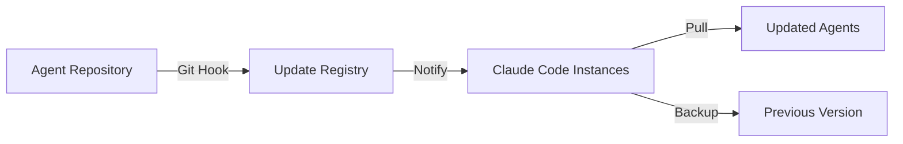
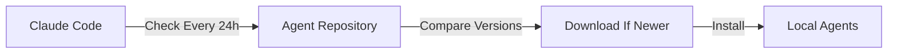
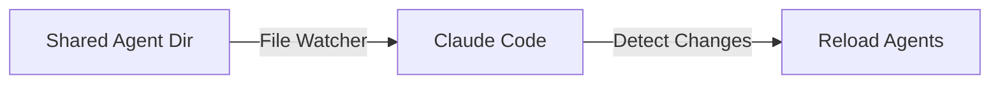

# Agent Update - Technical Design

## Feature: Agent Update
**Phase**: Design
**Architect**: System Architect
**Date**: 2025-08-06

## Requirements from Vision Phase
- Users need automatic agent updates
- Must be reliable (95% success rate)
- Updates within 24 hours of release
- User control for opt-out/rollback
- Clear change communication

## Proposed Architecture

### Design Option 1: Push-Based Updates (Recommended)
**Mechanism**: Agent registry with push notifications



**Pros**:
- Immediate updates
- Central control
- Version tracking
- Rollback capability

**Cons**:
- Requires registry service
- Network dependency

### Design Option 2: Pull-Based Updates
**Mechanism**: Claude Code polls for updates



**Pros**:
- Simple implementation
- No central service needed
- Works offline

**Cons**:
- Delay in updates (up to 24h)
- Each instance polls separately

### Design Option 3: File System Watcher
**Mechanism**: Watch shared agent directory



**Pros**:
- Real-time updates
- No network required
- Simple for local dev

**Cons**:
- Only works on same machine
- No version control

## Recommended Solution: Hybrid Approach

### Phase 1: Local Development (Option 3)
- File system watcher for `/agents/` directory
- Immediate reload on change
- Perfect for development workflow

### Phase 2: Distribution (Option 1)
- Git-based agent registry
- Webhook on push to main
- Claude Code subscribes to updates
- Automatic download and install

### Technical Components

#### 1. Agent Manifest (`agents/manifest.json`)
```json
{
  "version": "1.0.0",
  "agents": {
    "orchestrator-agent": {
      "version": "2.1.0",
      "path": "core/orchestrator-agent.md",
      "hash": "sha256:abc123...",
      "breaking": false
    }
  }
}
```

#### 2. Update Mechanism
```bash
# In Claude Code installation
claude-code agent update        # Manual update
claude-code agent auto-update on # Enable auto-update
claude-code agent rollback      # Revert to previous
```

#### 3. Version Management
- Semantic versioning for agents
- Breaking changes require user confirmation
- Automatic backup before update
- 3 previous versions retained

#### 4. Change Communication
- CHANGELOG.md per agent
- Update notifications in Claude Code
- Summary of changes shown to user

## Implementation Plan

### Sprint 6 (Current)
1. ✅ Design approval (this document)
2. File watcher prototype
3. Basic version detection

### Sprint 7
1. Git integration
2. Update command implementation
3. Rollback mechanism

### Sprint 8
1. Auto-update service
2. Change notifications
3. Production deployment

## Risk Mitigation
- **Breaking changes**: Semantic versioning + user confirmation
- **Failed updates**: Automatic rollback to previous version
- **Conflicts**: User modifications preserved in `.local/` variants
- **Performance**: Async updates, no blocking

## Success Metrics
- Update success rate > 95%
- Average update time < 5 minutes
- User satisfaction > 4.5/5
- Zero data loss incidents

## Decision Required

### Architect Approval:
- [ ] **APPROVE** - Proceed to Decision phase for ADR
- [ ] **REVISE** - Needs design changes
- [ ] **REJECT** - Fundamental issues

---
*Design Phase Output*
*Next: ADR creation in Decision phase*