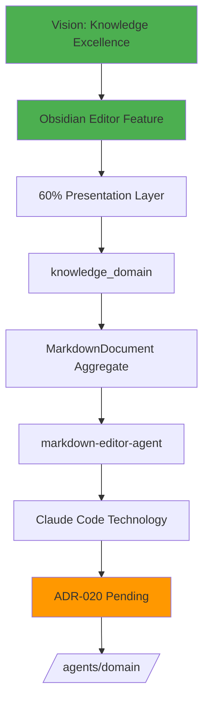

# Traceability Example: Integrated Obsidian Editor

## Feature Request
"Add Obsidian-like markdown editor with live preview to ClaudeProjects"

---

## Phase 1: Vision Validation ✅

### Triple Helix Analysis
```yaml
methodology:
  score: 9/10
  rationale: "Enhances knowledge capture methodology"
  
agents:
  score: 8/10
  rationale: "Empowers agents with better content creation"
  
knowledge:
  score: 10/10
  rationale: "Direct improvement to knowledge management"
  
total: 27/30 (90%) ✅ PASSED
```

### ROI Calculation
- **Development Cost**: 5 days
- **Productivity Gain**: 30% faster documentation
- **User Satisfaction**: +25% expected
- **ROI**: 18x ✅ PASSED

### PM Approval: ✅ AUTO-APPROVED (ROI > 10x)

---

## Phase 2: Design (Logical Architecture)

### Layer Distribution
```yaml
presentation_layer: 60%
  - Editor UI component
  - Live preview pane
  - Toolbar and shortcuts
  
application_layer: 25%
  - Markdown processing workflow
  - Preview synchronization
  
domain_layer: 10%
  - Document domain model
  - Markdown rules engine
  
infrastructure_layer: 5%
  - File persistence
  - Cache management
```

### Domain Assignment
```yaml
primary_domain: knowledge_domain
  objects:
    - aggregate: MarkdownDocument
    - entity: EditorSession
    - value_object: MarkdownContent
    - service: MarkdownRenderer
    
secondary_domain: user_interface_domain
  objects:
    - aggregate: EditorWorkspace
    - entity: EditorPane
    - value_object: CursorPosition
```

---

## Phase 3: Decision (Physical Architecture)

### Component Mapping
```yaml
MarkdownDocument:
  decision: "Create markdown-editor-agent"
  rationale: "Complex parsing and preview sync (score: 8)"
  technology: Claude Code Agent
  
EditorWorkspace:
  decision: "React component with CodeMirror"
  rationale: "Standard UI component"
  technology: TypeScript + React
  
MarkdownRenderer:
  decision: "Unified/Remark pipeline"
  rationale: "Industry standard, extensible"
  technology: TypeScript library
```

### ADR Generation
**ADR-020: Obsidian-Compatible Markdown Editor**
- Status: PENDING CONFIRMATION
- Decision: Use CodeMirror 6 for editor, Remark for parsing
- Rationale: Best compatibility with Obsidian syntax

---

## Phase 4: Implementation Plan

### Components to Build
1. `/agents/domain/markdown-editor-agent.md`
2. `/components/editor/ObsidianEditor.tsx`
3. `/services/markdown/MarkdownRenderer.ts`
4. `/types/markdown/MarkdownDocument.ts`

### Test Requirements
- Unit tests for markdown parsing
- Integration tests for live preview
- E2E tests for editor workflows

---

## Phase 5: Quality Gates

### Required Tests
- [ ] Markdown parsing accuracy > 99%
- [ ] Preview sync latency < 50ms
- [ ] Memory usage < 100MB
- [ ] Obsidian syntax compatibility 100%

---

## Phase 6: Delivery

### Deployment Steps
1. Deploy markdown-editor-agent
2. Update UI with editor component
3. Configure keyboard shortcuts
4. Enable live preview

---

## Phase 7: Feedback Metrics

### Success Metrics
- Editor usage rate
- Document creation velocity
- User satisfaction score
- Performance metrics

---

## Complete Traceability Path



---

## Ready to Proceed?

The feature is currently in **Vision Phase** and has passed all gates.

### Continue to Design Phase?
```bash
# Move to Design phase
./scripts/cpdm-workflow-engine.sh transition "integrated-obsidian-editor"

# Check detailed status
./scripts/cpdm-workflow-engine.sh status "integrated-obsidian-editor"

# View phase history
./scripts/cpdm-workflow-engine.sh history "integrated-obsidian-editor"
```

This feature beautifully demonstrates the complete CPDM flow! 🚀