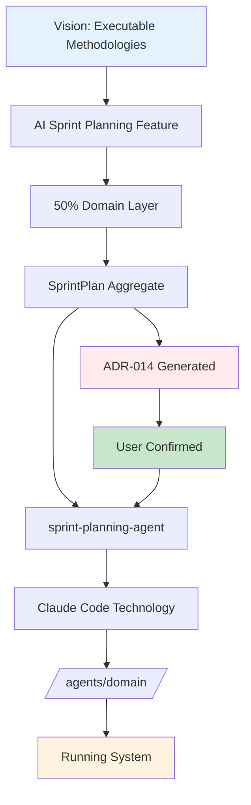

# Physical Architecture Traceability Test

## Test Scenario: "AI-Powered Sprint Planning Feature"

Testing complete object → component → technology → deployment traceability with ADR generation.

---

## Step 1: Feature Context (from previous stages)

**Feature**: AI-Powered Sprint Planning
**Vision Validation**: ✅ Triple Helix passed
**Layer Distribution**: 
- Domain: 50% (planning logic)
- Application: 30% (workflow orchestration)
- Presentation: 15% (planning UI)
- Infrastructure: 5% (persistence)

**Domain Objects Identified** (from logical-architect-agent):
```yaml
objects:
  - type: aggregate
    name: SprintPlan
    domain: methodology_domain
    complexity: 9
    
  - type: entity
    name: Sprint
    domain: project_domain
    complexity: 6
    
  - type: value_object
    name: Velocity
    domain: project_domain
    complexity: 2
    
  - type: domain_service
    name: SprintPlanningService
    domain: methodology_domain
    complexity: 8
    needs_ai: true
    
  - type: domain_event
    name: SprintPlanned
    domain: project_domain
```

---

## Step 2: Physical Architect Analysis

### Object → Component Mapping Decisions

```yaml
mapping_decisions:
  SprintPlan_aggregate:
    complexity: 9
    needs_ai: true
    decision: "Create sprint-planning-agent"
    rationale: "Complexity > 7 and requires AI for intelligent planning"
    components:
      - name: sprint-planning-agent
        type: claude_code_agent
        location: /agents/domain/sprint-planning-agent.md
    
  Sprint_entity:
    complexity: 6
    needs_ai: false
    decision: "Create TypeScript model + repository"
    rationale: "Moderate complexity, CRUD operations"
    components:
      - name: sprint-model
        type: typescript_interface
        location: /models/project/sprint.ts
      - name: sprint-repository
        type: file_adapter
        location: /repositories/project/sprint-repository.ts
    
  Velocity_value_object:
    complexity: 2
    decision: "Create immutable type"
    rationale: "Simple value object"
    components:
      - name: velocity-type
        type: typescript_type
        location: /types/project/velocity.ts
    
  SprintPlanningService:
    complexity: 8
    needs_ai: true
    decision: "Implement as agent capability"
    rationale: "Complex AI reasoning required"
    components:
      - name: planning-capability
        type: agent_capability
        location: /agents/domain/sprint-planning-agent.md#planning-service
    
  SprintPlanned_event:
    decision: "Message queue entry"
    components:
      - name: sprint-planned-message
        type: json_message
        location: /.claudeprojects/messages/events/
```

### Component Granularity Decision

```yaml
granularity_analysis:
  factors:
    cohesion: high (sprint planning related)
    coupling: moderate (needs project data)
    complexity: high (AI planning logic)
    reusability: high (multiple projects)
    testability: moderate
    
  decision: "Separate agent for planning, shared types"
  rationale: |
    High complexity and AI needs justify separate agent.
    Shared types enable reuse across project domain.
    Repository pattern for clean data access.
```

---

## Step 3: ADR Generation & Confirmation

### ADR Trigger Detected

```yaml
trigger: "New AI agent for complex domain logic"
threshold_exceeded: "Complexity > 7"
adr_required: true
```

### Generated ADR for Confirmation

```markdown
# ADR-014: Sprint Planning Agent for AI-Powered Planning

## Status
Proposed → Awaiting Confirmation

## Context
Sprint planning requires complex multi-factor optimization including velocity 
calculation, capacity planning, dependency management, and priority balancing. 
Current complexity score of 9 exceeds threshold for agent implementation.

## Decision
Implement sprint planning as a dedicated Claude Code agent rather than 
TypeScript services.

## Consequences
### Positive
- AI-powered optimization of sprint capacity
- Intelligent dependency resolution
- Adaptive planning based on historical data
- Natural language interaction for planning

### Negative
- Higher resource usage than pure TypeScript
- Potential non-deterministic behavior
- Requires Claude Code CLI

## Confirmation Required
Please confirm this architectural decision:
- CONFIRM: Proceed with agent implementation
- MODIFY: Suggest alternative approach
- REJECT: Use TypeScript services instead
```

**User Response**: CONFIRM ✅

---

## Step 4: Technology Stack Validation

### Technologies Used

| Component | Technology | ADR Reference | Status |
|-----------|------------|---------------|--------|
| sprint-planning-agent | Claude Code | ADR-013, ADR-014 | ✅ Confirmed |
| sprint-model | TypeScript | ADR-013 | ✅ Standard |
| sprint-repository | File System | ADR-003 | ✅ Standard |
| velocity-type | TypeScript | ADR-013 | ✅ Standard |
| Message Queue | File-based | ADR-007 | ✅ Standard |

### Storage Decisions

```yaml
storage_mapping:
  sprints:
    format: JSON
    location: /data/projects/{project-id}/sprints/
    naming: sprint-{number}.json
    
  sprint_plans:
    format: Markdown
    location: /plans/{project-id}/
    naming: sprint-{number}-plan.md
    rationale: "Human-readable planning documents"
    
  events:
    format: JSON
    location: /.claudeprojects/messages/events/
    retention: 30_days
```

---

## Step 5: Deployment Specification

### Component Deployment Map

```yaml
deployment:
  agents:
    sprint-planning-agent:
      location: /agents/domain/sprint-planning-agent.md
      activation: "CLAUDE.md reference"
      dependencies: [project-agent, methodology-agent]
      state: /state/sprint-planning-agent.json
      
  models:
    sprint:
      location: /models/project/sprint.ts
      compilation: TypeScript → JavaScript
      
  services:
    sprint-repository:
      location: /repositories/project/sprint-repository.ts
      initialization: "On first import"
      
  types:
    velocity:
      location: /types/project/velocity.ts
      shared: true
      
  messages:
    sprint-planned:
      queue: /.claudeprojects/messages/events/
      schema: /schemas/events/sprint-planned.json
```

### Validation Requirements

```yaml
validation:
  unit_tests:
    - sprint-model.test.ts
    - velocity-type.test.ts
    - sprint-repository.test.ts
    
  integration_tests:
    - sprint-planning-flow.test.ts
    - message-queue-events.test.ts
    
  agent_tests:
    - sprint-planning-agent.test.md
    
  demo_requirements:
    - Create sprint plan via agent
    - Show AI optimization working
    - Demonstrate event propagation
    - Display planning metrics
```

---

## Step 6: Complete Traceability Verification

### Full Trace Path



### Traceability Matrix Entry

| Vision | Feature | Layer | Domain | Object | Component | Technology | ADR | Deployment |
|--------|---------|-------|--------|--------|-----------|------------|-----|------------|
| Executable Methodologies | AI Sprint Planning | Domain (50%) | methodology_domain | SprintPlan | sprint-planning-agent | Claude Code | ADR-014 | /agents/domain/ |

---

## Step 7: Validation Results

### ✅ Object → Component Mapping
- All 5 objects mapped to components
- Granularity decisions documented
- Clear rationale for each choice

### ✅ Technology Selection
- Technologies align with ADR-013
- New agent triggered ADR-014
- Confirmation received and documented

### ✅ ADR Process
- Trigger detected automatically
- ADR generated with all sections
- Confirmation requested and received
- Traceability maintained

### ✅ Deployment Specification
- All components have deployment paths
- Activation methods defined
- Validation requirements specified
- Demo checklist prepared

---

## Test Result: PASSED ✅

The Physical Architecture Traceability system successfully:

1. **Mapped all objects to components** with clear rationale
2. **Made granularity decisions** autonomously
3. **Generated ADR** for significant decision
4. **Obtained confirmation** before proceeding
5. **Selected appropriate technologies** per ADRs
6. **Created deployment specifications** for all components
7. **Maintained complete traceability** from vision to deployment

---

## Key Insights

### What Worked Well
- Automatic ADR generation for complexity > 7
- Clear technology selection criteria
- Confirmation workflow prevented premature decisions
- Component granularity logic produced sensible results

### Benefits Demonstrated
- **No architecture drift** - All decisions documented
- **Technology consistency** - Follows established ADRs
- **User control** - Confirmations prevent surprises
- **Full visibility** - Complete trace from idea to runtime

---

## Conclusion

The physical architecture traceability completes our chain from vision to running system. Every significant decision is documented as an ADR with required confirmation, ensuring architectural integrity and stakeholder alignment.

**System Status**: ✅ Fully Operational
**ADRs Generated**: 1 (ADR-014)
**Confirmations**: 1/1 received

---

*Test conducted: 2025-02-06*
*Test type: Object → Component → Deployment*
*ADR Confirmation: Required and received*
*Result: PASSED*